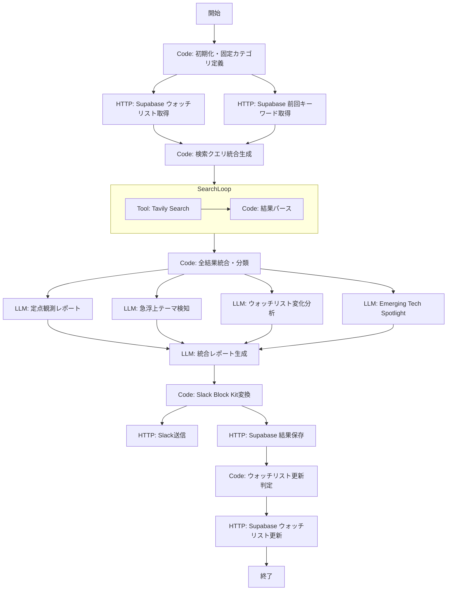

# 固定カテゴリ + ウォッチリスト + 探索枠 統合設計書

## 背景と課題

現行の `AInews_DeepResearch_Breadth` ワークフローでは、LLMが毎回8カテゴリを動的に生成するため以下の問題がある:

1. **カテゴリのぶれ**: 回ごとにカテゴリ名・範囲が変わり、定点観測ができない
2. **継続追跡の欠如**: 重要技術の「前回→今回」の変化を追えない
3. **新興技術の見落とし**: 実務直結のみに寄せて、視野が狭くなっている

本設計では、3つの改善指摘を統合し、既存ワークフローを拡張する。

---

## 1. 全体アーキテクチャ

### ノード構成図（Difyワークフロー）

```
Start
  │
  ▼
[Code] 初期化・日付計算・固定カテゴリ定義
  │
  ├──────────────────────────────────────────────┐
  │                                              │
  ▼                                              ▼
[HTTP] Supabase: ウォッチリスト取得         [HTTP] Supabase: 前回キーワード取得
  │                                              │
  └──────────────┬───────────────────────────────┘
                 │
                 ▼
[Code] 検索クエリ統合生成
  │    ・固定5カテゴリの検索クエリ
  │    ・ウォッチリスト各項目の検索クエリ
  │    ・探索枠の検索クエリ
  │
  ▼
[Iteration] メイン検索ループ（7〜8回）
  │
  │  ┌──────────────────────────────────┐
  │  │ [Tool] Tavily Search             │
  │  │          │                        │
  │  │          ▼                        │
  │  │ [Code] 結果パース・構造化         │
  │  └──────────────────────────────────┘
  │
  ▼
[Code] 全検索結果の統合・分類
  │
  ├─────────────────┐
  │                 │
  ▼                 ▼
[LLM] 定点観測    [LLM] 急浮上テーマ検知
  レポート生成       ・前回キーワードとの差分分析
  （固定5枠）        ・新出キーワード抽出
  │                 │
  ├─────────────────┤
  │                 │
  ▼                 ▼
[LLM] ウォッチリスト  [LLM] Emerging Tech Spotlight
  変化分析              ・探索枠から1件選定
  │                     ・「なぜ注目すべきか」生成
  │                     │
  └────────┬────────────┘
           │
           ▼
[LLM] 統合レポート生成
  │
  ▼
[Code] Slack Block Kit フォーマット変換
  │
  ├──────────────────────────┐
  │                          │
  ▼                          ▼
[HTTP] Slack送信          [HTTP] Supabase: 結果保存
  │                          ・今回のキーワード保存
  │                          ・ウォッチリスト自動更新
  │
  ▼
[Code] ウォッチリスト更新判定
  │
  ▼
[HTTP] Supabase: ウォッチリスト更新
  │
  ▼
End
```

### Mermaid図



---

## 2. 固定カテゴリ + 変動スポット枠

### 2-1. 固定5カテゴリの定義

| # | カテゴリID | カテゴリ名 | 対象範囲 |
|---|-----------|-----------|---------|
| 1 | `llm` | LLM・基盤モデル | 大規模言語モデル、マルチモーダルモデル、推論モデル、ファインチューニング、プロンプトエンジニアリング |
| 2 | `dev_tools` | 開発ツール・エージェント | AIエージェントフレームワーク、IDE・Copilot、CI/CD、テスト自動化、ローコード/ノーコード |
| 3 | `cloud_infra` | クラウド・基盤 | クラウドサービス新機能、GPU/TPU、推論基盤、エッジAI、MLOps、コンテナ・Kubernetes |
| 4 | `security` | セキュリティ・規制 | AIセキュリティ、脆弱性、データプライバシー、AI規制・法制度、ガバナンス |
| 5 | `oss` | OSS・コミュニティ | オープンソースモデル、OSSフレームワーク、コミュニティ動向、ライセンス変更 |
| 6 | `trending_spot` | （変動枠: 急浮上テーマ） | 前回までに出現しなかったキーワードの急増分野を自動検知して割り当て |

### 2-2. 検索クエリテンプレート

```python
FIXED_CATEGORIES = {
    "llm": {
        "name": "LLM・基盤モデル",
        "queries": [
            "large language model new release {date_suffix}",
            "LLM benchmark performance update {date_suffix}",
            "foundation model multimodal reasoning {date_suffix}",
            "GPT Claude Gemini Llama update {date_suffix}",
        ],
        "keywords_ja": [
            "大規模言語モデル 新モデル リリース",
            "LLM ベンチマーク 性能比較",
        ]
    },
    "dev_tools": {
        "name": "開発ツール・エージェント",
        "queries": [
            "AI agent framework release update {date_suffix}",
            "AI coding assistant copilot IDE {date_suffix}",
            "developer tools AI automation {date_suffix}",
            "MCP protocol AI tools integration {date_suffix}",
        ],
        "keywords_ja": [
            "AIエージェント フレームワーク 開発ツール",
            "AI コーディング アシスタント 自動化",
        ]
    },
    "cloud_infra": {
        "name": "クラウド・基盤",
        "queries": [
            "cloud AI infrastructure GPU update {date_suffix}",
            "MLOps model serving deployment {date_suffix}",
            "AWS Azure GCP AI service {date_suffix}",
            "edge AI inference optimization {date_suffix}",
        ],
        "keywords_ja": [
            "クラウド AI基盤 GPU 推論",
            "MLOps デプロイ サービング",
        ]
    },
    "security": {
        "name": "セキュリティ・規制",
        "queries": [
            "AI security vulnerability threat {date_suffix}",
            "AI regulation policy governance {date_suffix}",
            "LLM safety alignment red team {date_suffix}",
            "data privacy AI compliance {date_suffix}",
        ],
        "keywords_ja": [
            "AIセキュリティ 脆弱性 脅威",
            "AI規制 ガバナンス コンプライアンス",
        ]
    },
    "oss": {
        "name": "OSS・コミュニティ",
        "queries": [
            "open source AI model release {date_suffix}",
            "GitHub trending AI machine learning {date_suffix}",
            "OSS framework community update {date_suffix}",
            "open source LLM fine tuning {date_suffix}",
        ],
        "keywords_ja": [
            "オープンソース AIモデル リリース",
            "OSS コミュニティ フレームワーク",
        ]
    }
}
```

### 2-3. 変動枠（急浮上テーマ）の自動検知

初期化コードノードで固定カテゴリ定義を保持し、LLMノードで変動枠のテーマを決定する。

**変動枠検知のLLMプロンプト（急浮上テーマ検知ノード内）:**

```
あなたはテクノロジートレンドアナリストです。

## タスク
以下の「今回の検索結果」と「前回までに出現したキーワードリスト」を比較し、
「前回にはなかったが今回急浮上しているテーマ」を1つ特定してください。

## 今回の検索結果から抽出されたキーワード
{{all_current_keywords}}

## 前回までのキーワードリスト
{{previous_keywords}}

## 急浮上の判定基準
1. 前回のキーワードリストに存在しない、または出現頻度が極めて低かった
2. 今回の検索結果で複数のソースから言及されている
3. 固定5カテゴリ（LLM / 開発ツール / クラウド・基盤 / セキュリティ / OSS）には
   収まりきらない新しい切り口である
4. 一過性のバズではなく、技術的な深みがありそうなもの

## 出力形式（JSON）
{
  "trending_topic": "急浮上テーマ名",
  "description": "このテーマの概要（1-2文）",
  "evidence": ["根拠となるニュース/情報1", "根拠2", "根拠3"],
  "why_new": "なぜこれが新しいトレンドと言えるのか",
  "related_category": "最も近い固定カテゴリ（参考情報）",
  "search_query_for_detail": "このテーマをさらに深掘りするための検索クエリ"
}
```

### 2-4. カテゴリ体系のDifyワークフロー内保持方法

**方法: 初期化Codeノードでハードコードする（推奨）**

理由:
- Difyの環境変数は文字列のみ対応のため、複雑な構造体には不向き
- Codeノードにハードコードすれば、ワークフロー内で完結し、バージョン管理も容易
- カテゴリ変更時はCodeノードを編集するだけ

```python
def main(depth: int, date_range: str = None) -> dict:
    from datetime import datetime, timedelta

    depth = depth or 3
    today = datetime.now()
    week_ago = today - timedelta(days=7)

    if not date_range:
        date_range = f"{week_ago.strftime('%Y年%m月%d日')}〜{today.strftime('%Y年%m月%d日')}"

    date_suffix = today.strftime('%Y年%m月')
    since_date = week_ago.strftime('%Y-%m-%d')

    # 固定カテゴリ定義（ここを編集すればカテゴリ体系を変更可能）
    fixed_categories = [
        {
            "id": "llm",
            "name": "LLM・基盤モデル",
            "icon": "🧠",
            "query_en": f"large language model release update benchmark {date_suffix}",
            "query_ja": f"大規模言語モデル 新モデル リリース {date_suffix}"
        },
        {
            "id": "dev_tools",
            "name": "開発ツール・エージェント",
            "icon": "🛠️",
            "query_en": f"AI agent framework developer tools update {date_suffix}",
            "query_ja": f"AIエージェント 開発ツール フレームワーク {date_suffix}"
        },
        {
            "id": "cloud_infra",
            "name": "クラウド・基盤",
            "icon": "☁️",
            "query_en": f"cloud AI infrastructure GPU MLOps update {date_suffix}",
            "query_ja": f"クラウド AI基盤 GPU MLOps {date_suffix}"
        },
        {
            "id": "security",
            "name": "セキュリティ・規制",
            "icon": "🔒",
            "query_en": f"AI security regulation governance update {date_suffix}",
            "query_ja": f"AIセキュリティ 規制 ガバナンス {date_suffix}"
        },
        {
            "id": "oss",
            "name": "OSS・コミュニティ",
            "icon": "📦",
            "query_en": f"open source AI model framework community {date_suffix}",
            "query_ja": f"オープンソース AI フレームワーク {date_suffix}"
        }
    ]

    # 検索ループ用の配列（固定5 + ウォッチリスト + 探索枠は後段で結合）
    search_items = []
    for cat in fixed_categories:
        search_items.append({
            "type": "fixed_category",
            "id": cat["id"],
            "name": cat["name"],
            "icon": cat["icon"],
            "query": cat["query_en"]
        })
        search_items.append({
            "type": "fixed_category",
            "id": cat["id"],
            "name": cat["name"],
            "icon": cat["icon"],
            "query": cat["query_ja"]
        })

    return {
        "date_range": date_range,
        "since_date": since_date,
        "date_suffix": date_suffix,
        "fixed_categories": fixed_categories,
        "search_items": search_items,
        "depth": depth
    }
```

---

## 3. 継続ウォッチリスト

### 3-1. Supabaseスキーマ

```sql
-- =============================================
-- テーブル1: ウォッチリスト本体
-- =============================================
CREATE TABLE watchlist (
    id UUID DEFAULT gen_random_uuid() PRIMARY KEY,
    tech_name TEXT NOT NULL UNIQUE,          -- 技術名（例: "Claude Code"）
    category TEXT NOT NULL,                   -- 大分類（例: "dev_tools"）
    description TEXT,                         -- 技術の概要説明
    why_watching TEXT,                        -- なぜウォッチしているか
    status TEXT DEFAULT 'active'              -- active / paused / archived
        CHECK (status IN ('active', 'paused', 'archived')),
    priority INTEGER DEFAULT 5               -- 1(低)〜10(高)
        CHECK (priority BETWEEN 1 AND 10),
    added_at TIMESTAMPTZ DEFAULT now(),
    added_by TEXT DEFAULT 'system',           -- system / slack_user_xxx
    last_mentioned_at TIMESTAMPTZ,            -- 最後にニュースで言及された日
    mention_count INTEGER DEFAULT 0,          -- 累計言及回数
    consecutive_no_mention INTEGER DEFAULT 0, -- 連続未言及回数（自動除外判定用）
    search_queries JSONB DEFAULT '[]'::jsonb, -- カスタム検索クエリ
    metadata JSONB DEFAULT '{}'::jsonb,       -- 拡張フィールド
    created_at TIMESTAMPTZ DEFAULT now(),
    updated_at TIMESTAMPTZ DEFAULT now()
);

-- インデックス
CREATE INDEX idx_watchlist_status ON watchlist(status);
CREATE INDEX idx_watchlist_category ON watchlist(category);
CREATE INDEX idx_watchlist_priority ON watchlist(priority DESC);

-- =============================================
-- テーブル2: ウォッチリスト変化履歴
-- =============================================
CREATE TABLE watchlist_snapshots (
    id UUID DEFAULT gen_random_uuid() PRIMARY KEY,
    watchlist_id UUID REFERENCES watchlist(id) ON DELETE CASCADE,
    tech_name TEXT NOT NULL,
    snapshot_date DATE NOT NULL DEFAULT CURRENT_DATE,
    summary TEXT,                              -- その時点の要約
    key_changes TEXT[],                        -- 主な変化のリスト
    sentiment TEXT DEFAULT 'neutral'           -- positive / neutral / negative
        CHECK (sentiment IN ('positive', 'neutral', 'negative')),
    raw_search_results JSONB,                 -- 検索結果の生データ
    created_at TIMESTAMPTZ DEFAULT now(),
    UNIQUE(watchlist_id, snapshot_date)        -- 同一日に同一技術は1レコード
);

CREATE INDEX idx_snapshots_date ON watchlist_snapshots(snapshot_date DESC);
CREATE INDEX idx_snapshots_tech ON watchlist_snapshots(tech_name);

-- =============================================
-- テーブル3: キーワードトラッキング（急浮上テーマ検知用）
-- =============================================
CREATE TABLE keyword_tracking (
    id UUID DEFAULT gen_random_uuid() PRIMARY KEY,
    keyword TEXT NOT NULL,
    report_date DATE NOT NULL DEFAULT CURRENT_DATE,
    frequency INTEGER DEFAULT 1,              -- そのレポート内での出現頻度
    source TEXT,                               -- ソース元（news / github / arxiv）
    category TEXT,                             -- 関連カテゴリ
    created_at TIMESTAMPTZ DEFAULT now(),
    UNIQUE(keyword, report_date)
);

CREATE INDEX idx_keywords_date ON keyword_tracking(report_date DESC);
CREATE INDEX idx_keywords_keyword ON keyword_tracking(keyword);

-- =============================================
-- テーブル4: 探索枠の候補・採用履歴
-- =============================================
CREATE TABLE emerging_tech_history (
    id UUID DEFAULT gen_random_uuid() PRIMARY KEY,
    report_date DATE NOT NULL DEFAULT CURRENT_DATE,
    tech_name TEXT NOT NULL,
    description TEXT,
    why_notable TEXT,                          -- なぜ注目すべきか
    detection_source TEXT,                     -- github / arxiv / hackernews
    detection_signals JSONB,                   -- 検知シグナルの詳細
    was_selected BOOLEAN DEFAULT false,        -- 今回のSpotlightに選ばれたか
    later_became_mainstream BOOLEAN DEFAULT false, -- 後日メインストリームになったか
    created_at TIMESTAMPTZ DEFAULT now()
);

CREATE INDEX idx_emerging_date ON emerging_tech_history(report_date DESC);

-- =============================================
-- RLS (Row Level Security) ポリシー
-- =============================================
-- Difyワークフローからのアクセスはサービスロールキーを使用するため、
-- RLSはSlack Bot等の外部アクセス用に設定
ALTER TABLE watchlist ENABLE ROW LEVEL SECURITY;
ALTER TABLE watchlist_snapshots ENABLE ROW LEVEL SECURITY;

-- サービスロールはフルアクセス（Difyワークフロー用）
CREATE POLICY "service_role_full_access" ON watchlist
    FOR ALL USING (true) WITH CHECK (true);
CREATE POLICY "service_role_full_access" ON watchlist_snapshots
    FOR ALL USING (true) WITH CHECK (true);
```

### 3-2. 初期ウォッチリスト（2026年3月時点）

```sql
INSERT INTO watchlist (tech_name, category, description, why_watching, priority, search_queries) VALUES
('Claude Code', 'dev_tools',
 'Anthropic製のCLIベースAIコーディングアシスタント',
 'AIコーディングの主流ツールになりつつある。VS Code統合やMCP対応の動向を追跡',
 9,
 '["Claude Code update release", "Claude Code CLI new features"]'),

('OpenAI Agents SDK', 'dev_tools',
 'OpenAI公式のマルチエージェントフレームワーク',
 'エージェントフレームワークの標準化争いの中心。Swarm後継として業界への影響大',
 9,
 '["OpenAI Agents SDK update", "openai-agents-python new release"]'),

('MCP (Model Context Protocol)', 'dev_tools',
 'Anthropic発のAIツール接続標準プロトコル',
 'AIとツール統合の標準規格として急速に普及中。エコシステムの成長を追跡',
 10,
 '["Model Context Protocol MCP update", "MCP server new integration"]'),

('Gemini 2.5', 'llm',
 'Google DeepMindの最新LLMシリーズ',
 '100万トークンコンテキスト、思考モード等の独自機能。GPT/Claudeとの競争動向',
 8,
 '["Gemini 2.5 update benchmark", "Google Gemini new features"]'),

('Llama 4', 'oss',
 'Meta社のオープンソースLLMシリーズ最新版',
 'オープンソースLLMの最前線。商用利用可能なOSSモデルの性能上限を追跡',
 8,
 '["Llama 4 release Meta", "Llama open source model update"]'),

('Rust in AI Infrastructure', 'cloud_infra',
 'AI基盤ソフトウェアでのRust採用拡大',
 'Python代替としてのRust。推論エンジン、データパイプライン等での採用事例を追跡',
 6,
 '["Rust AI infrastructure", "Rust machine learning framework"]'),

('Browser Use / Computer Use', 'dev_tools',
 'AIによるブラウザ・PC操作の自動化技術',
 'GUI操作エージェントの発展。Claude Computer Use、Browser Use等の動向',
 7,
 '["AI browser automation agent", "computer use AI agent update"]'),

('EU AI Act Implementation', 'security',
 'EU人工知能法の施行と各国の対応',
 '世界初の包括的AI規制。日本含む各国の対応状況を追跡',
 7,
 '["EU AI Act implementation", "AI regulation compliance update"]'),

('Agentic RAG', 'dev_tools',
 'エージェント型RAG（検索拡張生成）パターン',
 'RAGの次世代アーキテクチャ。マルチステップ推論+検索の統合パターン',
 7,
 '["agentic RAG architecture", "multi-step RAG agent"]'),

('AI Code Review / Testing', 'dev_tools',
 'AIによるコードレビュー・テスト自動生成',
 'ソフトウェア品質向上へのAI活用。PR自動レビュー、テスト生成等の実用化',
 6,
 '["AI code review automation", "AI test generation tool"]');
```

### 3-3. ウォッチリスト自動更新ロジック

#### 自動追加の条件

```python
def should_auto_add_to_watchlist(tech_name: str, mentions: list, existing_watchlist: list) -> dict:
    """
    以下の条件を満たすとき、ウォッチリスト候補として提案する:
    1. 過去3回の配信で2回以上言及されている
    2. 既存ウォッチリストに含まれていない
    3. 固定カテゴリのいずれかに関連する
    """
    existing_names = [item["tech_name"].lower() for item in existing_watchlist]
    if tech_name.lower() in existing_names:
        return {"should_add": False, "reason": "already_in_watchlist"}

    recent_mentions = len([m for m in mentions if m["recency_days"] <= 14])
    if recent_mentions >= 2:
        return {
            "should_add": True,
            "reason": f"mentioned {recent_mentions} times in last 14 days",
            "suggested_priority": min(recent_mentions + 4, 10)
        }

    return {"should_add": False, "reason": "insufficient_mentions"}
```

#### 自動除外（アーカイブ）の条件

```python
def should_archive_from_watchlist(item: dict) -> dict:
    """
    以下の条件を満たすとき、ウォッチリストから自動アーカイブする:
    1. 連続6回（約2週間）言及なし
    2. かつ、priorityが7未満
    （priority 7以上は重要技術のため、手動除外のみ）
    """
    if item["consecutive_no_mention"] >= 6 and item["priority"] < 7:
        return {
            "should_archive": True,
            "reason": f"no mention for {item['consecutive_no_mention']} consecutive reports"
        }
    return {"should_archive": False}
```

### 3-4. 各ウォッチ対象の「前回からの変化」検知

**ウォッチリスト変化分析LLMプロンプト:**

```
あなたはテクノロジーウォッチャーです。
ウォッチリスト上の各技術について、「前回スナップショット」と「今回の検索結果」を比較し、
変化を報告してください。

## ウォッチリスト項目
{{watchlist_items_json}}

## 前回のスナップショット（各技術の前回要約）
{{previous_snapshots_json}}

## 今回の検索結果（各技術に関連するニュース）
{{current_search_results}}

## 各項目について以下を判定してください

1. **変化レベル**:
   - 🔴 大きな変化（新バージョンリリース、重大発表、方針転換）
   - 🟡 中程度の変化（機能追加、パートナーシップ、ベンチマーク更新）
   - 🟢 小さな変化 or 変化なし
   - ⚪ 情報なし（今回の検索で関連ニュースが見つからなかった）

2. **変化の要約**: 前回→今回で何が変わったかを1-2文で

3. **次回注目ポイント**: 次回チェック時に見るべき観点

## 出力形式（JSON配列）
[
  {
    "tech_name": "技術名",
    "change_level": "red|yellow|green|none",
    "change_summary": "前回からの変化の要約",
    "key_news": ["関連ニュース1", "関連ニュース2"],
    "next_watch_point": "次回の注目ポイント",
    "mention_count": 3
  }
]
```

### 3-5. ウォッチリスト管理のSlack UIデザイン

#### 追加コマンド

Slack Boltアプリまたはスラッシュコマンド経由で管理する。
Difyのチャットボット型アプリを別途作成し、Slack連携する方法を推奨。

**Slack Slash Command:**

```
/watchlist add Claude Code --category dev_tools --priority 9 --reason "AIコーディングの主流"
/watchlist remove Rust in AI Infrastructure
/watchlist list
/watchlist pause Browser Use --reason "一時的に観測を停止"
/watchlist resume Browser Use
```

**Slack Block Kit - ウォッチリスト管理メッセージ:**

```json
{
  "blocks": [
    {
      "type": "header",
      "text": {
        "type": "plain_text",
        "text": "Watchlist Manager"
      }
    },
    {
      "type": "section",
      "text": {
        "type": "mrkdwn",
        "text": "ウォッチリストを管理します。以下のアクションを選択してください。"
      }
    },
    {
      "type": "actions",
      "elements": [
        {
          "type": "button",
          "text": {
            "type": "plain_text",
            "text": "一覧表示"
          },
          "action_id": "watchlist_list",
          "style": "primary"
        },
        {
          "type": "button",
          "text": {
            "type": "plain_text",
            "text": "追加"
          },
          "action_id": "watchlist_add"
        },
        {
          "type": "button",
          "text": {
            "type": "plain_text",
            "text": "削除"
          },
          "action_id": "watchlist_remove",
          "style": "danger"
        }
      ]
    },
    {
      "type": "divider"
    },
    {
      "type": "section",
      "text": {
        "type": "mrkdwn",
        "text": "*現在のウォッチリスト (10件)*\n\n`P10` MCP (Model Context Protocol) - 🟢 active\n`P09` Claude Code - 🟢 active\n`P09` OpenAI Agents SDK - 🟢 active\n`P08` Gemini 2.5 - 🟢 active\n`P08` Llama 4 - 🟢 active\n`P07` Browser Use / Computer Use - 🟢 active\n`P07` EU AI Act Implementation - 🟢 active\n`P07` Agentic RAG - 🟢 active\n`P06` Rust in AI Infrastructure - 🟢 active\n`P06` AI Code Review / Testing - 🟢 active"
      }
    }
  ]
}
```

**追加ダイアログ（Slack Modal）:**

```json
{
  "type": "modal",
  "title": {
    "type": "plain_text",
    "text": "ウォッチリストに追加"
  },
  "submit": {
    "type": "plain_text",
    "text": "追加"
  },
  "blocks": [
    {
      "type": "input",
      "block_id": "tech_name_block",
      "element": {
        "type": "plain_text_input",
        "action_id": "tech_name_input",
        "placeholder": {
          "type": "plain_text",
          "text": "例: Claude Code"
        }
      },
      "label": {
        "type": "plain_text",
        "text": "技術名"
      }
    },
    {
      "type": "input",
      "block_id": "category_block",
      "element": {
        "type": "static_select",
        "action_id": "category_select",
        "options": [
          {"text": {"type": "plain_text", "text": "LLM・基盤モデル"}, "value": "llm"},
          {"text": {"type": "plain_text", "text": "開発ツール・エージェント"}, "value": "dev_tools"},
          {"text": {"type": "plain_text", "text": "クラウド・基盤"}, "value": "cloud_infra"},
          {"text": {"type": "plain_text", "text": "セキュリティ・規制"}, "value": "security"},
          {"text": {"type": "plain_text", "text": "OSS・コミュニティ"}, "value": "oss"}
        ]
      },
      "label": {
        "type": "plain_text",
        "text": "カテゴリ"
      }
    },
    {
      "type": "input",
      "block_id": "priority_block",
      "element": {
        "type": "static_select",
        "action_id": "priority_select",
        "options": [
          {"text": {"type": "plain_text", "text": "10 - 最重要"}, "value": "10"},
          {"text": {"type": "plain_text", "text": "9"}, "value": "9"},
          {"text": {"type": "plain_text", "text": "8"}, "value": "8"},
          {"text": {"type": "plain_text", "text": "7"}, "value": "7"},
          {"text": {"type": "plain_text", "text": "6"}, "value": "6"},
          {"text": {"type": "plain_text", "text": "5 - 標準"}, "value": "5"}
        ]
      },
      "label": {
        "type": "plain_text",
        "text": "優先度"
      }
    },
    {
      "type": "input",
      "block_id": "reason_block",
      "element": {
        "type": "plain_text_input",
        "action_id": "reason_input",
        "multiline": true,
        "placeholder": {
          "type": "plain_text",
          "text": "なぜこの技術をウォッチするのか"
        }
      },
      "label": {
        "type": "plain_text",
        "text": "ウォッチ理由"
      }
    }
  ]
}
```

---

## 4. 探索枠（Emerging Tech Spotlight）

### 4-1. 検知ロジック（Pythonコード - Dify Codeノード用）

```python
def main(
    github_search_results: str,
    arxiv_results: str,
    hackernews_results: str,
    previous_emerging_techs: str
) -> dict:
    """
    「まだ主流でないが伸びそうな技術」を検知する。
    3つのソースからシグナルを収集し、スコアリングして候補を絞る。

    入力:
    - github_search_results: GitHub API検索結果（JSON文字列）
    - arxiv_results: arxiv検索結果（JSON文字列）
    - hackernews_results: Hacker News検索結果（JSON文字列）
    - previous_emerging_techs: 過去に選出した技術リスト（JSON文字列）

    出力:
    - candidates: スコア付き候補リスト
    - top_candidate: 最有力候補1件
    """
    import json

    candidates = {}  # tech_name -> {"score": float, "signals": [], "sources": []}

    # ========================
    # ソース1: GitHub - stars 100-1000 で増加率が高いリポジトリ
    # ========================
    try:
        gh_data = json.loads(github_search_results) if github_search_results else []
        if isinstance(gh_data, dict):
            gh_data = gh_data.get("items", [])

        for repo in gh_data:
            stars = repo.get("stargazers_count", 0) or repo.get("stars", 0)
            name = repo.get("full_name", "") or repo.get("name", "")
            description = repo.get("description", "") or ""
            created_at = repo.get("created_at", "")

            # フィルタ: stars 100-2000 の「新興」リポジトリ
            if 100 <= stars <= 2000 and name:
                # スコア計算: stars数 + 説明の充実度 + 作成日の新しさ
                score = 0.0

                # stars 500前後が最もスイートスポット
                if 300 <= stars <= 1000:
                    score += 3.0
                elif 100 <= stars < 300:
                    score += 1.5
                else:
                    score += 2.0

                # 説明が充実している = ちゃんとしたプロジェクト
                if len(description) > 50:
                    score += 1.0

                # 直近1ヶ月以内に作成
                if created_at and "2026-02" in created_at or "2026-03" in created_at:
                    score += 2.0

                tech_key = name.split("/")[-1] if "/" in name else name
                if tech_key not in candidates:
                    candidates[tech_key] = {
                        "score": 0,
                        "signals": [],
                        "sources": [],
                        "description": description,
                        "url": repo.get("html_url", repo.get("url", ""))
                    }
                candidates[tech_key]["score"] += score
                candidates[tech_key]["signals"].append(
                    f"GitHub: {stars} stars"
                )
                candidates[tech_key]["sources"].append("github")
    except Exception:
        pass

    # ========================
    # ソース2: arxiv - 最近投稿された注目論文
    # ========================
    try:
        arxiv_data = json.loads(arxiv_results) if arxiv_results else []
        if isinstance(arxiv_data, dict):
            arxiv_data = arxiv_data.get("papers", [])

        for paper in arxiv_data:
            title = paper.get("title", "")
            # 論文タイトルからキーワードを抽出（簡易版）
            title_words = title.lower().split()

            # 新しい手法名を検出（大文字始まりの固有名詞的な単語）
            tech_keywords = []
            for word in title.split():
                if (len(word) > 2 and word[0].isupper() and
                        word not in ["The", "For", "And", "With", "From", "Using"]):
                    tech_keywords.append(word)

            if tech_keywords:
                tech_key = " ".join(tech_keywords[:3])
                if tech_key not in candidates:
                    candidates[tech_key] = {
                        "score": 0,
                        "signals": [],
                        "sources": [],
                        "description": title,
                        "url": paper.get("arxiv_url", "")
                    }
                candidates[tech_key]["score"] += 2.0
                candidates[tech_key]["signals"].append(
                    f"arxiv: {title[:80]}"
                )
                candidates[tech_key]["sources"].append("arxiv")
    except Exception:
        pass

    # ========================
    # ソース3: Hacker News - upvote急上昇
    # ========================
    try:
        hn_data = json.loads(hackernews_results) if hackernews_results else []
        if isinstance(hn_data, dict):
            hn_data = hn_data.get("hits", [])

        for item in hn_data:
            title = item.get("title", "")
            points = item.get("points", 0) or 0
            num_comments = item.get("num_comments", 0) or 0

            # upvote 50-300 の範囲（バズりすぎていないが注目されている）
            if 50 <= points <= 300:
                tech_keywords = []
                for word in title.split():
                    if (len(word) > 2 and word[0].isupper() and
                            word not in ["Show", "Ask", "Tell", "The", "How", "Why"]):
                        tech_keywords.append(word)

                if tech_keywords:
                    tech_key = " ".join(tech_keywords[:3])
                    if tech_key not in candidates:
                        candidates[tech_key] = {
                            "score": 0,
                            "signals": [],
                            "sources": [],
                            "description": title,
                            "url": item.get("url", "")
                        }
                    # コメント数が多い = 議論を呼んでいる
                    comment_bonus = min(num_comments / 50, 2.0)
                    candidates[tech_key]["score"] += 2.0 + comment_bonus
                    candidates[tech_key]["signals"].append(
                        f"HN: {points} points, {num_comments} comments"
                    )
                    candidates[tech_key]["sources"].append("hackernews")
    except Exception:
        pass

    # ========================
    # 過去に選出済みの技術を除外
    # ========================
    try:
        previous = json.loads(previous_emerging_techs) if previous_emerging_techs else []
        previous_names = set()
        for p in previous:
            if isinstance(p, dict):
                previous_names.add(p.get("tech_name", "").lower())
            elif isinstance(p, str):
                previous_names.add(p.lower())

        candidates = {
            k: v for k, v in candidates.items()
            if k.lower() not in previous_names
        }
    except Exception:
        pass

    # ========================
    # 複数ソースからのシグナルにボーナス
    # ========================
    for tech_key, data in candidates.items():
        unique_sources = set(data["sources"])
        if len(unique_sources) >= 3:
            data["score"] += 5.0  # 3ソース全てで言及 = 強いシグナル
        elif len(unique_sources) >= 2:
            data["score"] += 3.0  # 2ソースで言及

    # ========================
    # スコア順にソートし、上位5候補を返す
    # ========================
    sorted_candidates = sorted(
        candidates.items(),
        key=lambda x: x[1]["score"],
        reverse=True
    )

    top_5 = []
    for name, data in sorted_candidates[:5]:
        top_5.append({
            "tech_name": name,
            "score": round(data["score"], 1),
            "signals": data["signals"],
            "sources": list(set(data["sources"])),
            "description": data["description"][:200],
            "url": data.get("url", "")
        })

    top_candidate = top_5[0] if top_5 else {
        "tech_name": "N/A",
        "score": 0,
        "signals": [],
        "sources": [],
        "description": "今回は顕著な新興技術シグナルが検知されませんでした",
        "url": ""
    }

    return {
        "candidates": top_5,
        "top_candidate": top_candidate,
        "candidates_json": json.dumps(top_5, ensure_ascii=False),
        "total_evaluated": len(candidates)
    }
```

### 4-2. 探索枠用の検索クエリ（Dify Codeノード内で生成）

```python
def generate_exploration_queries(date_suffix: str) -> list:
    """探索枠用の検索クエリを生成する"""
    return [
        {
            "type": "exploration",
            "source": "github",
            "id": "explore_github",
            "name": "Emerging Tech (GitHub)",
            "query": f"https://api.github.com/search/repositories?q=topic:ai+topic:ml+stars:100..1000+created:>2026-03-01&sort=stars&order=desc&per_page=20"
        },
        {
            "type": "exploration",
            "source": "hackernews",
            "id": "explore_hn",
            "name": "Emerging Tech (HN)",
            "query": f"AI OR LLM OR agent new framework tool {date_suffix}"
        },
        {
            "type": "exploration",
            "source": "arxiv",
            "id": "explore_arxiv",
            "name": "Emerging Tech (arxiv)",
            "query": f"new architecture framework AI {date_suffix}"
        }
    ]
```

### 4-3. 「なぜ注目すべきか」の説明生成LLMプロンプト

```
あなたはEmerging Technologyスカウトです。

## タスク
以下の候補の中から、最も「まだ主流ではないが伸びそうな技術」を1つ選び、
なぜ注目すべきかを解説してください。

## 候補リスト
{{emerging_candidates_json}}

## 選定基準（優先度順）
1. **複数ソースでのシグナル**: GitHub + HN + arxivの2つ以上で言及 > 1ソースのみ
2. **実用性の兆し**: 理論だけでなく、動くコードやデモがある
3. **既存技術との差別化**: 既にメジャーな技術の焼き直しでない
4. **成長ポテンシャル**: 現在のstars/upvoteは少なくても、解決する課題が大きい
5. **新規性**: 過去のSpotlightで取り上げていない

## 出力形式（JSON）
{
  "selected_tech": "選んだ技術名",
  "one_liner": "一言で言うと何か（1文）",
  "why_notable": "なぜ今注目すべきか（3-5文。技術的な背景と将来性を含む）",
  "potential_impact": "実務にどう影響しうるか（2-3文）",
  "try_it": "試してみるには（URL or コマンド）",
  "risk_factors": "注意点・リスク（1-2文）",
  "confidence": "high|medium|low（この推薦の確信度）"
}
```

---

## 5. 統合LLMプロンプト（最終レポート生成）

```
あなたはAI/ITテクノロジーインテリジェンスレポーターです。
以下の4つのセクションの分析結果を統合し、1つの構造化されたレポートを生成してください。

## 入力データ

### セクション1: 定点観測（固定5カテゴリ）
{{fixed_category_report}}

### セクション2: 急浮上テーマ
{{trending_spot_json}}

### セクション3: ウォッチリスト定期報告
{{watchlist_analysis_json}}

### セクション4: Emerging Tech Spotlight
{{emerging_tech_json}}

## レポート生成ルール

### 全般
- 各セクションは独立して読めるようにする
- 事実と分析を明確に区別する
- URLやソースがある場合は必ず記載する
- 日本語で出力する

### セクション1: 定点観測
- 固定5カテゴリそれぞれについて、今週の最も重要なニュース1-2件を選び、
  「何が起きたか」「なぜ重要か」「開発者への影響」の3点で要約する
- 各カテゴリは100-150字程度に収める
- ニュースがなかったカテゴリは「今週は大きな動きなし」と明記する

### セクション2: 急浮上テーマ
- 固定カテゴリには収まらない新トレンドを1つ紹介する
- 「なぜ急浮上しているか」の背景説明を含める
- 50-100字程度

### セクション3: ウォッチリスト
- 変化レベルが🔴（大きな変化）の項目は詳しく（80字程度）
- 変化レベルが🟡（中程度）の項目は簡潔に（40字程度）
- 変化レベルが🟢（変化なし）の項目は1行で済ませる
- ⚪（情報なし）の項目は省略可

### セクション4: Emerging Tech Spotlight
- 選定された1件について、「何か」「なぜ注目か」「試すには」の3点で紹介
- 80-120字程度

## 出力フォーマット

以下の形式で出力してください。マークダウンではなくプレーンテキストで出力します。
Slackのmrkdwn記法（*太字*, _斜体_, `コード`）は使用可能です。

---

━━ 定点観測 ━━

1. [LLM・基盤モデル]
[要約テキスト]

2. [開発ツール・エージェント]
[要約テキスト]

3. [クラウド・基盤]
[要約テキスト]

4. [セキュリティ・規制]
[要約テキスト]

5. [OSS・コミュニティ]
[要約テキスト]

━━ 今回の新潮流 ━━

[急浮上テーマ名]
[説明テキスト]

━━ ウォッチリスト定期報告 ━━

[技術名1]: [変化の要約]
[技術名2]: [変化の要約]
...

━━ Emerging Tech Spotlight ━━

[新興技術名]
[説明テキスト]
試すには: [URL or コマンド]

---
```

---

## 6. Slack Block Kit フォーマット

### 6-1. Slack Block Kit変換コード（Dify Codeノード）

```python
def main(
    integrated_report: str,
    date_range: str,
    fixed_category_data: str,
    trending_spot_data: str,
    watchlist_data: str,
    emerging_tech_data: str
) -> dict:
    """
    統合レポートをSlack Block Kit JSON形式に変換する。
    Slackの1メッセージ上限（50ブロック / 3000文字/セクション）を考慮し、
    必要に応じて分割する。
    """
    import json

    blocks = []

    # ========== ヘッダー ==========
    blocks.append({
        "type": "header",
        "text": {
            "type": "plain_text",
            "text": f"Tech Intelligence Report {date_range}",
            "emoji": True
        }
    })
    blocks.append({"type": "divider"})

    # ========== セクション1: 定点観測 ==========
    blocks.append({
        "type": "section",
        "text": {
            "type": "mrkdwn",
            "text": "*━━ 定点観測 ━━*"
        }
    })

    # 固定カテゴリの結果をパース
    try:
        categories = json.loads(fixed_category_data) if isinstance(fixed_category_data, str) else fixed_category_data
    except Exception:
        categories = []

    category_icons = {
        "llm": ":brain:",
        "dev_tools": ":hammer_and_wrench:",
        "cloud_infra": ":cloud:",
        "security": ":lock:",
        "oss": ":package:"
    }

    if isinstance(categories, list):
        for cat in categories:
            cat_id = cat.get("id", "")
            cat_name = cat.get("name", "")
            cat_summary = cat.get("summary", "情報なし")
            icon = category_icons.get(cat_id, ":pushpin:")

            blocks.append({
                "type": "section",
                "text": {
                    "type": "mrkdwn",
                    "text": f"{icon} *{cat_name}*\n{cat_summary[:500]}"
                }
            })

    blocks.append({"type": "divider"})

    # ========== セクション2: 今回の新潮流 ==========
    blocks.append({
        "type": "section",
        "text": {
            "type": "mrkdwn",
            "text": "*━━ 今回の新潮流 ━━*"
        }
    })

    try:
        trending = json.loads(trending_spot_data) if isinstance(trending_spot_data, str) else trending_spot_data
    except Exception:
        trending = {}

    trending_name = trending.get("trending_topic", "N/A") if isinstance(trending, dict) else "N/A"
    trending_desc = trending.get("description", "") if isinstance(trending, dict) else ""
    trending_why = trending.get("why_new", "") if isinstance(trending, dict) else ""

    blocks.append({
        "type": "section",
        "text": {
            "type": "mrkdwn",
            "text": f":new: *{trending_name}*\n{trending_desc}\n_{trending_why}_"
        }
    })

    blocks.append({"type": "divider"})

    # ========== セクション3: ウォッチリスト定期報告 ==========
    blocks.append({
        "type": "section",
        "text": {
            "type": "mrkdwn",
            "text": "*━━ ウォッチリスト定期報告 ━━*"
        }
    })

    try:
        watchlist = json.loads(watchlist_data) if isinstance(watchlist_data, str) else watchlist_data
    except Exception:
        watchlist = []

    change_icons = {
        "red": ":red_circle:",
        "yellow": ":large_yellow_circle:",
        "green": ":large_green_circle:",
        "none": ":white_circle:"
    }

    if isinstance(watchlist, list):
        watchlist_text_lines = []
        for item in watchlist:
            tech = item.get("tech_name", "")
            level = item.get("change_level", "none")
            summary = item.get("change_summary", "変化なし")
            icon = change_icons.get(level, ":pushpin:")
            watchlist_text_lines.append(f"{icon} *{tech}*: {summary}")

        # 3000文字制限を考慮して分割
        watchlist_text = "\n".join(watchlist_text_lines)
        if len(watchlist_text) <= 2800:
            blocks.append({
                "type": "section",
                "text": {
                    "type": "mrkdwn",
                    "text": watchlist_text
                }
            })
        else:
            # 長い場合は2分割
            mid = len(watchlist_text_lines) // 2
            blocks.append({
                "type": "section",
                "text": {
                    "type": "mrkdwn",
                    "text": "\n".join(watchlist_text_lines[:mid])
                }
            })
            blocks.append({
                "type": "section",
                "text": {
                    "type": "mrkdwn",
                    "text": "\n".join(watchlist_text_lines[mid:])
                }
            })

    blocks.append({"type": "divider"})

    # ========== セクション4: Emerging Tech Spotlight ==========
    blocks.append({
        "type": "section",
        "text": {
            "type": "mrkdwn",
            "text": "*━━ Emerging Tech Spotlight ━━*"
        }
    })

    try:
        emerging = json.loads(emerging_tech_data) if isinstance(emerging_tech_data, str) else emerging_tech_data
    except Exception:
        emerging = {}

    if isinstance(emerging, dict):
        em_name = emerging.get("selected_tech", "N/A")
        em_oneliner = emerging.get("one_liner", "")
        em_why = emerging.get("why_notable", "")
        em_try = emerging.get("try_it", "")
        em_confidence = emerging.get("confidence", "medium")

        confidence_label = {
            "high": ":star: 確信度: 高",
            "medium": ":star: 確信度: 中",
            "low": ":star: 確信度: 低"
        }.get(em_confidence, "")

        blocks.append({
            "type": "section",
            "text": {
                "type": "mrkdwn",
                "text": (
                    f":crystal_ball: *{em_name}*\n"
                    f"_{em_oneliner}_\n\n"
                    f"{em_why}\n\n"
                    f":point_right: 試すには: {em_try}\n"
                    f"{confidence_label}"
                )
            }
        })

    # ========== フッター ==========
    blocks.append({"type": "divider"})
    blocks.append({
        "type": "context",
        "elements": [
            {
                "type": "mrkdwn",
                "text": (
                    f":robot_face: Generated by Tech Intelligence System | "
                    f"{date_range} | "
                    f"Powered by Dify + Claude"
                )
            }
        ]
    })

    # Slack Webhook用のペイロード生成
    payload = json.dumps({"blocks": blocks}, ensure_ascii=False)

    # 50ブロック上限チェック
    if len(blocks) > 50:
        # 超過時は2メッセージに分割
        mid = len(blocks) // 2
        payload_1 = json.dumps({"blocks": blocks[:mid]}, ensure_ascii=False)
        payload_2 = json.dumps({"blocks": blocks[mid:]}, ensure_ascii=False)
        return {
            "payload": payload_1,
            "payload_2": payload_2,
            "needs_split": True,
            "block_count": len(blocks)
        }

    return {
        "payload": payload,
        "payload_2": "",
        "needs_split": False,
        "block_count": len(blocks)
    }
```

### 6-2. Slack出力サンプル（見え方イメージ）

```
┌──────────────────────────────────────────────────┐
│ Tech Intelligence Report 2026年3月13日〜3月20日     │
├──────────────────────────────────────────────────┤
│                                                    │
│ ━━ 定点観測 ━━                                     │
│                                                    │
│ 🧠 LLM・基盤モデル                                 │
│ Anthropic が Claude 4 を発表。推論ベンチマークで      │
│ GPT-5を上回るスコアを記録。特にコーディングタスクで    │
│ 顕著な改善。開発者はAPI移行を検討する価値あり。       │
│                                                    │
│ 🛠️ 開発ツール・エージェント                         │
│ OpenAI Agents SDK v1.2がリリース。ハンドオフ機能が   │
│ 強化され、マルチエージェント構成が大幅に簡素化。       │
│ LangGraphからの移行ガイドも公開。                     │
│                                                    │
│ ☁️ クラウド・基盤                                    │
│ AWS re:Invent 2026 SpringでBedrock Agent強化を発表。 │
│ カスタムモデルのサーバーレス推論が正式GA。             │
│                                                    │
│ 🔒 セキュリティ・規制                                │
│ OWASP LLM Top 10 が2026年版に更新。プロンプト        │
│ インジェクションの新たな攻撃パターン3種を追加。       │
│                                                    │
│ 📦 OSS・コミュニティ                                │
│ Llama 4 Scout (17Bx16 MoE) が公開。オープンウェイト  │
│ で商用利用可。vLLMでの推論最適化も同時リリース。       │
│                                                    │
├──────────────────────────────────────────────────┤
│ ━━ 今回の新潮流 ━━                                 │
│                                                    │
│ 🆕 AIネイティブデータベース                          │
│ LLMの文脈理解を前提としたデータベース設計が急浮上。   │
│ 従来のベクトルDBだけでなく、グラフ+ベクトル融合型の   │
│ 新しいストレージが複数登場している。                   │
│                                                    │
├──────────────────────────────────────────────────┤
│ ━━ ウォッチリスト定期報告 ━━                        │
│                                                    │
│ 🔴 Claude Code: v1.5リリース。並列エージェント実行    │
│    とMCPサーバー自動検出機能を搭載。大幅アップデート。 │
│ 🟡 MCP: 新たにSlack, Notion, Linear用公式サーバー追加│
│ 🟡 OpenAI Agents SDK: ガードレールAPIが拡充           │
│ 🟢 Gemini 2.5: 目立った更新なし                      │
│ 🟢 Llama 4: 上記OSS枠で報告済み                      │
│ ⚪ Rust in AI Infra: 今回関連ニュースなし             │
│ 🟡 Browser Use: Anthropic Computer Use 2.0発表       │
│ 🟢 EU AI Act: 施行準備が進行中、新情報なし           │
│ 🟡 Agentic RAG: LlamaIndex新アーキテクチャ提案       │
│ 🟡 AI Code Review: CodeRabbit v3リリース             │
│                                                    │
├──────────────────────────────────────────────────┤
│ ━━ Emerging Tech Spotlight ━━                      │
│                                                    │
│ 🔮 SpecRouter                                      │
│ LLM推論リクエストを複数モデルに動的ルーティングする   │
│ OSSミドルウェア。コスト最適化と品質維持を両立。       │
│ GitHub stars 450で直近1週間に+200。3つのクラウド       │
│ ベンダーがPoC採用を表明。推論コスト削減が業界課題と   │
│ なる中、このアプローチは広がる可能性が高い。          │
│ 👉 試すには: pip install specrouter                   │
│ ⭐ 確信度: 中                                       │
│                                                    │
├──────────────────────────────────────────────────┤
│ 🤖 Generated by Tech Intelligence System           │
│ 2026年3月13日〜3月20日 | Powered by Dify + Claude    │
└──────────────────────────────────────────────────┘
```

---

## 7. Supabase連携のHTTP Requestノード設定

### 7-1. ウォッチリスト取得

```yaml
fetch_watchlist:
  type: http-request
  method: GET
  url: "{{#env.SUPABASE_URL#}}/rest/v1/watchlist?status=eq.active&order=priority.desc"
  headers:
    apikey: "{{#env.SUPABASE_ANON_KEY#}}"
    Authorization: "Bearer {{#env.SUPABASE_SERVICE_ROLE_KEY#}}"
    Content-Type: application/json
  timeout:
    max_connect_timeout: 10
    max_read_timeout: 30
```

### 7-2. 前回スナップショット取得

```yaml
fetch_previous_snapshots:
  type: http-request
  method: GET
  url: "{{#env.SUPABASE_URL#}}/rest/v1/watchlist_snapshots?order=snapshot_date.desc&limit=20"
  headers:
    apikey: "{{#env.SUPABASE_ANON_KEY#}}"
    Authorization: "Bearer {{#env.SUPABASE_SERVICE_ROLE_KEY#}}"
    Content-Type: application/json
```

### 7-3. 前回キーワード取得（急浮上テーマ検知用）

```yaml
fetch_previous_keywords:
  type: http-request
  method: GET
  url: "{{#env.SUPABASE_URL#}}/rest/v1/keyword_tracking?order=report_date.desc&limit=100"
  headers:
    apikey: "{{#env.SUPABASE_ANON_KEY#}}"
    Authorization: "Bearer {{#env.SUPABASE_SERVICE_ROLE_KEY#}}"
    Content-Type: application/json
```

### 7-4. スナップショット保存

```yaml
save_snapshot:
  type: http-request
  method: POST
  url: "{{#env.SUPABASE_URL#}}/rest/v1/watchlist_snapshots"
  headers:
    apikey: "{{#env.SUPABASE_ANON_KEY#}}"
    Authorization: "Bearer {{#env.SUPABASE_SERVICE_ROLE_KEY#}}"
    Content-Type: application/json
    Prefer: return=minimal
  body:
    type: json
    data: "{{#snapshot_data_json#}}"
```

### 7-5. ウォッチリスト更新（言及カウント等）

```yaml
update_watchlist_item:
  type: http-request
  method: PATCH
  url: "{{#env.SUPABASE_URL#}}/rest/v1/watchlist?tech_name=eq.{{#tech_name#}}"
  headers:
    apikey: "{{#env.SUPABASE_ANON_KEY#}}"
    Authorization: "Bearer {{#env.SUPABASE_SERVICE_ROLE_KEY#}}"
    Content-Type: application/json
    Prefer: return=minimal
  body:
    type: json
    data: |
      {
        "last_mentioned_at": "{{#current_timestamp#}}",
        "mention_count": {{#new_mention_count#}},
        "consecutive_no_mention": {{#new_consecutive_no_mention#}},
        "updated_at": "{{#current_timestamp#}}"
      }
```

---

## 8. Dify環境変数の設定

ワークフローの環境変数に以下を設定する:

| 変数名 | 説明 | 例 |
|--------|------|-----|
| `SUPABASE_URL` | SupabaseプロジェクトURL | `https://xxxx.supabase.co` |
| `SUPABASE_ANON_KEY` | Supabase匿名キー | `eyJhbGciOi...` |
| `SUPABASE_SERVICE_ROLE_KEY` | Supabaseサービスロールキー | `eyJhbGciOi...` |
| `SLACK_WEBHOOK_URL` | Slack Incoming Webhook URL | `SET_IN_DIFY_ENV` |
| `GITHUB_TOKEN` | GitHub Personal Access Token | `SET_IN_SECRET_MANAGER` |

---

## 9. 検索クエリ統合生成ノード（全体を結合）

```python
def main(
    fixed_categories: list,
    watchlist_items: str,
    date_suffix: str,
    since_date: str
) -> dict:
    """
    固定カテゴリ + ウォッチリスト + 探索枠の検索クエリを統合して、
    1つの検索ループで実行可能な配列を生成する。
    """
    import json

    search_items = []

    # ========== 固定5カテゴリ ==========
    for cat in fixed_categories:
        search_items.append({
            "type": "fixed_category",
            "id": cat["id"],
            "name": cat["name"],
            "icon": cat.get("icon", ""),
            "query": cat["query_en"]
        })

    # ========== ウォッチリスト ==========
    try:
        wl_items = json.loads(watchlist_items) if isinstance(watchlist_items, str) else watchlist_items
    except Exception:
        wl_items = []

    for item in (wl_items or []):
        tech_name = item.get("tech_name", "")
        custom_queries = item.get("search_queries", [])

        if isinstance(custom_queries, str):
            try:
                custom_queries = json.loads(custom_queries)
            except Exception:
                custom_queries = []

        # カスタムクエリがあればそれを使う、なければ技術名で検索
        query = custom_queries[0] if custom_queries else f"{tech_name} update news {date_suffix}"

        search_items.append({
            "type": "watchlist",
            "id": f"wl_{tech_name.lower().replace(' ', '_')}",
            "name": tech_name,
            "icon": ":pushpin:",
            "query": query,
            "watchlist_id": item.get("id", "")
        })

    # ========== 探索枠 ==========
    search_items.append({
        "type": "exploration",
        "id": "explore_general",
        "name": "Emerging Tech Scan",
        "icon": ":crystal_ball:",
        "query": f"emerging AI technology new framework tool 2026 March"
    })

    return {
        "search_items": search_items,
        "total_queries": len(search_items),
        "breakdown": {
            "fixed": len(fixed_categories),
            "watchlist": len(wl_items or []),
            "exploration": 1
        }
    }
```

---

## 10. 実装上の注意事項

### 10-1. Difyの制約への対応

| 制約 | 対応策 |
|------|--------|
| LLMノードの出力はテキストのみ | JSON文字列で出力し、後続のCodeノードでパースする |
| 環境変数は文字列のみ | 固定カテゴリ定義はCodeノード内にハードコード |
| Iteration内のHTTP Requestはシーケンシャル | `parallel_nums: 1` でレートリミット対策。検索クエリを事前に最適化して件数を減らす |
| Slack Block Kitの50ブロック上限 | Codeノードで事前にブロック数をカウントし、超過時は2メッセージに分割 |
| Supabaseへの書き込みはIteration外で | 検索結果を一括集約後、1回のHTTPリクエストでバッチ保存 |

### 10-2. 既存ワークフローとの互換性

現行の `AInews_DeepResearch_Breadth` との差分:

| 項目 | 現行 | 改善後 |
|------|------|--------|
| カテゴリ | LLMが毎回8個を動的生成 | 固定5枠 + 変動1枠 |
| 検索計画 | LLMが都度決定 | 初期化Codeで事前生成 + ウォッチリスト結合 |
| 検索ループ | depth回のイテレーション | 固定カテゴリ + ウォッチリスト + 探索枠を1ループ |
| 外部データ | なし | Supabaseでウォッチリスト・キーワード履歴を保持 |
| レポート構成 | 自由形式 | 4セクション固定構成 |
| Slack送信 | なし (LINE送信) | Slack Block Kit形式 |

### 10-3. 移行方針

既存ワークフローは残したまま、新ワークフロー `TechIntelligence_v2` を新規作成する。
安定稼働を確認後に切り替える。

---

## 11. 実装ロードマップ

### Phase 1: Supabase基盤構築（2日）
- [ ] Supabaseプロジェクト作成
- [ ] テーブル作成（watchlist, watchlist_snapshots, keyword_tracking, emerging_tech_history）
- [ ] 初期ウォッチリストデータ投入
- [ ] Dify環境変数にSupabase接続情報を設定

### Phase 2: 固定カテゴリ + 基本検索（3日）
- [ ] 初期化Codeノード（固定カテゴリ定義）
- [ ] 検索クエリ統合生成ノード
- [ ] メイン検索ループ（Tavily Search）
- [ ] 結果統合・分類ノード
- [ ] 定点観測レポート生成LLM

### Phase 3: ウォッチリスト連携（3日）
- [ ] Supabase読み書きHTTPノード
- [ ] ウォッチリスト変化分析LLM
- [ ] スナップショット保存ロジック
- [ ] 自動追加/除外の判定ロジック

### Phase 4: 急浮上テーマ + 探索枠（2日）
- [ ] 急浮上テーマ検知LLM
- [ ] 探索枠検知ロジック（Codeノード）
- [ ] Emerging Tech Spotlight LLM

### Phase 5: 統合 + Slack配信（2日）
- [ ] 統合レポート生成LLM
- [ ] Slack Block Kit変換Codeノード
- [ ] Slack Webhook送信
- [ ] エンドツーエンドテスト

### Phase 6: Slack UI + 運用（追加）
- [ ] ウォッチリスト管理のSlack Bot（オプション）
- [ ] スケジュール設定（月水金）
- [ ] 1週間の試験運用 → フィードバック反映

**合計所要日数: 約12日（Phase 1-5）+ 追加Phase 6**

---

**作成日**: 2026年3月20日
**バージョン**: 1.0
**前提ワークフロー**: AInews_DeepResearch_Breadth (既存) を参考に新規構築
**依存サービス**: Dify, Supabase, Slack, Tavily, Anthropic Claude API
