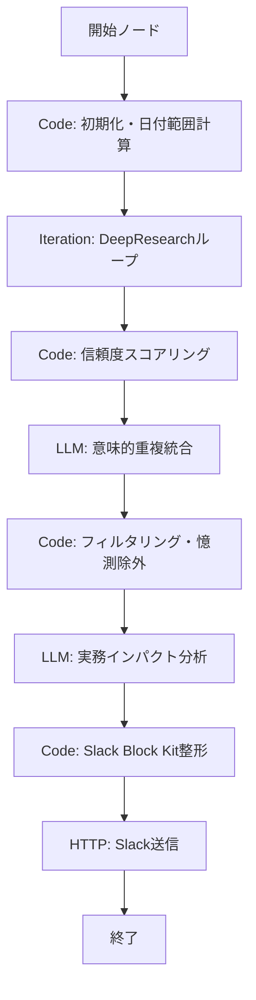

# AInews 改善設計書: 信頼度フィルタ + 実務インパクト変換

## 概要

現行の `AInews_Logic` ワークフローに対し、以下2つの最優先改善を統合的に適用する。

1. **信頼度フィルタ + 重複統合**: 収集段階で情報の質を担保
2. **実務インパクト変換**: 出力段階で「開発者にとっての意味」を明示

配信先をLINEからSlackに変更し、Block Kit形式で構造化された出力を行う。

---

## 改善後の全体フロー



### ノード一覧（既存 → 改善後）

| # | ノードID | 種別 | 役割 | 新規/既存 |
|---|---------|------|------|----------|
| 1 | `start` | Start | 入力変数定義 | 既存 |
| 2 | `code_date_array` | Code | 日付範囲・配列作成 | 既存 |
| 3 | `iteration_research` | Iteration | DeepResearchループ（Tavily検索） | 既存 |
| 4 | `code_credibility` | Code | 信頼度スコアリング | **新規** |
| 5 | `llm_dedup` | LLM | 意味的重複統合 | **新規** |
| 6 | `code_filter` | Code | フィルタリング・憶測検出 | **新規** |
| 7 | `llm_impact` | LLM | 実務インパクト分析 | **新規（既存reasoning_modelを置換）** |
| 8 | `code_slack_format` | Code | Slack Block Kit整形 | **新規（既存llm_format_1/2を置換）** |
| 9 | `http_slack_post` | HTTP | Slack Webhook送信 | **新規（既存http_line_pushを置換）** |
| 10 | `end` | End | 終了 | 既存 |

### エッジ定義

```yaml
edges:
  - source: start → target: code_date_array
  - source: code_date_array → target: iteration_research
  - source: iteration_research → target: code_credibility
  - source: code_credibility → target: llm_dedup
  - source: llm_dedup → target: code_filter
  - source: code_filter → target: llm_impact
  - source: llm_impact → target: code_slack_format
  - source: code_slack_format → target: http_slack_post
  - source: http_slack_post → target: end
```

---

## ステージ1: 信頼度スコアリング（code_credibility）

### ノード設定

```yaml
- id: code_credibility
  data:
    title: 信頼度スコアリング
    type: code
    code_language: python3
    variables:
      - value_selector: [iteration_research, output]
        variable: raw_findings
```

### Pythonコード

```python
def main(raw_findings: list) -> dict:
    """
    各ニュース項目にソース信頼度スコア(1-5)を付与する。
    入力: DeepResearchループから得られたfindings文字列のリスト
    出力: 信頼度スコア付きのニュースリスト
    """
    import re
    import json

    # ========================================
    # ドメインベース信頼度マッピング
    # ========================================

    # 信頼度5: 公式ブログ・リリースノート・論文
    TIER_5_DOMAINS = [
        # 主要AIベンダー公式
        "openai.com", "blog.openai.com",
        "anthropic.com", "www.anthropic.com",
        "deepmind.google", "blog.google",
        "ai.meta.com", "engineering.fb.com",
        "aws.amazon.com/blogs", "cloud.google.com/blog",
        "azure.microsoft.com/blog", "devblogs.microsoft.com",
        "nvidia.com/blog", "developer.nvidia.com",
        # 論文・学術
        "arxiv.org",
        "proceedings.neurips.cc", "proceedings.mlr.press",
        "aclanthology.org", "openreview.net",
        # 公式リリースノート・ドキュメント
        "github.com/openai", "github.com/anthropics",
        "github.com/google", "github.com/meta-llama",
        "huggingface.co/blog",
        # 大手クラウド公式
        "cloud.google.com", "docs.aws.amazon.com",
    ]

    # 信頼度4: 主要テックメディア
    TIER_4_DOMAINS = [
        "techcrunch.com", "theverge.com",
        "wired.com", "wired.jp",
        "arstechnica.com", "thenewstack.io",
        "venturebeat.com", "zdnet.com",
        "reuters.com", "bloomberg.com",
        "nikkei.com", "itmedia.co.jp",
        "japan.zdnet.com", "japan.cnet.com",
        "theregister.com", "infoworld.com",
        "siliconangle.com", "9to5google.com",
        "theinformation.com", "semafor.com",
        "towardsdatascience.com",
        "spectrum.ieee.org",
    ]

    # 信頼度3: 技術コミュニティ・ブログプラットフォーム
    TIER_3_DOMAINS = [
        "zenn.dev", "qiita.com",
        "dev.to", "medium.com",
        "note.com", "hatenablog.com",
        "hatena.ne.jp", "b.hatena.ne.jp",
        "hackernews.com", "news.ycombinator.com",
        "reddit.com/r/MachineLearning",
        "reddit.com/r/artificial",
        "stackoverflow.com",
        "gigazine.net", "gihyo.jp",
        "publickey1.jp", "codezine.jp",
    ]

    # 信頼度2: SNS
    TIER_2_DOMAINS = [
        "twitter.com", "x.com",
        "reddit.com",
        "threads.net",
        "bsky.app",
        "mastodon.social",
    ]

    def extract_urls(text):
        """テキストからURLを抽出"""
        url_pattern = r'https?://[^\s\)\]\}\"\'<>]+'
        return re.findall(url_pattern, text)

    def extract_domain(url):
        """URLからドメインを抽出"""
        try:
            # プロトコル除去
            domain = url.split("://")[1].split("/")[0]
            # www除去
            if domain.startswith("www."):
                domain = domain[4:]
            return domain
        except (IndexError, AttributeError):
            return ""

    def get_credibility_score(text):
        """テキスト中のURLからソース信頼度を判定"""
        urls = extract_urls(text)
        if not urls:
            return 1, "unknown", []

        best_score = 1
        best_source = "unknown"
        all_sources = []

        for url in urls:
            domain = extract_domain(url)
            full_url_lower = url.lower()
            score = 1
            source_type = "個人/不明"

            # ドメイン部分一致でチェック（より具体的なパスも考慮）
            for tier5 in TIER_5_DOMAINS:
                if tier5 in full_url_lower:
                    score = 5
                    source_type = "公式/論文"
                    break
            if score < 5:
                for tier4 in TIER_4_DOMAINS:
                    if tier4 in domain.lower() or tier4 in full_url_lower:
                        score = 4
                        source_type = "主要メディア"
                        break
            if score < 4:
                for tier3 in TIER_3_DOMAINS:
                    if tier3 in domain.lower() or tier3 in full_url_lower:
                        score = 3
                        source_type = "技術コミュニティ"
                        break
            if score < 3:
                for tier2 in TIER_2_DOMAINS:
                    if tier2 in domain.lower():
                        score = 2
                        source_type = "SNS"
                        break

            all_sources.append({"url": url, "domain": domain, "score": score})

            if score > best_score:
                best_score = score
                best_source = source_type

        return best_score, best_source, all_sources

    # ========================================
    # メイン処理: 各findingにスコア付与
    # ========================================
    scored_findings = []

    for finding in raw_findings:
        if not finding or not isinstance(finding, str):
            continue

        score, source_type, sources = get_credibility_score(finding)

        scored_findings.append({
            "content": finding,
            "credibility_score": score,
            "source_type": source_type,
            "source_urls": [s["url"] for s in sources],
            "source_domains": [s["domain"] for s in sources]
        })

    # スコア順にソート（高い方が先）
    scored_findings.sort(key=lambda x: x["credibility_score"], reverse=True)

    # 統計情報
    score_dist = {1: 0, 2: 0, 3: 0, 4: 0, 5: 0}
    for f in scored_findings:
        score_dist[f["credibility_score"]] = score_dist.get(f["credibility_score"], 0) + 1

    return {
        "scored_findings": json.dumps(scored_findings, ensure_ascii=False),
        "total_count": len(scored_findings),
        "score_distribution": json.dumps(score_dist, ensure_ascii=False)
    }
```

---

## ステージ2: 意味的重複統合（llm_dedup）

### ノード設定

```yaml
- id: llm_dedup
  data:
    title: 意味的重複統合
    type: llm
    model:
      provider: anthropic
      name: claude-sonnet-4-20250514
      mode: chat
      completion_params:
        temperature: 0.2
        max_tokens: 8000
```

### プロンプト

```yaml
prompt_template:
  - role: system
    text: |
      あなたはニュース記事の重複統合エキスパートです。

      ## タスク
      以下のニュース項目リスト(JSON)を分析し、**同一の出来事・話題を報じている項目をグループ化**して1件に統合してください。

      ## 入力データ（信頼度スコア付き）
      {{#code_credibility.scored_findings#}}

      ## 統合ルール

      ### 同一話題の判定基準
      - 同じ製品・サービスのリリースや更新について言及している
      - 同じ企業の同じ発表・決定について報じている
      - 同じ研究論文・技術成果について言及している
      - 同じ規制・政策の動きについて報じている
      ※ 「AIの規制全般」のような漠然とした共通テーマでは統合しない。具体的な出来事が同一の場合のみ統合する。

      ### 統合時の処理
      1. **最も信頼度スコアが高いソースの記述を主文とする**
      2. 他のソースの情報で主文を補完する（信頼度が高い情報を優先）
      3. ソースURL一覧を併記する
      4. 報じたソース数を記録する（複数ソースが報じている = 確度が高い）
      5. 統合後の信頼度 = max(個別スコア) + (ソース数が3以上なら+1、上限5)

      ## 出力形式（JSON配列）
      必ず以下のJSON配列で出力してください。Markdownのコードブロック(```)で囲んでください。

      ```json
      [
        {
          "id": 1,
          "title": "統合後のニュースタイトル（30文字以内）",
          "summary": "統合後の要約（事実ベース、200文字以内）",
          "credibility_score": 5,
          "source_count": 3,
          "source_urls": ["url1", "url2", "url3"],
          "source_types": ["公式/論文", "主要メディア", "技術コミュニティ"],
          "is_speculation": false,
          "original_count": 3
        },
        ...
      ]
      ```

      ## 重要な注意
      - 統合しすぎない。明確に同一の出来事の場合のみ統合する
      - 統合されなかった項目もそのまま含める（original_count: 1）
      - 元の情報を失わない。URLは必ず保持する
  - role: user
    text: |
      上記の入力データを分析し、重複統合を実施してください。
```

---

## ステージ3: フィルタリング・憶測除外（code_filter）

### ノード設定

```yaml
- id: code_filter
  data:
    title: フィルタリング・憶測除外
    type: code
    code_language: python3
    variables:
      - value_selector: [llm_dedup, text]
        variable: dedup_result
```

### Pythonコード

```python
def main(dedup_result: str) -> dict:
    """
    重複統合済みデータに対して:
    1. 信頼度2以下のソースのみの情報に「未確認」タグ付与
    2. 憶測記事パターンの検出
    3. 最終的な配信対象の選定
    """
    import json
    import re

    # ========================================
    # JSONパース（LLM出力からコードブロック抽出）
    # ========================================
    def parse_json_from_llm(text):
        """LLM出力からJSON配列を抽出"""
        # ```json ... ``` パターン
        match = re.search(r'```(?:json)?\s*(\[[\s\S]*?\])\s*```', text)
        if match:
            return json.loads(match.group(1))
        # 直接JSON配列
        match = re.search(r'\[[\s\S]*\]', text)
        if match:
            return json.loads(match.group(0))
        return []

    # ========================================
    # 憶測パターン定義
    # ========================================
    SPECULATION_PATTERNS_JA = [
        r'[〜～].+か[？?]?$',       # 「〜か」「〜か？」
        r'と見られ[るてい]',         # 「と見られる」
        r'と[のも]噂',              # 「との噂」
        r'可能性が(ある|高い|出てき)', # 「可能性がある」
        r'かもしれない',
        r'と[のも]?観測',           # 「との観測」
        r'未確認(情報|だが)',
        r'リーク(情報|によ)',
        r'噂では',
        r'らしい[。、]',
        r'(予想|予測|推測)され',
        r'と(思われ|考えられ)',
        r'見込み[だで]',
    ]

    SPECULATION_PATTERNS_EN = [
        r'(?i)\brumor(?:ed|s)?\b',
        r'(?i)\ballegedly\b',
        r'(?i)\breportedly\b',
        r'(?i)\bmay\s+(?:be|have|launch|release)\b',
        r'(?i)\bmight\s+(?:be|have)\b',
        r'(?i)\bcould\s+(?:be|launch|release)\b',
        r'(?i)\bexpected\s+to\b',
        r'(?i)\bunconfirmed\b',
        r'(?i)\bleak(?:ed|s)?\b',
        r'(?i)\bspeculat(?:ion|e|ed)\b',
    ]

    ALL_PATTERNS = SPECULATION_PATTERNS_JA + SPECULATION_PATTERNS_EN

    def detect_speculation(text):
        """憶測パターンの検出。マッチしたパターン数を返す"""
        count = 0
        matched = []
        for pattern in ALL_PATTERNS:
            if re.search(pattern, text):
                count += 1
                matched.append(pattern)
        return count, matched

    # ========================================
    # メイン処理
    # ========================================
    try:
        items = parse_json_from_llm(dedup_result)
    except (json.JSONDecodeError, Exception):
        # パース失敗時はそのまま通す
        return {
            "filtered_items": dedup_result,
            "filter_stats": json.dumps({
                "error": "JSON parse failed",
                "total": 0
            }, ensure_ascii=False)
        }

    filtered = []
    excluded = []
    stats = {
        "total_input": len(items),
        "passed": 0,
        "tagged_unconfirmed": 0,
        "tagged_speculation": 0,
        "excluded": 0
    }

    for item in items:
        if not isinstance(item, dict):
            continue

        score = item.get("credibility_score", 1)
        source_count = item.get("source_count", 1)
        summary = item.get("summary", "")
        title = item.get("title", "")
        full_text = f"{title} {summary}"

        # 憶測検出
        spec_count, spec_patterns = detect_speculation(full_text)
        is_speculation = item.get("is_speculation", False) or spec_count >= 2

        # フィルタリングロジック
        tags = []

        # 信頼度2以下 かつ 単一ソースのみ → 除外 or 未確認タグ
        if score <= 2 and source_count <= 1:
            if spec_count >= 1:
                # 低信頼度 + 憶測 → 除外
                excluded.append(item)
                stats["excluded"] += 1
                continue
            else:
                tags.append("未確認情報")
                stats["tagged_unconfirmed"] += 1

        # 信頼度3以上でも、強い憶測パターンがあればタグ付け
        if is_speculation:
            tags.append("憶測含む")
            stats["tagged_speculation"] += 1

        item["tags"] = tags
        item["speculation_score"] = spec_count
        filtered.append(item)
        stats["passed"] += 1

    # 信頼度・ソース数でソート
    filtered.sort(
        key=lambda x: (x.get("credibility_score", 0) * 10 + x.get("source_count", 0)),
        reverse=True
    )

    return {
        "filtered_items": json.dumps(filtered, ensure_ascii=False),
        "filter_stats": json.dumps(stats, ensure_ascii=False),
        "excluded_count": stats["excluded"]
    }
```

---

## ステージ4: 実務インパクト分析（llm_impact）

### ノード設定

```yaml
- id: llm_impact
  data:
    title: 実務インパクト分析
    type: llm
    model:
      provider: anthropic
      name: claude-sonnet-4-20250514
      mode: chat
      completion_params:
        temperature: 0.3
        max_tokens: 12000
```

### プロンプト（Claude向け実務インパクト分析）

```yaml
prompt_template:
  - role: system
    text: |
      あなたはソフトウェア開発チーム向けの「テクノロジーインテリジェンスアナリスト」です。
      ニュースの要約ではなく、**開発者が明日からの設計・実装・学習にどう活かすか**を分析してください。

      ## 入力データ（フィルタリング済み・信頼度スコア付き）
      {{#code_filter.filtered_items#}}

      ## 分析期間
      {{#code_date_array.date_range#}}

      ## あなたの出力フォーマット

      各ニュース項目について、以下の**3点固定フォーマット**で分析してください。

      ### 3点フォーマット
      1. **何が起きた**: 事実を1〜2文で。固有名詞・数値・日付を必ず含める。
      2. **誰に効く**: このニュースが影響するロール・領域を特定。
      3. **何を試すべきか**: 具体的なアクション。「〜を確認する」「〜を試す」「〜の移行を検討する」など。
         アクションがない場合は「ウォッチ継続」と明記。

      ### ロール別影響度タグ
      各項目に以下の4ロールへの影響度を付与してください:
      - **BE** (バックエンド): 高/中/低/-
      - **FE** (フロントエンド): 高/中/低/-
      - **ML** (ML/AI): 高/中/低/-
      - **Infra** (インフラ/DevOps): 高/中/低/-

      影響度の判断基準:
      - **高**: 直接的にアーキテクチャ・ツール選定・実装方針に影響する
      - **中**: 知っておくと設計判断に役立つ。半年以内に影響が出る可能性がある
      - **低**: 間接的に関連するが、すぐに対応の必要はない
      - **-**: 関連なし

      ### 優先度ランク
      各項目に以下の優先度を付与:
      - **CRITICAL**: 即座にチームで共有・対応検討すべき（重大な脆弱性、主要ツールのBreaking Change等）
      - **HIGH**: 今週中に目を通すべき
      - **MEDIUM**: 時間があるときに読むべき
      - **LOW**: 興味があれば

      ## 出力形式（JSON配列）
      ```json
      [
        {
          "id": 1,
          "priority": "HIGH",
          "title": "ニュースタイトル（30文字以内）",
          "what_happened": "何が起きた（事実、1〜2文）",
          "who_benefits": "誰に効く（対象ロール・領域の特定）",
          "what_to_try": "何を試すべきか（具体的アクション）",
          "roles": {
            "BE": "中",
            "FE": "-",
            "ML": "高",
            "Infra": "低"
          },
          "credibility_score": 5,
          "source_count": 3,
          "source_urls": ["url1", "url2"],
          "tags": [],
          "category": "LLM"
        }
      ]
      ```

      ## カテゴリ（自動分類）
      以下から最も適切な1つを選択:
      - LLM（大規模言語モデル・基盤モデル）
      - DevTools（開発ツール・フレームワーク）
      - Cloud（クラウド・インフラ）
      - Security（セキュリティ・脆弱性）
      - Research（研究・論文）
      - Business（ビジネス・企業動向）
      - Regulation（規制・政策）
      - OSS（オープンソース）

      ## 重要な制約
      - 入力にtagsとして「未確認情報」「憶測含む」がある場合、what_happenedの冒頭に【未確認】【憶測】と明記
      - 信頼度スコア(credibility_score)と情報源数(source_count)はそのまま引き継ぐ
      - 出力は**最大15件**に絞る。優先度が高い順に選定する
      - 「何を試すべきか」は抽象的な記述を避け、可能な限り具体的に（コマンド、URL、設定名などを含める）

  - role: user
    text: |
      上記の入力データを分析し、開発チーム向けの実務インパクト分析を実施してください。
```

---

## ステージ5: Slack Block Kit整形（code_slack_format）

### ノード設定

```yaml
- id: code_slack_format
  data:
    title: Slack Block Kit整形
    type: code
    code_language: python3
    variables:
      - value_selector: [llm_impact, text]
        variable: impact_result
      - value_selector: [code_date_array, date_range]
        variable: date_range
      - value_selector: [code_filter, filter_stats]
        variable: filter_stats
```

### Pythonコード

```python
def main(impact_result: str, date_range: str, filter_stats: str) -> dict:
    """
    LLMの実務インパクト分析結果をSlack Block Kit JSON形式に変換する。
    """
    import json
    import re

    # ========================================
    # JSONパース
    # ========================================
    def parse_json_from_llm(text):
        match = re.search(r'```(?:json)?\s*(\[[\s\S]*?\])\s*```', text)
        if match:
            return json.loads(match.group(1))
        match = re.search(r'\[[\s\S]*\]', text)
        if match:
            return json.loads(match.group(0))
        return []

    try:
        items = parse_json_from_llm(impact_result)
    except Exception:
        items = []

    try:
        stats = json.loads(filter_stats)
    except Exception:
        stats = {}

    # ========================================
    # 優先度の表示設定
    # ========================================
    PRIORITY_EMOJI = {
        "CRITICAL": ":rotating_light:",
        "HIGH": ":red_circle:",
        "MEDIUM": ":large_yellow_circle:",
        "LOW": ":white_circle:"
    }

    CREDIBILITY_BAR = {
        5: ":star::star::star::star::star:",
        4: ":star::star::star::star:",
        3: ":star::star::star:",
        2: ":star::star:",
        1: ":star:"
    }

    ROLE_DISPLAY = {
        "高": ":large_red_square:",
        "中": ":large_orange_square:",
        "低": ":white_large_square:",
        "-": ""
    }

    # ========================================
    # Block Kit構築
    # ========================================
    blocks = []

    # ヘッダー
    blocks.append({
        "type": "header",
        "text": {
            "type": "plain_text",
            "text": f":newspaper: AI/Tech Intelligence Report",
            "emoji": True
        }
    })

    blocks.append({
        "type": "context",
        "elements": [
            {
                "type": "mrkdwn",
                "text": f":calendar: {date_range} | :mag: {stats.get('total_input', '?')}件収集 → {stats.get('passed', '?')}件採用 ({stats.get('excluded', 0)}件除外)"
            }
        ]
    })

    blocks.append({"type": "divider"})

    # ロール別影響度の凡例
    blocks.append({
        "type": "section",
        "text": {
            "type": "mrkdwn",
            "text": "*ロール影響度*: :large_red_square:高 :large_orange_square:中 :white_large_square:低  |  BE=バックエンド FE=フロント ML=ML/AI Infra=インフラ"
        }
    })

    blocks.append({"type": "divider"})

    # CRITICAL/HIGHを先に、その後MEDIUM/LOW
    priority_order = {"CRITICAL": 0, "HIGH": 1, "MEDIUM": 2, "LOW": 3}
    items.sort(key=lambda x: priority_order.get(x.get("priority", "LOW"), 9))

    # 各ニュース項目
    for i, item in enumerate(items):
        if i >= 15:
            break

        priority = item.get("priority", "MEDIUM")
        priority_emoji = PRIORITY_EMOJI.get(priority, ":white_circle:")
        title = item.get("title", "不明")
        category = item.get("category", "")
        cred_score = item.get("credibility_score", 1)
        source_count = item.get("source_count", 1)
        tags = item.get("tags", [])
        tag_str = " ".join([f"`{t}`" for t in tags]) if tags else ""

        # ロール影響度バッジ
        roles = item.get("roles", {})
        role_badges = []
        for role_key in ["BE", "FE", "ML", "Infra"]:
            level = roles.get(role_key, "-")
            emoji = ROLE_DISPLAY.get(level, "")
            if emoji:
                role_badges.append(f"{emoji}{role_key}")
        role_str = " ".join(role_badges) if role_badges else "影響なし"

        # タイトル行
        blocks.append({
            "type": "section",
            "text": {
                "type": "mrkdwn",
                "text": f"{priority_emoji} *[{priority}]* `{category}` *{title}* {tag_str}"
            }
        })

        # 3点フォーマット
        what_happened = item.get("what_happened", "")
        who_benefits = item.get("who_benefits", "")
        what_to_try = item.get("what_to_try", "")

        blocks.append({
            "type": "section",
            "text": {
                "type": "mrkdwn",
                "text": (
                    f":one: *何が起きた*\n{what_happened}\n\n"
                    f":two: *誰に効く*\n{who_benefits}\n\n"
                    f":three: *何を試すべきか*\n{what_to_try}"
                )
            }
        })

        # メタ情報行
        cred_bar = CREDIBILITY_BAR.get(cred_score, ":star:")
        source_urls = item.get("source_urls", [])
        source_links = " | ".join([f"<{url}|src{j+1}>" for j, url in enumerate(source_urls[:3])])

        blocks.append({
            "type": "context",
            "elements": [
                {
                    "type": "mrkdwn",
                    "text": f"信頼度{cred_bar} ({source_count}件報道) | {role_str} | {source_links}"
                }
            ]
        })

        blocks.append({"type": "divider"})

    # フッター
    blocks.append({
        "type": "context",
        "elements": [
            {
                "type": "mrkdwn",
                "text": f":robot_face: Generated by AInews Intelligence | 信頼度1=不明 2=SNS 3=技術ブログ 4=主要メディア 5=公式/論文"
            }
        ]
    })

    # Slackメッセージペイロード
    payload = json.dumps({"blocks": blocks}, ensure_ascii=False)

    # Slack APIの制限: blocks最大50個
    # 超過時は分割フラグを立てる
    needs_split = len(blocks) > 50

    return {
        "slack_payload": payload,
        "block_count": len(blocks),
        "item_count": min(len(items), 15),
        "needs_split": needs_split
    }
```

---

## ステージ6: Slack送信（http_slack_post）

### ノード設定

```yaml
- id: http_slack_post
  data:
    title: Slack送信
    type: http-request
    method: POST
    url: "{{#env.SLACK_WEBHOOK_URL#}}"
    headers: |
      Content-Type: application/json
    body:
      type: raw-text
      data: "{{#code_slack_format.slack_payload#}}"
    timeout:
      max_connect_timeout: 10
      max_read_timeout: 30
```

### 環境変数

```yaml
environment_variables:
  - name: SLACK_WEBHOOK_URL
    value: "SET_IN_DIFY_ENV"
    value_type: secret
```

---

## Slack出力イメージ

以下はSlack上での表示イメージを疑似的に示したものである。

```
┌─────────────────────────────────────────────────────────┐
│  📰 AI/Tech Intelligence Report                         │
│  📅 2026年3月14日〜2026年3月20日                           │
│  🔍 45件収集 → 12件採用 (8件除外)                          │
├─────────────────────────────────────────────────────────┤
│  ロール影響度: 🟥高 🟧中 ⬜低                              │
│  BE=バックエンド FE=フロント ML=ML/AI Infra=インフラ         │
├─────────────────────────────────────────────────────────┤
│                                                         │
│  🔴 [HIGH] `LLM` Claude 4 Opus リリース                  │
│                                                         │
│  1️⃣ 何が起きた                                           │
│  Anthropicが3/18にClaude 4 Opusをリリース。               │
│  コーディングベンチマークでGPT-5を上回る結果。                │
│                                                         │
│  2️⃣ 誰に効く                                            │
│  LLMをAPI経由で利用する全バックエンド開発者。                 │
│  特にコード生成・レビュー自動化を導入済みのチーム。            │
│                                                         │
│  3️⃣ 何を試すべきか                                       │
│  Anthropic APIでmodel=claude-opus-4-20250514に           │
│  切り替えて既存プロンプトの出力品質を比較検証する。            │
│  特にコード生成タスクでの精度向上を確認。                     │
│                                                         │
│  信頼度⭐⭐⭐⭐⭐ (5件報道)                               │
│  🟥BE 🟧FE 🟥ML ⬜Infra                                  │
│  src1 | src2 | src3                                      │
├─────────────────────────────────────────────────────────┤
│                                                         │
│  🟡 [MEDIUM] `DevTools` Next.js 16 RC公開                │
│                                                         │
│  1️⃣ 何が起きた                                           │
│  VercelがNext.js 16 RCを公開。Server Actionsの            │
│  パフォーマンスが40%改善、Turbopackが安定版に。              │
│                                                         │
│  2️⃣ 誰に効く                                            │
│  Next.jsを採用しているフロントエンドチーム全般。              │
│                                                         │
│  3️⃣ 何を試すべきか                                       │
│  npx create-next-app@canary でRCを試し、                  │
│  既存プロジェクトのビルド時間を比較する。                     │
│  Breaking Changesリストを確認:                             │
│  https://nextjs.org/blog/next-16-rc                      │
│                                                         │
│  信頼度⭐⭐⭐⭐⭐ (2件報道)                               │
│  ⬜BE 🟥FE ⬜ML ⬜Infra                                  │
│  src1 | src2                                             │
├─────────────────────────────────────────────────────────┤
│  🤖 Generated by AInews Intelligence                     │
│  信頼度1=不明 2=SNS 3=技術ブログ 4=主要メディア 5=公式/論文 │
└─────────────────────────────────────────────────────────┘
```

---

## 信頼度判定ドメインリスト（完全版）

### Tier 5: 公式ブログ・リリースノート・論文（信頼度5）

| カテゴリ | ドメイン |
|---------|---------|
| **AI企業公式** | `openai.com`, `blog.openai.com` |
| | `anthropic.com`, `www.anthropic.com` |
| | `deepmind.google`, `blog.google/technology/ai` |
| | `ai.meta.com`, `engineering.fb.com` |
| | `huggingface.co/blog` |
| | `stability.ai` |
| | `mistral.ai` |
| | `cohere.com/blog` |
| **クラウドベンダー** | `aws.amazon.com/blogs` |
| | `cloud.google.com/blog` |
| | `azure.microsoft.com/blog`, `devblogs.microsoft.com` |
| | `developer.nvidia.com`, `nvidia.com/blog` |
| **論文・学術** | `arxiv.org` |
| | `proceedings.neurips.cc` |
| | `proceedings.mlr.press` |
| | `aclanthology.org` |
| | `openreview.net` |
| | `paperswithcode.com` |
| **公式GitHub** | `github.com/openai`, `github.com/anthropics` |
| | `github.com/google`, `github.com/meta-llama` |
| | `github.com/microsoft`, `github.com/aws` |
| | `github.com/huggingface` |

### Tier 4: 主要テックメディア（信頼度4）

| カテゴリ | ドメイン |
|---------|---------|
| **英語圏** | `techcrunch.com`, `theverge.com`, `wired.com` |
| | `arstechnica.com`, `venturebeat.com` |
| | `zdnet.com`, `infoworld.com` |
| | `thenewstack.io`, `theregister.com` |
| | `siliconangle.com`, `9to5google.com` |
| | `theinformation.com`, `semafor.com` |
| **通信社・経済紙** | `reuters.com`, `bloomberg.com` |
| | `wsj.com`, `ft.com` |
| **日本語圏** | `nikkei.com`, `itmedia.co.jp` |
| | `japan.zdnet.com`, `japan.cnet.com` |
| | `wired.jp` |
| **専門メディア** | `towardsdatascience.com` |
| | `spectrum.ieee.org` |
| | `technologyreview.com` (MIT) |

### Tier 3: 技術コミュニティ（信頼度3）

| カテゴリ | ドメイン |
|---------|---------|
| **日本語** | `zenn.dev`, `qiita.com`, `note.com` |
| | `hatenablog.com`, `hatena.ne.jp` |
| | `gigazine.net`, `gihyo.jp` |
| | `publickey1.jp`, `codezine.jp` |
| **英語** | `dev.to`, `medium.com` |
| | `news.ycombinator.com` |
| | `stackoverflow.com` |
| | `reddit.com/r/MachineLearning` |

### Tier 2: SNS（信頼度2）

| ドメイン |
|---------|
| `twitter.com`, `x.com` |
| `reddit.com`（ML以外のサブレディット） |
| `threads.net` |
| `bsky.app` |
| `mastodon.social` |

### Tier 1: 不明・個人ブログ（信頼度1）

上記いずれにも該当しないドメイン。

---

## Iterationノード内部の変更は不要

既存の `iteration_research` ノード（DeepResearchループ）はそのまま活用する。変更が必要なのはイテレーション終了後のパイプライン部分のみである。

### 既存ノードの接続変更

```
変更前:
  iteration_research → reasoning_model → llm_format_1 → http_line_push → end
                                       → llm_format_2 ↗

変更後:
  iteration_research → code_credibility → llm_dedup → code_filter → llm_impact → code_slack_format → http_slack_post → end
```

削除対象ノード:
- `reasoning_model`（llm_impactに統合）
- `llm_format_1`（code_slack_formatに統合）
- `llm_format_2`（code_slack_formatに統合）
- `http_line_push`（http_slack_postに置換）

---

## Conversation Variables の追加

既存の `topics`, `findings`, `nextSearchTopic`, `shouldContinue` に加えて変更不要。
パイプライン後段の新ノードはConversation Variablesを使用せず、ノード間の直接データ受け渡しで動作する。

---

## コスト・パフォーマンス考慮

### LLM呼び出し回数の変化

| 段階 | 変更前 | 変更後 |
|------|--------|--------|
| イテレーション内 | gemini-2.0-flash x N回 | 変更なし |
| レポート生成 | gemini-thinking x 1回 | claude-sonnet x 1回（llm_dedup） |
| 整形 | gemini-flash x 2回 | claude-sonnet x 1回（llm_impact） |
| **合計(後段)** | **3回** | **2回** |

後段のLLM呼び出し回数は3回から2回に削減される。ただし各呼び出しでの入出力トークン数は増える可能性がある。

### 処理時間の目安

- `code_credibility`: <1秒（純粋なPython処理）
- `llm_dedup`: 10〜20秒（Claude Sonnet）
- `code_filter`: <1秒（純粋なPython処理）
- `llm_impact`: 15〜30秒（Claude Sonnet）
- `code_slack_format`: <1秒（純粋なPython処理）

合計で既存と同等程度（30〜60秒の増加）。

---

## 段階的導入の推奨

一度にすべてを入れ替えるのではなく、以下の順で段階的に導入することを推奨する。

### Phase 1: 信頼度スコアリング + フィルタリング
- `code_credibility` と `code_filter` のみを追加
- 既存の `reasoning_model` の前に挿入
- フィルタ済みデータを既存プロンプトに渡す
- **リスク: 低** / **効果: 情報の質が向上**

### Phase 2: 重複統合
- `llm_dedup` を `code_credibility` と `code_filter` の間に追加
- **リスク: 中**（LLMのJSON出力精度に依存）/ **効果: 重複排除**

### Phase 3: 実務インパクト変換 + Slack Block Kit
- `llm_impact` + `code_slack_format` + `http_slack_post` に切り替え
- LINE配信を停止し、Slack配信に完全移行
- **リスク: 中**（出力フォーマットの大幅変更）/ **効果: 最大**
