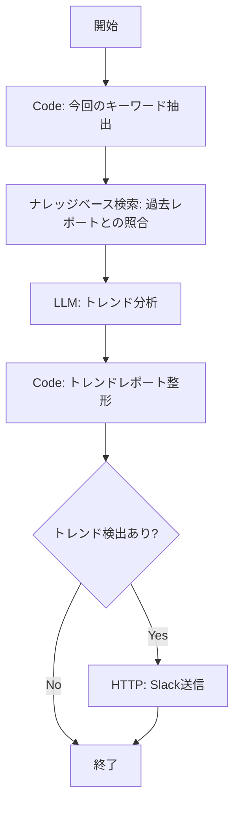
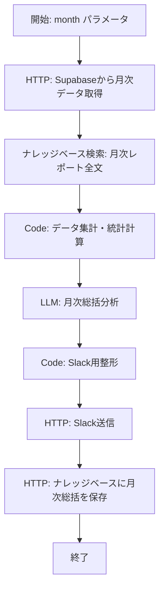
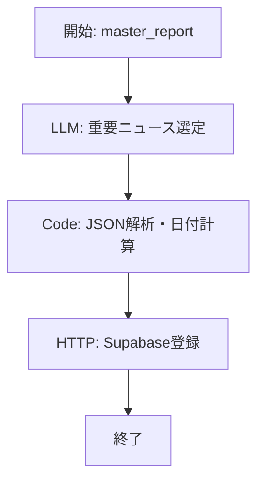
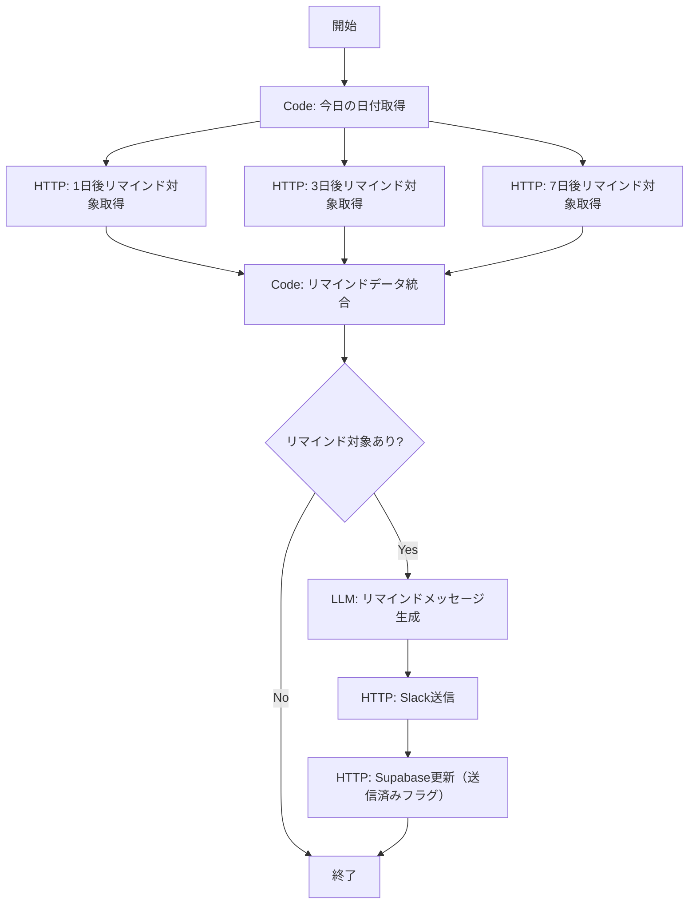
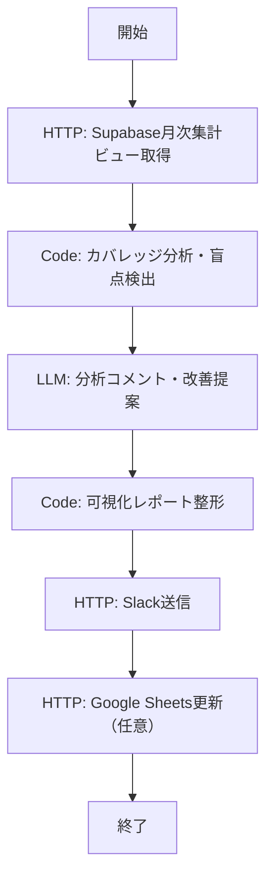

# ナレッジ蓄積システム設計書
## AI/IT技術知識の「蓄積・振り返り・定着」

---

## 全体アーキテクチャ

既存の `AInews_DeepResearch_Hybrid` ワークフロー（月水金配信）を「親アプリ」として、以下4つのサブシステムを追加構築する。

```
┌─────────────────────────────────────────────────────────┐
│                    既存システム                            │
│  AInews_DeepResearch_Hybrid (月水金 Slack/LINE配信)       │
│  ・Tavily検索 → マスターレポート → 8カテゴリ分類 → 配信    │
└──────────┬──────────────────────────────────────────────┘
           │ レポートデータを保存
           ▼
┌─────────────────────────────────────────────────────────┐
│              ナレッジストア (共通データ層)                  │
│  ・Difyナレッジベース「AInews_Archive」                    │
│  ・各レポートをドキュメントとして蓄積                       │
│  ・メタデータ: 日付, カテゴリ, キーワード, 重要度           │
└──────────┬──────────────────────────────────────────────┘
           │
     ┌─────┼──────┬──────────┐
     ▼     ▼      ▼          ▼
   [1]   [2]    [3]        [4]
  トレンド 月次   間隔反復  ポートフォリオ
  トラッキング 総括 リマインド  可視化
```

---

## 共通データ層: ナレッジストアの構築

### 保存方式の選定

| 方式 | メリット | デメリット | 採否 |
|------|---------|-----------|------|
| Difyナレッジベース | Dify内で完結、RAG検索が可能、セットアップ不要 | 構造化クエリが弱い、メタデータ検索が限定的 | **主軸として採用** |
| 外部DB (Supabase/PostgreSQL) | 構造化クエリ可能、集計が容易 | 別途構築・運用が必要 | **補助として採用** |
| ファイル保存 (Google Sheets) | 可視化が容易、非エンジニアも編集可能 | スケーラビリティに限界 | ポートフォリオ可視化で採用 |

### Difyナレッジベース「AInews_Archive」の構成

既存ワークフローのマスターレポート作成後に、レポートをナレッジベースに自動保存するノードを追加する。

**保存フォーマット（1配信 = 1ドキュメント）:**
```
---
date: 2026-03-19
type: regular_report
categories_covered: [llm, business, research, regulation, creative, implementation, risk, future]
keywords: [GPT-5, EU AI Act, Sora, ...]
importance_scores: {llm: 8, business: 6, research: 9, ...}
---

# AIニュースレポート 2026年3月19日

## 大規模言語モデル・基盤モデル
- OpenAIがGPT-5を発表、マルチモーダル性能が大幅向上（2026年3月18日）
...

## ビジネス・企業動向
...
```

### 既存ワークフローへの追加ノード: レポート保存

**追加位置**: `master_report_llm` の後、`message_splitter` の前

**ノード1: Code - メタデータ抽出**
ノードID: `metadata_extractor`

```python
def main(master_report: str, date_range: str) -> dict:
    """
    マスターレポートからメタデータを抽出し、
    ナレッジベース保存用のフォーマットを生成
    """
    import json
    from datetime import datetime

    today = datetime.now().strftime('%Y-%m-%d')

    # カテゴリごとのニュース件数をカウント
    category_map = {
        "大規模言語モデル": "llm",
        "ビジネス": "business",
        "研究": "research",
        "規制": "regulation",
        "クリエイティブ": "creative",
        "実用化": "implementation",
        "リスク": "risk",
        "未来": "future"
    }

    categories_covered = []
    news_items = []
    current_category = None

    for line in master_report.split('\n'):
        line_stripped = line.strip()
        # カテゴリ見出しの検出
        if line_stripped.startswith('## '):
            for jp_name, en_name in category_map.items():
                if jp_name in line_stripped:
                    current_category = en_name
                    categories_covered.append(en_name)
                    break
        # ニュース項目の検出（箇条書き）
        elif line_stripped.startswith('- ') and current_category:
            news_items.append({
                "category": current_category,
                "text": line_stripped[2:],
                "date": today
            })

    # キーワード抽出用のテキスト（LLMに渡す）
    keywords_source = master_report[:3000]

    # ナレッジベース保存用ドキュメント
    document_text = f"---\ndate: {today}\ntype: regular_report\ncategories_covered: {json.dumps(categories_covered)}\n---\n\n{master_report}"

    return {
        "document_text": document_text,
        "date": today,
        "categories_covered": categories_covered,
        "news_count": len(news_items),
        "news_items_json": json.dumps(news_items, ensure_ascii=False),
        "keywords_source": keywords_source
    }
```

**ノード2: LLM - キーワード抽出**
ノードID: `keyword_extractor_llm`

```yaml
provider: langgenius/gemini/google
name: gemini-2.0-flash
mode: chat
temperature: 0.3
system: |
  以下のニュースレポートから、主要な固有名詞・技術キーワードを最大20個抽出してください。
  JSON配列形式で出力してください。例: ["GPT-5", "EU AI Act", "Sora"]

  レポート:
  {{#metadata_extractor.keywords_source#}}
user: キーワードを抽出してください。
```

**ノード3: HTTP Request - Difyナレッジベースへ保存**
ノードID: `save_to_knowledge_base`

```yaml
method: POST
url: http://localhost/v1/datasets/{DATASET_ID}/document/create-by-text
headers:
  Authorization: Bearer {DIFY_API_KEY}
  Content-Type: application/json
body:
  type: json
  data: |
    {
      "name": "report_{{#metadata_extractor.date#}}",
      "text": "{{#metadata_extractor.document_text#}}",
      "indexing_technique": "high_quality",
      "process_rule": {
        "mode": "automatic"
      }
    }
```

**ノード4: HTTP Request - 外部DB (Supabase) へメタデータ保存**
ノードID: `save_to_supabase`

```yaml
method: POST
url: https://{PROJECT_REF}.supabase.co/rest/v1/news_reports
headers:
  apikey: {SUPABASE_ANON_KEY}
  Authorization: Bearer {SUPABASE_ANON_KEY}
  Content-Type: application/json
  Prefer: return=minimal
body:
  type: json
  data: |
    {
      "report_date": "{{#metadata_extractor.date#}}",
      "categories_covered": {{#metadata_extractor.categories_covered#}},
      "news_count": {{#metadata_extractor.news_count#}},
      "news_items": {{#metadata_extractor.news_items_json#}},
      "keywords": {{#keyword_extractor_llm.text#}},
      "full_report": "{{#master_report_llm.text#}}"
    }
```

### Supabaseテーブル定義

```sql
-- メインテーブル: レポート
CREATE TABLE news_reports (
    id BIGSERIAL PRIMARY KEY,
    report_date DATE NOT NULL,
    categories_covered JSONB NOT NULL DEFAULT '[]',
    news_count INTEGER NOT NULL DEFAULT 0,
    news_items JSONB NOT NULL DEFAULT '[]',
    keywords JSONB NOT NULL DEFAULT '[]',
    full_report TEXT NOT NULL,
    created_at TIMESTAMPTZ NOT NULL DEFAULT NOW()
);

-- トレンドトラッキング用: キーワード出現履歴
CREATE TABLE keyword_occurrences (
    id BIGSERIAL PRIMARY KEY,
    keyword TEXT NOT NULL,
    report_date DATE NOT NULL,
    category TEXT NOT NULL,
    context TEXT,  -- キーワードが登場した文脈（1-2文）
    created_at TIMESTAMPTZ NOT NULL DEFAULT NOW()
);

CREATE INDEX idx_keyword_occurrences_keyword ON keyword_occurrences(keyword);
CREATE INDEX idx_keyword_occurrences_date ON keyword_occurrences(report_date);

-- 間隔反復用: リマインドスケジュール
CREATE TABLE spaced_repetition_queue (
    id BIGSERIAL PRIMARY KEY,
    news_item_text TEXT NOT NULL,
    category TEXT NOT NULL,
    importance_score INTEGER NOT NULL DEFAULT 5,  -- 1-10
    original_date DATE NOT NULL,
    remind_date_1 DATE NOT NULL,  -- +1日
    remind_date_3 DATE NOT NULL,  -- +3日
    remind_date_7 DATE NOT NULL,  -- +7日
    reminded_1 BOOLEAN NOT NULL DEFAULT FALSE,
    reminded_3 BOOLEAN NOT NULL DEFAULT FALSE,
    reminded_7 BOOLEAN NOT NULL DEFAULT FALSE,
    created_at TIMESTAMPTZ NOT NULL DEFAULT NOW()
);

CREATE INDEX idx_spaced_repetition_remind ON spaced_repetition_queue(remind_date_1, remind_date_3, remind_date_7);

-- ポートフォリオ可視化用: カテゴリ別月次集計
CREATE VIEW monthly_category_summary AS
SELECT
    DATE_TRUNC('month', report_date) AS month,
    category_elem AS category,
    COUNT(*) AS news_count
FROM news_reports,
     LATERAL jsonb_array_elements_text(categories_covered) AS category_elem
GROUP BY DATE_TRUNC('month', report_date), category_elem
ORDER BY month DESC, news_count DESC;
```

---

## 1. トレンドトラッキング（経時変化検知）

### 目的
同じトピック（キーワード）が複数回のレポートにまたがって登場した場合、「継続的トレンド」として検知し、ハイライトする。

### Difyワークフロー: `TrendTracker`

**実行タイミング**: 毎回のニュース配信時（月水金）、メインレポート作成後に実行



#### ノード詳細

**ノード1: Code - 今回のキーワードリスト取得**
ノードID: `get_current_keywords`

```python
def main(keywords_json: str) -> dict:
    """
    今回のレポートから抽出されたキーワードを取得
    """
    import json
    try:
        keywords = json.loads(keywords_json)
    except:
        keywords = []

    # 各キーワードを個別の検索クエリに変換
    search_queries = []
    for kw in keywords[:15]:  # 最大15キーワード
        search_queries.append(kw)

    return {
        "keywords": keywords,
        "search_queries": search_queries,
        "query_text": " OR ".join(keywords[:10])  # ナレッジベース検索用
    }
```

**ノード2: ナレッジベース検索（Knowledge Retrieval）**
ノードID: `search_past_reports`

```yaml
type: knowledge-retrieval
dataset_ids:
  - {AInews_Archive_DATASET_ID}
query_variable_selector:
  - get_current_keywords
  - query_text
retrieval_mode: multiple
multiple_retrieval_config:
  top_k: 10
  score_threshold: 0.6
  reranking_mode:
    reranking_provider_name: langgenius/gemini/google
    reranking_model_name: gemini-2.0-flash
```

**ノード3: LLM - トレンド分析**
ノードID: `trend_analyzer_llm`

```yaml
provider: langgenius/gemini/google
name: gemini-2.0-flash
mode: chat
temperature: 0.5
system: |
  あなたはAI業界のトレンドアナリストです。

  ## 今回のレポートのキーワード
  {{#get_current_keywords.keywords#}}

  ## 過去のレポートから検索された関連情報
  {{#search_past_reports.result#}}

  ## タスク
  以下の基準で「継続的トレンド」を検出してください:

  1. **ホットトレンド**: 過去2週間(4回以上の配信)で3回以上登場したキーワード/トピック
  2. **ライジングトレンド**: 過去1週間で初めて登場し、今回も登場したキーワード（勢いがある）
  3. **定番トピック**: 過去1ヶ月以上にわたって継続的に登場しているキーワード

  各トレンドについて以下を分析してください:
  - トレンド名
  - 分類（ホット/ライジング/定番）
  - 初出日（推定）
  - 登場回数（推定）
  - 経時変化の要約（どう発展しているか）
  - 今後の予測

  ## 出力形式（JSON）
  {
    "trends": [
      {
        "name": "トレンド名",
        "type": "hot|rising|established",
        "first_seen": "YYYY-MM-DD",
        "occurrence_count": 3,
        "evolution_summary": "経時変化の説明",
        "prediction": "今後の予測"
      }
    ],
    "has_notable_trends": true
  }

user: トレンド分析を実行してください。
```

**ノード4: Code - Slack用トレンドレポート整形**
ノードID: `format_trend_report`

```python
def main(trend_analysis: str) -> dict:
    import json

    try:
        data = json.loads(trend_analysis)
    except:
        return {"has_trends": False, "slack_message": ""}

    trends = data.get("trends", [])
    has_notable = data.get("has_notable_trends", False)

    if not has_notable or not trends:
        return {"has_trends": False, "slack_message": ""}

    # Slack Block Kit形式で整形
    type_emoji = {
        "hot": ":fire:",
        "rising": ":chart_with_upwards_trend:",
        "established": ":anchor:"
    }
    type_label = {
        "hot": "ホットトレンド",
        "rising": "ライジングトレンド",
        "established": "定番トピック"
    }

    blocks = []
    blocks.append({
        "type": "header",
        "text": {
            "type": "plain_text",
            "text": ":mag: トレンドトラッキング速報"
        }
    })
    blocks.append({"type": "divider"})

    for t in trends:
        emoji = type_emoji.get(t.get("type", ""), ":bulb:")
        label = type_label.get(t.get("type", ""), "その他")
        name = t.get("name", "不明")
        count = t.get("occurrence_count", "?")
        evolution = t.get("evolution_summary", "")
        prediction = t.get("prediction", "")

        text = (
            f"{emoji} *{name}* ({label})\n"
            f">登場回数: {count}回 | 初出: {t.get('first_seen', '不明')}\n"
            f">経過: {evolution}\n"
            f">予測: {prediction}"
        )
        blocks.append({
            "type": "section",
            "text": {"type": "mrkdwn", "text": text}
        })

    slack_message = json.dumps({"blocks": blocks}, ensure_ascii=False)

    return {
        "has_trends": True,
        "slack_message": slack_message
    }
```

**ノード5: IF/ELSE - トレンド検出判定**

```yaml
cases:
  - case_id: 'has_trends'
    conditions:
      - comparison_operator: is
        value: 'true'
        varType: string
        variable_selector: [format_trend_report, has_trends]
```

**ノード6: HTTP Request - Slack送信**
ノードID: `slack_trend_notification`

```yaml
method: POST
url: https://slack.com/api/chat.postMessage
headers:
  Authorization: Bearer {SLACK_BOT_TOKEN}
  Content-Type: application/json
body:
  type: json
  data: |
    {
      "channel": "{SLACK_CHANNEL_ID}",
      "text": "トレンドトラッキング速報",
      "blocks": {{#format_trend_report.slack_message#}}
    }
```

### Slack表示イメージ

```
━━━━━━━━━━━━━━━━━━━━━━━━
:mag: トレンドトラッキング速報
━━━━━━━━━━━━━━━━━━━━━━━━

:fire: *GPT-5 マルチモーダル機能* (ホットトレンド)
  > 登場回数: 5回 | 初出: 2026-03-05
  > 経過: 3/5にリーク情報 → 3/10に公式ティーザー → 3/17に正式発表
  > 予測: 来週にかけてベンチマーク比較記事が増加する見込み

:chart_with_upwards_trend: *EU AI Act 施行準備* (ライジングトレンド)
  > 登場回数: 3回 | 初出: 2026-03-12
  > 経過: 施行期限が近づき、企業の対応事例が急増
  > 予測: コンプライアンスツール市場が活性化

:anchor: *RAG技術の進化* (定番トピック)
  > 登場回数: 12回 | 初出: 2026-01-08
  > 経過: チャンキング手法の多様化からGraphRAGへの移行が加速
  > 予測: エンタープライズ向けRAGプラットフォームの統合が進む
━━━━━━━━━━━━━━━━━━━━━━━━
```

---

## 2. エバーグリーンダイジェスト（月次総括）

### 目的
月内の全配信（月水金 x 約4週 = 約12回）を月末にまとめ、「今月のトップトレンド」「今月最も議論された技術」「来月注目すべき動向」を自動生成する。

### Difyワークフロー: `MonthlyDigest`

**実行タイミング**: 毎月最終営業日（Dify外部スケジューラまたはcronでAPIトリガー）



#### ノード詳細

**ノード1: 開始ノード**

```yaml
variables:
  - label: target_month
    type: text-input
    required: false
    variable: target_month
    description: 対象月（例: "2026-03"）。空の場合は前月を自動計算
```

**ノード2: Code - 月次パラメータ計算**
ノードID: `calc_month_params`

```python
def main(target_month: str = "") -> dict:
    from datetime import datetime, timedelta

    if not target_month:
        # 前月を自動計算
        today = datetime.now()
        first_of_this_month = today.replace(day=1)
        last_of_prev_month = first_of_this_month - timedelta(days=1)
        target_month = last_of_prev_month.strftime('%Y-%m')

    year, month = target_month.split('-')
    year, month = int(year), int(month)

    # 月の開始日と終了日
    start_date = f"{year}-{month:02d}-01"
    if month == 12:
        end_date = f"{year + 1}-01-01"
    else:
        end_date = f"{year}-{month + 1:02d}-01"

    month_label = f"{year}年{month}月"

    return {
        "target_month": target_month,
        "start_date": start_date,
        "end_date": end_date,
        "month_label": month_label,
        "kb_query": f"AIニュースレポート {month_label}"
    }
```

**ノード3: HTTP Request - Supabaseから月次データ取得**
ノードID: `fetch_monthly_data`

```yaml
method: GET
url: https://{PROJECT_REF}.supabase.co/rest/v1/news_reports?report_date=gte.{{#calc_month_params.start_date#}}&report_date=lt.{{#calc_month_params.end_date#}}&order=report_date.asc
headers:
  apikey: {SUPABASE_ANON_KEY}
  Authorization: Bearer {SUPABASE_ANON_KEY}
```

**ノード4: ナレッジベース検索 - 月次レポート全文取得**
ノードID: `fetch_monthly_kb`

```yaml
type: knowledge-retrieval
dataset_ids:
  - {AInews_Archive_DATASET_ID}
query_variable_selector:
  - calc_month_params
  - kb_query
retrieval_mode: multiple
multiple_retrieval_config:
  top_k: 20
  score_threshold: 0.5
```

**ノード5: Code - データ集計**
ノードID: `aggregate_monthly_data`

```python
def main(monthly_data_json: str, kb_results: str) -> dict:
    import json
    from collections import Counter

    try:
        reports = json.loads(monthly_data_json)
    except:
        reports = []

    # カテゴリ別集計
    category_counts = Counter()
    all_keywords = Counter()
    total_news = 0

    for report in reports:
        total_news += report.get("news_count", 0)
        for cat in report.get("categories_covered", []):
            category_counts[cat] += 1
        for kw in report.get("keywords", []):
            all_keywords[kw] += 1

    # トップキーワード（頻出順）
    top_keywords = all_keywords.most_common(20)

    # カテゴリバランス
    categories = ["llm", "business", "research", "regulation",
                  "creative", "implementation", "risk", "future"]
    category_balance = {}
    for cat in categories:
        category_balance[cat] = category_counts.get(cat, 0)

    # 週次推移（簡易）
    weekly_counts = {}
    for report in reports:
        date_str = report.get("report_date", "")
        if date_str:
            # 簡易的に日付の上旬/中旬/下旬で分類
            day = int(date_str.split('-')[2])
            if day <= 10:
                period = "上旬"
            elif day <= 20:
                period = "中旬"
            else:
                period = "下旬"
            weekly_counts[period] = weekly_counts.get(period, 0) + report.get("news_count", 0)

    return {
        "total_reports": len(reports),
        "total_news": total_news,
        "top_keywords": json.dumps(top_keywords, ensure_ascii=False),
        "category_balance": json.dumps(category_balance, ensure_ascii=False),
        "weekly_counts": json.dumps(weekly_counts, ensure_ascii=False),
        "summary_text": f"レポート数: {len(reports)}回, ニュース総数: {total_news}件, トップキーワード: {', '.join([k for k, v in top_keywords[:5]])}"
    }
```

**ノード6: LLM - 月次総括分析**
ノードID: `monthly_analysis_llm`

```yaml
provider: langgenius/gemini/google
name: gemini-2.0-flash-thinking-exp-01-21
mode: chat
temperature: 0.7
system: |
  あなたはAI/IT業界の月次アナリストです。
  今月のニュース配信データを分析し、月次総括レポートを作成してください。

  ## 入力データ
  - 対象月: {{#calc_month_params.month_label#}}
  - レポート数: {{#aggregate_monthly_data.total_reports#}}回
  - ニュース総数: {{#aggregate_monthly_data.total_news#}}件
  - トップキーワード: {{#aggregate_monthly_data.top_keywords#}}
  - カテゴリバランス: {{#aggregate_monthly_data.category_balance#}}
  - 週次推移: {{#aggregate_monthly_data.weekly_counts#}}

  ## 過去レポートの参照データ
  {{#fetch_monthly_kb.result#}}

  ## 出力構成（必ずこの順番で記述）

  ### 1. 今月のトップトレンド TOP5
  最も頻繁に取り上げられ、業界への影響が大きかったトピックを5つ選出。
  各トレンドに「重要度スコア（10点満点）」と「一言要約」を付与。

  ### 2. 今月最も議論された技術 TOP3
  技術的な観点で最も注目を集めた技術を3つ選出。
  各技術の「現在の成熟度」「実用化までの距離」を評価。

  ### 3. カテゴリ別ハイライト
  8カテゴリそれぞれの今月のハイライトを1-2行で記述。
  カバレッジが薄いカテゴリがあれば指摘。

  ### 4. 来月注目すべき動向 TOP3
  今月のトレンドから予測される、来月注目すべき動向を3つ予測。
  各予測に「確信度（高/中/低）」を付与。

  ### 5. 月間サマリー統計
  - ニュース総数、カテゴリ別件数、上旬/中旬/下旬の推移

  文体は「だ・である」調で客観的に。

user: 月次総括レポートを作成してください。
```

**ノード7: Code - Slack用整形**
ノードID: `format_monthly_slack`

```python
def main(monthly_analysis: str, month_label: str, category_balance: str) -> dict:
    import json

    try:
        cat_bal = json.loads(category_balance)
    except:
        cat_bal = {}

    # カテゴリバランスのバーチャート（テキストベース）
    cat_names = {
        "llm": "LLM/基盤モデル",
        "business": "ビジネス    ",
        "research": "研究/技術革新",
        "regulation": "規制/政策    ",
        "creative": "クリエイティブ",
        "implementation": "実用化/導入  ",
        "risk": "リスク/倫理  ",
        "future": "未来展望     "
    }

    max_count = max(cat_bal.values()) if cat_bal else 1
    bar_chart_lines = []
    for cat_id, cat_name in cat_names.items():
        count = cat_bal.get(cat_id, 0)
        bar_length = int((count / max_count) * 15) if max_count > 0 else 0
        bar = "█" * bar_length + "░" * (15 - bar_length)
        bar_chart_lines.append(f"{cat_name} {bar} {count}件")

    bar_chart = "\n".join(bar_chart_lines)

    slack_text = (
        f"━━━━━━━━━━━━━━━━━━━━━━━━\n"
        f":books: *{month_label} エバーグリーンダイジェスト*\n"
        f"━━━━━━━━━━━━━━━━━━━━━━━━\n\n"
        f"{monthly_analysis}\n\n"
        f"━━━━━━━━━━━━━━━━━━━━━━━━\n"
        f":bar_chart: *カテゴリカバレッジ*\n"
        f"```\n{bar_chart}\n```\n"
        f"━━━━━━━━━━━━━━━━━━━━━━━━"
    )

    return {
        "slack_text": slack_text
    }
```

**ノード8: HTTP Request - Slack送信**

```yaml
method: POST
url: https://slack.com/api/chat.postMessage
headers:
  Authorization: Bearer {SLACK_BOT_TOKEN}
  Content-Type: application/json
body:
  type: json
  data: |
    {
      "channel": "{SLACK_CHANNEL_ID}",
      "text": "{{#format_monthly_slack.slack_text#}}",
      "unfurl_links": false
    }
```

### Slack表示イメージ

```
━━━━━━━━━━━━━━━━━━━━━━━━
:books: 2026年3月 エバーグリーンダイジェスト
━━━━━━━━━━━━━━━━━━━━━━━━

### 1. 今月のトップトレンド TOP5

| 順位 | トレンド | 重要度 | 一言要約 |
|------|---------|--------|---------|
| 1 | GPT-5リリース | 9/10 | マルチモーダルの新基準を確立 |
| 2 | EU AI Act施行準備 | 8/10 | 企業コンプライアンス対応が加速 |
| 3 | AIエージェント実用化 | 8/10 | SWEベンチで人間超え報告多数 |
| 4 | 動画生成AIの進化 | 7/10 | Sora/Runway競争激化 |
| 5 | オープンソースLLM | 7/10 | Llama 4がGPT-4o水準に到達 |

### 2. 今月最も議論された技術 TOP3
...

### 4. 来月注目すべき動向 TOP3
1. [確信度: 高] Google I/O 2026でのGemini新モデル発表
2. [確信度: 中] AIエージェント向けOS/プラットフォームの登場
3. [確信度: 低] 量子AI融合の実証実験結果公開

━━━━━━━━━━━━━━━━━━━━━━━━
:bar_chart: カテゴリカバレッジ
```
LLM/基盤モデル  ███████████████ 15件
ビジネス        ██████████░░░░░ 10件
研究/技術革新   ████████████░░░ 12件
規制/政策       █████░░░░░░░░░░  5件
クリエイティブ   ████████░░░░░░░  8件
実用化/導入     ██████████░░░░░ 10件
リスク/倫理     ████░░░░░░░░░░░  4件  <-- 盲点!
未来展望        ██████░░░░░░░░░  6件
```
━━━━━━━━━━━━━━━━━━━━━━━━
```

---

## 3. スペースドリペティション（間隔反復）

### 目的
エビングハウスの忘却曲線に基づき、重要なニュースを1日後、3日後、7日後に再度リマインドし、技術知識の定着を支援する。

### 仕組みの概要

```
Day 0 (配信日):  通常ニュース配信 + 重要ニュースをキューに登録
Day 1 (+1日):    第1回リマインド「覚えていますか?」形式
Day 3 (+3日):    第2回リマインド「要点確認」形式 + 関連情報付加
Day 7 (+7日):    第3回リマインド「深掘りクイズ」形式 + その後の進展
```

### Difyワークフロー構成

2つのワークフローを構築する:

#### ワークフローA: `SpacedRep_Register` (重要ニュース登録)

**実行タイミング**: メインのニュース配信ワークフロー内で、マスターレポート作成後に実行



**ノード1: LLM - 重要ニュース選定**
ノードID: `select_important_news`

```yaml
provider: langgenius/gemini/google
name: gemini-2.0-flash
mode: chat
temperature: 0.3
system: |
  以下のニュースレポートから、開発者が「必ず覚えておくべき」重要ニュースを最大5件選定してください。

  選定基準:
  1. 業界への影響が大きい（新製品リリース、大型買収、規制変更など）
  2. 技術的にブレークスルーである
  3. 実務に直接影響する（APIの変更、新ツールのリリースなど）
  4. セキュリティ・リスクに関わる重要情報

  各ニュースに「重要度スコア（1-10）」と「覚えるべきポイント（1文）」を付与してください。

  レポート:
  {{#master_report_llm.text#}}

  出力形式（JSON配列）:
  [
    {
      "text": "ニュースの要約文",
      "category": "llm|business|research|regulation|creative|implementation|risk|future",
      "importance_score": 8,
      "key_point": "覚えるべきポイント",
      "quiz_question": "7日後に出題するクイズの問題文"
    }
  ]

user: 重要ニュースを選定してください。
```

**ノード2: Code - 日付計算・DB保存用データ整形**
ノードID: `calc_remind_dates`

```python
def main(selected_news_json: str) -> dict:
    import json
    from datetime import datetime, timedelta

    try:
        news_items = json.loads(selected_news_json)
    except:
        news_items = []

    today = datetime.now().date()
    records = []

    for item in news_items:
        record = {
            "news_item_text": item.get("text", ""),
            "category": item.get("category", ""),
            "importance_score": item.get("importance_score", 5),
            "key_point": item.get("key_point", ""),
            "quiz_question": item.get("quiz_question", ""),
            "original_date": today.isoformat(),
            "remind_date_1": (today + timedelta(days=1)).isoformat(),
            "remind_date_3": (today + timedelta(days=3)).isoformat(),
            "remind_date_7": (today + timedelta(days=7)).isoformat(),
            "reminded_1": False,
            "reminded_3": False,
            "reminded_7": False
        }
        records.append(record)

    return {
        "records_json": json.dumps(records, ensure_ascii=False),
        "record_count": len(records)
    }
```

**ノード3: HTTP Request - Supabase一括登録**

```yaml
method: POST
url: https://{PROJECT_REF}.supabase.co/rest/v1/spaced_repetition_queue
headers:
  apikey: {SUPABASE_ANON_KEY}
  Authorization: Bearer {SUPABASE_ANON_KEY}
  Content-Type: application/json
  Prefer: return=minimal
body:
  type: json
  data: "{{#calc_remind_dates.records_json#}}"
```

#### ワークフローB: `SpacedRep_Remind` (リマインド配信)

**実行タイミング**: 毎日（Dify外部スケジューラでAPIトリガー）



**ノード: HTTP Request - 1日後リマインド対象取得**

```yaml
method: GET
url: https://{PROJECT_REF}.supabase.co/rest/v1/spaced_repetition_queue?remind_date_1=eq.{{#today_code.today#}}&reminded_1=eq.false
headers:
  apikey: {SUPABASE_ANON_KEY}
  Authorization: Bearer {SUPABASE_ANON_KEY}
```

（3日後・7日後も同様に `remind_date_3`, `remind_date_7` で取得）

**ノード: LLM - リマインドメッセージ生成**
ノードID: `generate_remind_message`

```yaml
provider: langgenius/gemini/google
name: gemini-2.0-flash
mode: chat
temperature: 0.7
system: |
  あなたは技術知識の定着を支援するAIチューターです。
  以下のニュースについて、間隔反復学習用のリマインドメッセージを作成してください。

  ## リマインド対象データ
  {{#merge_remind_data.merged_json#}}

  ## リマインドレベル別の形式

  ### 1日後リマインド（レベル1: 想起確認）
  形式: 「:brain: 昨日のニュースを覚えていますか?」
  - ニュースのキーポイントを1文で提示
  - 「なぜ重要か」を1文で補足

  ### 3日後リマインド（レベル2: 要点確認 + 関連情報）
  形式: 「:bulb: 3日前のニュースの続報・関連情報」
  - 元のニュースの要点を再掲
  - 関連する最新情報や背景知識を補足
  - 「実務でどう活用できるか」を1文で提示

  ### 7日後リマインド（レベル3: 深掘りクイズ）
  形式: 「:mortar_board: 1週間前のニュースから出題!」
  - クイズ形式で知識確認
  - 回答と解説を折りたたみ形式で提示
  - その後1週間の進展があれば追記

  各レベルごとにセクションを分けて出力してください。

user: リマインドメッセージを生成してください。
```

**ノード: Code - Slack整形**
ノードID: `format_remind_slack`

```python
def main(remind_message: str, day1_count: int, day3_count: int, day7_count: int) -> dict:

    total = day1_count + day3_count + day7_count
    if total == 0:
        return {"has_reminders": False, "slack_text": ""}

    header = (
        ":repeat: *スペースドリペティション*\n"
        f"本日のリマインド: {total}件 "
        f"(1日後:{day1_count} / 3日後:{day3_count} / 7日後:{day7_count})\n"
        "━━━━━━━━━━━━━━━━━━━━━━━━\n"
    )

    slack_text = header + remind_message

    return {
        "has_reminders": True,
        "slack_text": slack_text
    }
```

### Slack表示イメージ

```
:repeat: スペースドリペティション
本日のリマインド: 3件 (1日後:1 / 3日後:1 / 7日後:1)
━━━━━━━━━━━━━━━━━━━━━━━━

:brain: 昨日のニュースを覚えていますか?
> *OpenAI、GPT-5を正式発表*
> キーポイント: 128Kコンテキストとネイティブマルチモーダルが標準搭載
> なぜ重要: 競合モデルとの性能差が再び拡大し、APIプライシングにも影響

━━━━━━━━━━━━━━━━━━━━━━━━

:bulb: 3日前のニュースの続報
> *Google、Gemini 2.5 Proを研究者向けに公開*（元ニュース: 3/17）
> 要点再掲: 100万トークンコンテキスト、コーディング性能が大幅向上
> 関連情報: 複数のベンチマークでGPT-4oを上回る結果が報告された
> 実務活用: 大規模コードベースの一括レビューが現実的に

━━━━━━━━━━━━━━━━━━━━━━━━

:mortar_board: 1週間前のニュースから出題!
> Q. Anthropicが3/13に発表した新機能の名前と、その主な用途は?
>
> (スレッドで回答を確認 :point_down:)

[スレッド返信]
> A. 「Claude Code」。CLIベースのAIコーディングアシスタントで、
>    ターミナルから直接コード生成・修正・デバッグが可能。
>    その後の進展: VS Code拡張機能も3/18にリリースされた。
━━━━━━━━━━━━━━━━━━━━━━━━
```

---

## 4. 技術ポートフォリオ可視化

### 目的
チームが追跡している8つの技術カテゴリのカバレッジバランスを可視化し、情報収集の「盲点」を特定する。

### Difyワークフロー: `PortfolioVisualizer`

**実行タイミング**: 週次（金曜配信後）および月次ダイジェストと同時



#### ノード詳細

**ノード1: HTTP Request - 月次集計データ取得**

```yaml
method: GET
url: https://{PROJECT_REF}.supabase.co/rest/v1/rpc/get_portfolio_analysis
headers:
  apikey: {SUPABASE_ANON_KEY}
  Authorization: Bearer {SUPABASE_ANON_KEY}
  Content-Type: application/json
body:
  type: json
  data: |
    {
      "months_back": 3
    }
```

**Supabase RPC関数:**

```sql
CREATE OR REPLACE FUNCTION get_portfolio_analysis(months_back INTEGER DEFAULT 3)
RETURNS JSONB AS $$
DECLARE
    result JSONB;
BEGIN
    WITH monthly_data AS (
        SELECT
            DATE_TRUNC('month', report_date) AS month,
            jsonb_array_elements_text(categories_covered) AS category,
            COUNT(*) AS cnt
        FROM news_reports
        WHERE report_date >= (CURRENT_DATE - (months_back || ' months')::INTERVAL)
        GROUP BY DATE_TRUNC('month', report_date),
                 jsonb_array_elements_text(categories_covered)
    ),
    current_month AS (
        SELECT category, cnt
        FROM monthly_data
        WHERE month = DATE_TRUNC('month', CURRENT_DATE)
    ),
    trend AS (
        SELECT
            category,
            ARRAY_AGG(cnt ORDER BY month) AS monthly_counts
        FROM monthly_data
        GROUP BY category
    )
    SELECT jsonb_build_object(
        'current_month', (SELECT jsonb_object_agg(category, cnt) FROM current_month),
        'trends', (SELECT jsonb_object_agg(category, monthly_counts) FROM trend),
        'analysis_date', CURRENT_DATE
    ) INTO result;

    RETURN result;
END;
$$ LANGUAGE plpgsql;
```

**ノード2: Code - カバレッジ分析・盲点検出**
ノードID: `coverage_analysis`

```python
def main(portfolio_data_json: str) -> dict:
    import json
    import math

    try:
        data = json.loads(portfolio_data_json)
    except:
        data = {}

    current = data.get("current_month", {})
    trends = data.get("trends", {})

    categories = ["llm", "business", "research", "regulation",
                  "creative", "implementation", "risk", "future"]

    cat_labels = {
        "llm": "LLM/基盤モデル",
        "business": "ビジネス/企業動向",
        "research": "研究/技術革新",
        "regulation": "規制/政策",
        "creative": "クリエイティブAI",
        "implementation": "実用化/導入事例",
        "risk": "リスク/倫理",
        "future": "未来展望"
    }

    # 現在月のカバレッジ
    counts = [current.get(cat, 0) for cat in categories]
    total = sum(counts)
    avg = total / len(categories) if categories else 0

    # 理想的な均等分布との乖離度（ジニ係数的な指標）
    if total > 0:
        proportions = [c / total for c in counts]
        ideal = 1.0 / len(categories)
        imbalance_score = sum(abs(p - ideal) for p in proportions) / 2
    else:
        imbalance_score = 1.0

    # 盲点の検出（平均の50%未満）
    blind_spots = []
    strong_areas = []
    for i, cat in enumerate(categories):
        count = counts[i]
        if count < avg * 0.5:
            blind_spots.append(cat_labels[cat])
        elif count > avg * 1.5:
            strong_areas.append(cat_labels[cat])

    # トレンド（月次推移）の方向性
    trend_directions = {}
    for cat in categories:
        monthly = trends.get(cat, [])
        if len(monthly) >= 2:
            if monthly[-1] > monthly[-2]:
                trend_directions[cat_labels[cat]] = "上昇"
            elif monthly[-1] < monthly[-2]:
                trend_directions[cat_labels[cat]] = "下降"
            else:
                trend_directions[cat_labels[cat]] = "横ばい"
        else:
            trend_directions[cat_labels[cat]] = "データ不足"

    # レーダーチャート用データ（テキストベース）
    radar_lines = []
    for i, cat in enumerate(categories):
        label = cat_labels[cat]
        count = counts[i]
        pct = int((count / total * 100)) if total > 0 else 0
        dots = "●" * min(count, 20) + "○" * max(0, 20 - count)
        radar_lines.append(f"{label:12s} {dots} {count:2d}件 ({pct}%)")

    radar_chart = "\n".join(radar_lines)

    # バランススコア（100点満点: 完全均等=100）
    balance_score = int((1 - imbalance_score) * 100)

    return {
        "radar_chart": radar_chart,
        "balance_score": balance_score,
        "blind_spots": json.dumps(blind_spots, ensure_ascii=False),
        "strong_areas": json.dumps(strong_areas, ensure_ascii=False),
        "trend_directions": json.dumps(trend_directions, ensure_ascii=False),
        "total_news": total,
        "imbalance_score": round(imbalance_score, 3)
    }
```

**ノード3: LLM - 分析コメント生成**
ノードID: `portfolio_commentary_llm`

```yaml
provider: langgenius/gemini/google
name: gemini-2.0-flash
mode: chat
temperature: 0.7
system: |
  あなたはAI/IT技術の情報戦略アドバイザーです。
  チームの技術ポートフォリオ分析結果に基づき、改善提案を行ってください。

  ## 分析データ
  - バランススコア: {{#coverage_analysis.balance_score#}}/100
  - 盲点カテゴリ: {{#coverage_analysis.blind_spots#}}
  - 強みカテゴリ: {{#coverage_analysis.strong_areas#}}
  - トレンド方向: {{#coverage_analysis.trend_directions#}}
  - 今月のニュース総数: {{#coverage_analysis.total_news#}}件

  ## 出力内容
  1. **バランス評価**: 現在のカバレッジバランスの評価（A/B/C/Dランク）
  2. **盲点への対策**: 盲点カテゴリの情報を増やすための具体的なアクション
     - 追加すべき情報源（具体的なメディア名/サイト名）
     - 検索に追加すべきキーワード
  3. **注目すべき変化**: トレンド方向から読み取れる変化
  4. **来週の検索戦略提案**: 次回の検索計画に反映すべき調整

  簡潔に、各項目2-3行で。

user: ポートフォリオ分析に基づく改善提案を出してください。
```

**ノード4: Code - 可視化レポート整形**
ノードID: `format_portfolio_slack`

```python
def main(radar_chart: str, balance_score: int, blind_spots: str,
         commentary: str, total_news: int) -> dict:
    import json

    blind_spots_list = json.loads(blind_spots) if blind_spots else []
    blind_spots_text = ", ".join(blind_spots_list) if blind_spots_list else "なし"

    # バランススコアのゲージ
    gauge_filled = int(balance_score / 5)  # 20段階
    gauge = "▓" * gauge_filled + "░" * (20 - gauge_filled)

    # ランク判定
    if balance_score >= 80:
        rank = "A :star:"
    elif balance_score >= 60:
        rank = "B :ok_hand:"
    elif balance_score >= 40:
        rank = "C :warning:"
    else:
        rank = "D :rotating_light:"

    slack_text = (
        f"━━━━━━━━━━━━━━━━━━━━━━━━\n"
        f":radar: *技術ポートフォリオダッシュボード*\n"
        f"━━━━━━━━━━━━━━━━━━━━━━━━\n\n"
        f"*バランススコア*: {rank} [{gauge}] {balance_score}/100\n"
        f"*今月のニュース総数*: {total_news}件\n"
        f"*盲点カテゴリ*: {blind_spots_text}\n\n"
        f"```\n"
        f"--- カテゴリ別カバレッジ ---\n"
        f"{radar_chart}\n"
        f"```\n\n"
        f"━━━━━━━━━━━━━━━━━━━━━━━━\n"
        f":bulb: *分析・改善提案*\n"
        f"━━━━━━━━━━━━━━━━━━━━━━━━\n"
        f"{commentary}\n"
        f"━━━━━━━━━━━━━━━━━━━━━━━━"
    )

    return {
        "slack_text": slack_text
    }
```

**ノード5: HTTP Request - Slack送信**

```yaml
method: POST
url: https://slack.com/api/chat.postMessage
headers:
  Authorization: Bearer {SLACK_BOT_TOKEN}
  Content-Type: application/json
body:
  type: json
  data: |
    {
      "channel": "{SLACK_CHANNEL_ID}",
      "text": "{{#format_portfolio_slack.slack_text#}}",
      "unfurl_links": false
    }
```

### Slack表示イメージ

```
━━━━━━━━━━━━━━━━━━━━━━━━
:radar: 技術ポートフォリオダッシュボード
━━━━━━━━━━━━━━━━━━━━━━━━

バランススコア: B :ok_hand: [▓▓▓▓▓▓▓▓▓▓▓▓▓░░░░░░░] 65/100
今月のニュース総数: 70件
盲点カテゴリ: リスク/倫理, 規制/政策

--- カテゴリ別カバレッジ ---
LLM/基盤モデル  ●●●●●●●●●●●●●●●○○○○○ 15件 (21%)
ビジネス/企業   ●●●●●●●●●●○○○○○○○○○○ 10件 (14%)
研究/技術革新   ●●●●●●●●●●●●○○○○○○○○ 12件 (17%)
規制/政策       ●●●●●○○○○○○○○○○○○○○○  5件 ( 7%) <-- 盲点
クリエイティブ   ●●●●●●●●○○○○○○○○○○○○  8件 (11%)
実用化/導入     ●●●●●●●●●●○○○○○○○○○○ 10件 (14%)
リスク/倫理     ●●●●○○○○○○○○○○○○○○○○  4件 ( 6%) <-- 盲点
未来展望        ●●●●●●○○○○○○○○○○○○○○  6件 ( 9%)

━━━━━━━━━━━━━━━━━━━━━━━━
:bulb: 分析・改善提案
━━━━━━━━━━━━━━━━━━━━━━━━

1. バランス評価: Bランク
   LLM関連に偏重している。規制/リスク系が弱い。

2. 盲点への対策:
   - 規制: The AI Act Explorer, NIST AI RMF, 総務省AIガバナンスを情報源に追加
   - リスク: OWASP AI Security, Alignment Forum を定期チェック
   - 検索キーワード追加: "AI safety incident", "AI regulation compliance"

3. 注目すべき変化:
   実用化カテゴリが先月比30%増。企業導入が加速期に入った兆候。

4. 来週の検索戦略:
   規制/リスク系を重点検索（depth +1回を割り当て）。
   "EU AI Act compliance", "AI倫理ガイドライン" を優先クエリに設定。
━━━━━━━━━━━━━━━━━━━━━━━━
```

---

## 実行スケジュール全体像

| 曜日/タイミング | 実行されるワークフロー | Slack配信内容 |
|---------------|---------------------|-------------|
| 月・水・金 朝 | `AInews_DeepResearch_Hybrid` (既存) | 通常ニュース配信 |
| 月・水・金 朝 | + `SpacedRep_Register` (新規) | (裏で登録のみ、Slack配信なし) |
| 月・水・金 朝 | + `TrendTracker` (新規) | トレンド速報（検出時のみ） |
| 毎日 朝 | `SpacedRep_Remind` (新規) | 間隔反復リマインド |
| 毎週金曜 夕 | `PortfolioVisualizer` (新規) | ポートフォリオダッシュボード |
| 毎月末 | `MonthlyDigest` (新規) | エバーグリーンダイジェスト |

---

## 外部スケジューラの設定

Difyのワークフローは外部からAPIで起動する必要があるため、以下のいずれかでスケジューリングする。

### 方式A: GitHub Actions (推奨、無料枠で十分)

```yaml
# .github/workflows/knowledge-system-scheduler.yml
name: Knowledge System Scheduler

on:
  schedule:
    # 毎日朝9時(JST=UTC+9 → UTC 0:00)にリマインド配信
    - cron: '0 0 * * *'
    # 月水金の朝8時(UTC 23:00前日)にメインニュース配信
    - cron: '0 23 * * 0,2,4'
    # 毎週金曜17時(UTC 8:00)にポートフォリオ可視化
    - cron: '0 8 * * 5'
    # 毎月末(28日)にエバーグリーンダイジェスト
    - cron: '0 8 28 * *'

jobs:
  daily-reminder:
    if: github.event.schedule == '0 0 * * *'
    runs-on: ubuntu-latest
    steps:
      - name: Trigger SpacedRep_Remind
        run: |
          curl -X POST "${{ secrets.DIFY_API_BASE }}/workflows/run" \
            -H "Authorization: Bearer ${{ secrets.DIFY_SPACED_REP_KEY }}" \
            -H "Content-Type: application/json" \
            -d '{"inputs": {}, "user": "scheduler"}'

  news-delivery:
    if: github.event.schedule == '0 23 * * 0,2,4'
    runs-on: ubuntu-latest
    steps:
      - name: Trigger AInews + TrendTracker + SpacedRep_Register
        run: |
          curl -X POST "${{ secrets.DIFY_API_BASE }}/workflows/run" \
            -H "Authorization: Bearer ${{ secrets.DIFY_AINEWS_KEY }}" \
            -H "Content-Type: application/json" \
            -d '{"inputs": {"depth": 3}, "user": "scheduler"}'

  weekly-portfolio:
    if: github.event.schedule == '0 8 * * 5'
    runs-on: ubuntu-latest
    steps:
      - name: Trigger PortfolioVisualizer
        run: |
          curl -X POST "${{ secrets.DIFY_API_BASE }}/workflows/run" \
            -H "Authorization: Bearer ${{ secrets.DIFY_PORTFOLIO_KEY }}" \
            -H "Content-Type: application/json" \
            -d '{"inputs": {}, "user": "scheduler"}'

  monthly-digest:
    if: github.event.schedule == '0 8 28 * *'
    runs-on: ubuntu-latest
    steps:
      - name: Trigger MonthlyDigest
        run: |
          curl -X POST "${{ secrets.DIFY_API_BASE }}/workflows/run" \
            -H "Authorization: Bearer ${{ secrets.DIFY_MONTHLY_KEY }}" \
            -H "Content-Type: application/json" \
            -d '{"inputs": {}, "user": "scheduler"}'
```

---

## 実装優先順位

| Phase | 対象 | 期間 | 前提条件 |
|-------|------|------|---------|
| Phase 0 | 共通データ層の構築（Supabase + ナレッジベース） | 2-3日 | Supabaseプロジェクト作成 |
| Phase 1 | 既存ワークフローへのデータ保存ノード追加 | 1-2日 | Phase 0 |
| Phase 2 | スペースドリペティション（最も定着効果が高い） | 3-4日 | Phase 1 |
| Phase 3 | トレンドトラッキング | 2-3日 | Phase 1 |
| Phase 4 | 技術ポートフォリオ可視化 | 2-3日 | Phase 1 |
| Phase 5 | エバーグリーンダイジェスト（月末まで待てる） | 2-3日 | Phase 1 + 1ヶ月分のデータ蓄積 |

**合計見積もり: 約12-18日**

---

## 技術的な注意事項

1. **Difyナレッジベースの容量**: 無料プランでは容量制限があるため、半年以上のデータは古いものから順次アーカイブ（Supabaseのみに残す）。

2. **Supabaseの無料枠**: 500MB DB + 1GB ファイルストレージ。テキストベースのニュースデータなら数年分は余裕。

3. **Slack API制限**: 1秒あたり1メッセージの投稿制限。リマインドが複数ある場合は間に1秒のスリープを入れる。

4. **LLMコスト**: 追加ワークフローによるLLM呼び出し増加分。Gemini 2.0 Flashは低コストだが、月次で見積もりを確認。
   - トレンドトラッキング: 月12回 x LLM 2回 = 24回
   - リマインド: 月30回 x LLM 1回 = 30回
   - ポートフォリオ: 月4回 x LLM 1回 = 4回
   - 月次ダイジェスト: 月1回 x LLM 2回 = 2回
   - **合計追加: 約60回/月** (Gemini Flashなら数ドル/月)

5. **既存ワークフローへの影響**: データ保存ノードの追加は `master_report_llm` → `message_splitter` の間に並列分岐で挿入し、メイン配信フローの遅延を最小化する。
