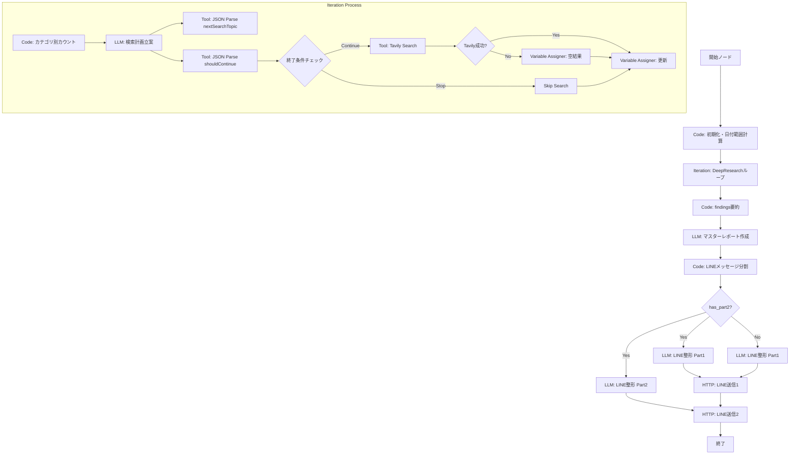

# AInews_for_LINE + DeepResearch ハイブリッド型アーキテクチャ 実装計画書 v2.0
## (改善提案反映版)

## 📋 プロジェクト概要

### 目的
DeepResearchの動的検索ロジックとAInews_for_LINEの8カテゴリ分類・LINE送信機能を統合し、より幅広い分野を調査できるアプリケーションを構築する。

### 方針 (Plan A: 堅実なDeepResearch型 - 改善版)
- **順次実行 (Sequential)**: 前回の検索結果を踏まえて次の検索計画を立てることで、深掘り調査を実現する。
- **堅牢性 (Robustness)**: エラーハンドリングとコンテキスト管理を強化し、安定稼働を目指す。
- **動的分割 (Dynamic Splitting)**: カテゴリ境界で適切に分割し、空のpart2はスキップする。
- **網羅性確保**: 8カテゴリのカバー状況を客観的に評価し、不足カテゴリを優先的に調査。

---

## 🏗️ アーキテクチャ設計

### 全体フロー



---

## 📝 詳細実装仕様

### 1. 開始ノード (Start Node)

#### 変数定義
```yaml
variables:
  - label: date_range
    type: text-input
    required: false
    variable: date_range
    description: 日付範囲（例: "2024年1月1日〜1月7日"）
  
  - label: query_suffix
    type: text-input
    required: false
    variable: query_suffix
    description: 検索クエリ用サフィックス（例: "2024年1月"）
  
  - label: depth
    type: number
    required: false
    variable: depth
    default: 3
    description: イテレーション回数（デフォルト: 3回）
```

---

### 2. Codeノード: 初期化・日付範囲計算

#### 実装コード
```python
def main(depth: int, date_range: str = None) -> dict:
    depth = depth or 3
    array = list(range(depth))
    
    if not date_range:
        from datetime import datetime, timedelta
        today = datetime.now()
        week_ago = today - timedelta(days=7)
        date_range = f"{week_ago.strftime('%Y年%m月%d日')}〜{today.strftime('%Y年%m月%d日')}"
    
    return {
        "array": array,
        "depth": depth,
        "date_range": date_range
    }
```

---

### 3. Conversation Variables定義

#### 変数一覧
```yaml
conversation_variables:
  - id: topics-var
    name: topics
    value_type: array[string]
    value: []
    description: 調査済みトピックのリスト
  
  - id: nextSearchTopic-var
    name: nextSearchTopic
    value_type: string
    value: ''
    description: 次に検索するキーワード
  
  - id: findings-var
    name: findings
    value_type: array[string]
    value: []
    description: 調査結果（事実）の蓄積リスト
  
  - id: shouldContinue-var
    name: shouldContinue
    value_type: string
    value: 'true'
    description: 調査を継続するか否か
  
  - id: findings_count-var
    name: findings_count
    value_type: number
    value: 0
    description: 調査済み件数
```

---

### 4. Iterationノード: DeepResearchループ

#### 設定
```yaml
type: iteration
iterator_selector: [code_node, array]
output_selector: [variable_aggregator, output]
iterator_input_type: array[number]
output_type: array[string]
flatten_output: true
error_handle_mode: continue-on-error
parallel_nums: 1
```

#### 内部ノード構成

##### 4-1. Code: カテゴリ別カウント (新規追加)

**ノードID**: `category_counter`

**実装コード**:
```python
def main(findings: list[str]) -> dict:
    """
    findingsを分析してカテゴリ別の情報量をカウント
    """
    category_keywords = {
        "llm": ["大規模言語モデル", "LLM", "foundation model", "基盤モデル", "GPT", "Gemini", "Claude", "大規模言語"],
        "business": ["ビジネス", "企業", "business", "enterprise", "投資", "資金調達", "買収", "M&A"],
        "research": ["研究", "research", "技術革新", "innovation", "論文", "paper", "学会", "academic"],
        "regulation": ["規制", "政策", "regulation", "policy", "法律", "law", "政府", "government"],
        "creative": ["クリエイティブ", "creative", "画像生成", "動画生成", "DALL-E", "Midjourney", "Stable Diffusion", "Sora"],
        "implementation": ["実用化", "導入", "implementation", "deployment", "採用", "adoption", "活用", "利用"],
        "risk": ["リスク", "倫理", "risk", "ethics", "安全性", "safety", "危険性", "問題"],
        "future": ["未来", "展望", "future", "outlook", "予測", "prediction", "将来", "trend"]
    }
    
    category_counts = {key: 0 for key in category_keywords.keys()}
    
    for finding in findings:
        if not finding or not isinstance(finding, str):
            continue
        finding_lower = finding.lower()
        matched = False
        for category, keywords in category_keywords.items():
            if any(keyword.lower() in finding_lower for keyword in keywords):
                category_counts[category] += 1
                matched = True
                break  # 1つのニュースは1つのカテゴリにのみカウント
        if not matched:
            # カテゴリ不明の場合は「その他」として扱う（オプション）
            pass
    
    return {
        "category_counts": category_counts,
        "total_count": len(findings)
    }
```

##### 4-2. LLM: 検索計画立案 (改善版)

**ノードID**: `search_plan_llm`

**モデル設定**:
```yaml
provider: langgenius/gemini/google
name: gemini-2.0-flash
mode: chat
temperature: 0.7
```

**プロンプトテンプレート**:
```yaml
system:
  text: |
    あなたはAIニュースの「取材デスク」です。
    今週のAI業界の動向を「広く網羅的」に収集するために、次に検索すべきトピックを決定してください。

    ## 現在の調査状況
    - ターゲット期間: {{#start_node.query_suffix#}}
    - 既に調査したトピック: {{#conversation.topics#}}
    - 調査済み件数: {{#conversation.findings_count#}}件
    - イテレーション回数: {{#iteration_node.index#}} / {{#code_node.depth#}}

    ## カテゴリカバー状況
    {{#category_counter.category_counts#}}
    
    各カテゴリの状況:
    - 大規模言語モデル (llm): {{#category_counter.category_counts.llm#}}件
    - ビジネス (business): {{#category_counter.category_counts.business#}}件
    - 研究 (research): {{#category_counter.category_counts.research#}}件
    - 規制 (regulation): {{#category_counter.category_counts.regulation#}}件
    - クリエイティブ (creative): {{#category_counter.category_counts.creative#}}件
    - 実用化 (implementation): {{#category_counter.category_counts.implementation#}}件
    - リスク (risk): {{#category_counter.category_counts.risk#}}件
    - 未来 (future): {{#category_counter.category_counts.future#}}件

    ## 必須カバーカテゴリ（全8カテゴリ）
    以下のリストのうち、まだ情報が不足しているカテゴリを優先してください。
    1. 大規模言語モデル・基盤モデル
    2. ビジネス・企業動向
    3. 研究・技術革新
    4. 規制・政策
    5. クリエイティブAI
    6. 実用化・導入事例
    7. リスク・倫理
    8. 未来展望

    ## 検索戦略
    - **【重要】効率重視**: 1回の検索で複数のカテゴリをカバーできるよう、関連性の高い2〜3個のカテゴリを組み合わせた「複合クエリ」を作成してください。
      - 良い例: "AI 規制 政策 リスク 倫理" (カテゴリ4, 7を同時調査)
      - 良い例: "Generative AI Creative Future Outlook" (カテゴリ5, 8を同時調査)
      - 良い例: "LLM foundation model business enterprise" (カテゴリ1, 2を同時調査)
      - 良い例: "AI research innovation technology breakthrough" (カテゴリ3を深掘り)
      - 良い例: "AI implementation deployment enterprise adoption" (カテゴリ6を深掘り)
    - 特定のモデル（Geminiなど）だけでなく、業界全体の動きを広く探すキーワードを選定してください。
    - 検索済みのtopicsと完全に同じtopicは出力しないでください。
    - 各カテゴリが3件以上ある場合は、そのカテゴリの優先度を下げてください。

    ## 出力形式 (JSON)
    必ず以下のJSON形式で出力してください。Markdownのコードブロックは不要です。
    {
      "nextSearchTopic": "カテゴリA カテゴリB 複合キーワード",
      "shouldContinue": true,
      "reasoning": "なぜこのキーワードを選んだか、どのカテゴリをカバーするか"
    }

user:
  text: |
    次に検索すべきトピックを決定してください。
```

**Memory設定**:
```yaml
enabled: true
query_prompt_template: |
  ## トピック
  {{#sys.query#}}

  ## 現在の発見事項（件数のみ）
  調査済み: {{#conversation.findings_count#}}件

  ## 検索済のtopics
  {{#conversation.topics#}}
```

##### 4-3. Tool: JSON Parse (nextSearchTopic抽出)

**ノードID**: `extract_next_search_topic`

**設定**:
```yaml
provider_id: json_process
tool_name: parse
tool_parameters:
  content:
    type: mixed
    value: '{{#search_plan_llm.text#}}'
  json_filter:
    type: mixed
    value: nextSearchTopic
```

##### 4-4. Tool: JSON Parse (shouldContinue抽出)

**ノードID**: `extract_should_continue`

**設定**:
```yaml
provider_id: json_process
tool_name: parse
tool_parameters:
  content:
    type: mixed
    value: '{{#search_plan_llm.text#}}'
  json_filter:
    type: mixed
    value: shouldContinue
```

##### 4-5. Code: 終了条件チェック (新規追加)

**ノードID**: `end_condition_checker`

**実装コード**:
```python
def main(
    category_counts: dict,
    shouldContinue_llm: str,
    iteration_index: int,
    max_iterations: int = 5
) -> dict:
    """
    客観的な終了条件をチェック
    """
    # 全カテゴリが3件以上あるか
    all_sufficient = all(count >= 3 for count in category_counts.values())
    
    # イテレーション回数が上限に達したか
    reached_max = iteration_index >= max_iterations - 1  # 0-indexedなので-1
    
    # LLMの判断
    llm_says_continue = str(shouldContinue_llm).lower() in ['true', '1', 'yes']
    
    # 最終判断
    if all_sufficient:
        final_shouldContinue = False
        reason = "全カテゴリ充足"
    elif reached_max:
        final_shouldContinue = False
        reason = "最大イテレーション数到達"
    else:
        final_shouldContinue = llm_says_continue
        reason = "LLM判断"
    
    return {
        "shouldContinue": str(final_shouldContinue).lower(),
        "reason": reason,
        "all_sufficient": all_sufficient,
        "reached_max": reached_max
    }
```

##### 4-6. IF/ELSE: shouldContinue判定

**ノードID**: `should_continue_check`

**条件**:
```yaml
cases:
  - case_id: 'true'
    conditions:
      - comparison_operator: is
        value: 'true'
        varType: string
        variable_selector: [end_condition_checker, shouldContinue]
    logical_operator: and
```

**分岐**:
- `true`: Tavily Search実行
- `false`: Skip Search → Variable Assigner（空結果）

##### 4-7. Tool: Tavily Search

**ノードID**: `tavily_search`

**設定**:
```yaml
provider_id: tavily
tool_name: tavily_search
tool_configurations:
  days:
    type: constant
    value: 7
  max_results:
    type: constant
    value: 5
  search_depth:
    type: constant
    value: advanced
  topic:
    type: constant
    value: general
tool_parameters:
  query:
    type: mixed
    value: '{{#conversation.nextSearchTopic#}} {{#start_node.query_suffix#}}'
```

##### 4-8. IF/ELSE: Tavily Search成功判定 (新規追加)

**ノードID**: `tavily_success_check`

**条件**:
```yaml
cases:
  - case_id: 'success'
    conditions:
      - comparison_operator: is not empty
        varType: string
        variable_selector: [tavily_search, text]
    logical_operator: and
```

**分岐**:
- `success`: Variable Assigner（通常更新）
- `failure`: Variable Assigner（空結果 + エラーログ）

##### 4-9. Variable Assigner: 更新

**ノードID**: `update_variables`

**設定（成功時）**:
```yaml
items:
  # nextSearchTopicを更新
  - input_type: variable
    operation: over-write
    value: [extract_next_search_topic, text]
    variable_selector: [conversation, nextSearchTopic]
    write_mode: over-write
  
  # shouldContinueを更新
  - input_type: variable
    operation: over-write
    value: [end_condition_checker, shouldContinue]
    variable_selector: [conversation, shouldContinue]
    write_mode: over-write
  
  # topicsにnextSearchTopicを追加
  - input_type: variable
    operation: append
    value: [conversation, nextSearchTopic]
    variable_selector: [conversation, topics]
    write_mode: over-write
  
  # findingsに検索結果を追加
  - input_type: variable
    operation: append
    value: [tavily_search, text]
    variable_selector: [conversation, findings]
    write_mode: over-write
  
  # findings_countを更新
  - input_type: code
    operation: over-write
    value: |
      def main(findings: list) -> int:
          return len(findings)
    variable_selector: [conversation, findings_count]
    write_mode: over-write
```

**設定（失敗時）**:
```yaml
items:
  # topicsにnextSearchTopicを追加（検索失敗でも記録）
  - input_type: variable
    operation: append
    value: [conversation, nextSearchTopic]
    variable_selector: [conversation, topics]
    write_mode: over-write
  
  # エラーログをfindingsに追加
  - input_type: constant
    operation: append
    value: "[エラー] 検索失敗: {{#conversation.nextSearchTopic#}}"
    variable_selector: [conversation, findings]
    write_mode: over-write
```

##### 4-10. Template Transform: 中間出力フォーマット

**ノードID**: `intermediate_output_format`

**設定**:
```yaml
template: |
  {{ index + 1 }}/{{ depth }}回目の検索を実行しました。
  検索トピック: {{#conversation.nextSearchTopic#}}
  終了理由: {{#end_condition_checker.reason#}}
  
variables:
  - value_selector: [iteration_node, index]
    variable: index
  - value_selector: [code_node, depth]
    variable: depth
```

##### 4-11. Variable Aggregator: 中間出力集約

**ノードID**: `intermediate_aggregator`

**設定**:
```yaml
output_type: string
variables:
  - [intermediate_output_format, output]
```

---

### 5. Code: findings要約 (新規追加)

**ノードID**: `findings_summarizer`

**実装コード**:
```python
def main(findings: list[str], max_items: int = 50) -> dict:
    """
    findingsが多すぎる場合、最新のものを残す
    """
    if not findings:
        return {
            "summarized_findings": [],
            "was_summarized": False,
            "original_count": 0,
            "summarized_count": 0
        }
    
    if len(findings) <= max_items:
        return {
            "summarized_findings": findings,
            "was_summarized": False,
            "original_count": len(findings),
            "summarized_count": len(findings)
        }
    
    # 最新のmax_items件を残す
    summarized = findings[-max_items:]
    
    return {
        "summarized_findings": summarized,
        "was_summarized": True,
        "original_count": len(findings),
        "summarized_count": len(summarized)
    }
```

---

### 6. LLM: マスターレポート作成 (詳細版)

**ノードID**: `master_report_llm`

**モデル設定**:
```yaml
provider: langgenius/gemini/google
name: gemini-2.0-flash-thinking-exp-01-21
mode: chat
temperature: 0.7
```

**プロンプトテンプレート**:
```yaml
system:
  text: |
    あなたはAIニュースの「編集長」です。
    取材班が集めた大量の検索結果（findings）に基づき、今週のAIニュースの「マスターレポート」を作成してください。

    ## 入力データ
    {{#findings_summarizer.summarized_findings#}}

    ## 思考プロセス（Thinking）
    1. **重複排除**: 同じニュースが複数回出現している場合は統合してください。
    2. **信憑性評価**: 
       - 信頼できる情報源（公式発表、主要メディア）を優先
       - 推測や噂レベルのものは除外するか、「噂レベル」と明記
    3. **日付確認**: 指定期間（{{#code_node.date_range#}}）外の古いニュースは除外してください。
    4. **重要度評価**: 業界への影響度が高いニュースを優先的に記載してください。
    5. **カテゴリ分類**: 各ニュースを8つのカテゴリに分類してください。

    ## 出力要件
    - 以下の8つのカテゴリに分類して記述してください。
      [大規模言語モデル, ビジネス, 研究, 規制, クリエイティブ, 実用化, リスク, 未来]
    - 各ニュースには必ず「具体的な数値」「固有名詞」「日付」を含めてください。
    - 文体は「だ・である」調で、客観的な事実を中心に記述してください。
    - マークダウン形式で出力してください。
    - 各カテゴリごとに見出し（##）を付けてください。

    ## 出力フォーマット例
    # マスターレポート

    ## 大規模言語モデル・基盤モデル
    - {具体的なニュース1}（2024年1月15日）
    - {具体的なニュース2}（2024年1月16日）
    ...

    ## ビジネス・企業動向
    ...

user:
  text: |
    マスターレポートを作成してください。
```

**Memory設定**:
```yaml
enabled: true
query_prompt_template: |
  ## topic
  {{#sys.query#}}

  ## findings
  {{#findings_summarizer.summarized_findings#}}
```

---

### 7. Code: LINEメッセージ分割 (改善版)

**ノードID**: `message_splitter`

**実装コード**:
```python
def main(master_report: str) -> dict:
    """
    マスターレポートをLINE送信可能なサイズに分割する
    カテゴリ境界で分割する
    """
    MAX_LENGTH = 3500  # 安全マージンをとって3500
    
    if not master_report or len(master_report) <= MAX_LENGTH:
        return {
            "part1": master_report or "",
            "part2": "",
            "has_part2": False
        }
    
    # カテゴリ見出し（## で始まる行）を探す
    lines = master_report.split('\n')
    category_headings = []
    for i, line in enumerate(lines):
        if line.strip().startswith('## '):
            category_headings.append(i)
    
    if len(category_headings) <= 1:
        # カテゴリ見出しが1つ以下なら、単純に文字数で分割
        mid_point = len(master_report) // 2
        return {
            "part1": master_report[:mid_point],
            "part2": master_report[mid_point:],
            "has_part2": True
        }
    
    # 最初の分割点を探す（カテゴリ境界で分割）
    current_length = 0
    split_index = 0
    
    for i in range(1, len(category_headings)):
        # 前の見出しから現在の見出しまでの文字数を計算
        start_idx = category_headings[i-1]
        end_idx = category_headings[i]
        section_text = '\n'.join(lines[start_idx:end_idx])
        section_length = len(section_text)
        
        if current_length + section_length > MAX_LENGTH:
            # 前のカテゴリ境界で分割
            split_index = category_headings[i-1]
            break
        current_length += section_length
    
    if split_index == 0:
        # 分割不要（最後まで行ったがMAX_LENGTHを超えなかった）
        return {
            "part1": master_report,
            "part2": "",
            "has_part2": False
        }
    
    part1_lines = lines[:split_index]
    part2_lines = lines[split_index:]
    
    return {
        "part1": "\n".join(part1_lines),
        "part2": "\n".join(part2_lines),
        "has_part2": True
    }
```

---

### 8. IF/ELSE: has_part2判定 (新規追加)

**ノードID**: `has_part2_check`

**条件**:
```yaml
cases:
  - case_id: 'true'
    conditions:
      - comparison_operator: is
        value: 'true'
        varType: boolean
        variable_selector: [message_splitter, has_part2]
    logical_operator: and
```

**分岐**:
- `true`: LINE整形LLM2を実行
- `false`: LINE整形LLM2をスキップ

---

### 9. LLM: LINE用整形 (Part 1)

**ノードID**: `line_format_llm_1`

**モデル設定**:
```yaml
provider: langgenius/gemini/google
name: gemini-2.5-flash
mode: chat
temperature: 0.7
reasoning_format: tagged
```

**プロンプトテンプレート**:
```yaml
system:
  text: |
    あなたは優秀なAIニュース編集者です。
    提供されたニューステキストを、LINE配信用の読みやすいフォーマットに整形してください。

    ## 入力テキスト
    {{#message_splitter.part1#}}

    ## 制約事項
    - 日付範囲: {{#code_node.date_range#}}
    - 内容は変更せず、見出しや箇条書きを整えるのみにしてください。
    - 絵文字を適切に使用してください（🤖 🏢 🔬 ⚖️ 🎨 💼 ⚠️ 🔮）。
    - 【重要】全体の文字数を必ず「4000文字以内」に収めてください。
    - 各ニュースの要約は「1行・100文字以内」に短縮してください。

    ## 投稿フォーマット
    ━━━━━━━━━━━━━━━
    📰 AI週次ニュースまとめ (前半)
    日付範囲:{{#code_node.date_range#}}
    ━━━━━━━━━━━━━━━

    {整形されたニュース内容}

user:
  text: |
    上記の設定とテキストに基づき、LINE用フォーマットに整形してください。
```

---

### 10. LLM: LINE用整形 (Part 2)

**ノードID**: `line_format_llm_2`

**モデル設定**:
```yaml
provider: langgenius/gemini/google
name: gemini-2.5-flash
mode: chat
temperature: 0.7
reasoning_format: tagged
```

**プロンプトテンプレート**:
```yaml
system:
  text: |
    あなたは優秀なAIニュース編集者です。
    提供されたニューステキストを、LINE配信用の読みやすいフォーマットに整形してください。

    ## 入力テキスト
    {{#message_splitter.part2#}}

    ## 制約事項
    - 前置きや挨拶は一切不要です。フォーマットの先頭から出力してください。
    - 絵文字を適切に使用してください。
    - 【重要】全体の文字数を必ず「4000文字以内」に収めてください。
    - 最後に、今回のレポートに含まれるトピック総数をカウントして記載してください。

    ## 投稿フォーマット
    {整形されたニュース内容}

    ━━━━━━━━━━━━━━━
    📊 今週のトピック数: {合計}件
    ━━━━━━━━━━━━━━━

user:
  text: |
    上記の設定とテキストに基づき、LINE用フォーマットに整形してください。
```

---

### 11. HTTP Request: LINE送信1

**ノードID**: `line_http_1`

**設定**:
```yaml
method: POST
url: https://api.line.me/v2/bot/message/push
authorization:
  type: no-auth
headers: |
  Content-Type: application/json
  Authorization: Bearer {YOUR_LINE_CHANNEL_ACCESS_TOKEN}
body:
  type: json
  data: |
    {
      "to": "{YOUR_LINE_USER_ID}",
      "messages": [
        {
          "type": "text",
          "text": "{{#line_format_llm_1.text#}}"
        }
      ]
    }
retry_config:
  retry_enabled: true
  max_retries: 3
  retry_interval: 100
timeout:
  max_connect_timeout: 10
  max_read_timeout: 30
  max_write_timeout: 30
```

---

### 12. HTTP Request: LINE送信2

**ノードID**: `line_http_2`

**設定**:
```yaml
method: POST
url: https://api.line.me/v2/bot/message/push
authorization:
  type: no-auth
headers: |
  Content-Type: application/json
  Authorization: Bearer {YOUR_LINE_CHANNEL_ACCESS_TOKEN}
body:
  type: json
  data: |
    {
      "to": "{YOUR_LINE_USER_ID}",
      "messages": [
        {
          "type": "text",
          "text": "{{#line_format_llm_2.text#}}"
        }
      ]
    }
retry_config:
  retry_enabled: true
  max_retries: 3
  retry_interval: 100
timeout:
  max_connect_timeout: 10
  max_read_timeout: 30
  max_write_timeout: 30
```

---

## 🔄 エッジ（接続）定義

### エッジ一覧
```yaml
edges:
  # Start → Code
  - source: start_node
    target: code_node
    sourceType: start
    targetType: code
  
  # Code → Iteration
  - source: code_node
    target: iteration_node
    sourceType: code
    targetType: iteration
  
  # Iteration Start → Category Counter
  - source: iteration_nodestart
    target: category_counter
    sourceType: iteration-start
    targetType: code
    isInIteration: true
  
  # Category Counter → Search Plan LLM
  - source: category_counter
    target: search_plan_llm
    sourceType: code
    targetType: llm
    isInIteration: true
  
  # Search Plan LLM → Extract nextSearchTopic
  - source: search_plan_llm
    target: extract_next_search_topic
    sourceType: llm
    targetType: tool
    isInIteration: true
  
  # Search Plan LLM → Extract shouldContinue
  - source: search_plan_llm
    target: extract_should_continue
    sourceType: llm
    targetType: tool
    isInIteration: true
  
  # Extract shouldContinue → End Condition Checker
  - source: extract_should_continue
    target: end_condition_checker
    sourceType: tool
    targetType: code
    isInIteration: true
  
  # End Condition Checker → IF/ELSE
  - source: end_condition_checker
    target: should_continue_check
    sourceType: code
    targetType: if-else
    isInIteration: true
  
  # IF/ELSE (true) → Tavily Search
  - source: should_continue_check
    target: tavily_search
    sourceType: if-else
    targetType: tool
    sourceHandle: 'true'
    isInIteration: true
  
  # IF/ELSE (false) → Skip (直接Variable Assignerへ)
  - source: should_continue_check
    target: update_variables
    sourceType: if-else
    targetType: assigner
    sourceHandle: 'false'
    isInIteration: true
  
  # Tavily Search → Tavily Success Check
  - source: tavily_search
    target: tavily_success_check
    sourceType: tool
    targetType: if-else
    isInIteration: true
  
  # Tavily Success Check (success) → Variable Assigner
  - source: tavily_success_check
    target: update_variables
    sourceType: if-else
    targetType: assigner
    sourceHandle: 'success'
    isInIteration: true
  
  # Tavily Success Check (failure) → Variable Assigner (空結果)
  - source: tavily_success_check
    target: update_variables
    sourceType: if-else
    targetType: assigner
    sourceHandle: 'failure'
    isInIteration: true
  
  # Variable Assigner → Template Transform
  - source: update_variables
    target: intermediate_output_format
    sourceType: assigner
    targetType: template-transform
    isInIteration: true
  
  # Template Transform → Variable Aggregator
  - source: intermediate_output_format
    target: intermediate_aggregator
    sourceType: template-transform
    targetType: variable-aggregator
    isInIteration: true
  
  # Iteration → Findings Summarizer
  - source: iteration_node
    target: findings_summarizer
    sourceType: iteration
    targetType: code
  
  # Findings Summarizer → Master Report LLM
  - source: findings_summarizer
    target: master_report_llm
    sourceType: code
    targetType: llm
  
  # Master Report LLM → Message Splitter
  - source: master_report_llm
    target: message_splitter
    sourceType: llm
    targetType: code
  
  # Message Splitter → Has Part2 Check
  - source: message_splitter
    target: has_part2_check
    sourceType: code
    targetType: if-else
  
  # Has Part2 Check (true) → LINE Format LLM 2
  - source: has_part2_check
    target: line_format_llm_2
    sourceType: if-else
    targetType: llm
    sourceHandle: 'true'
  
  # Message Splitter → LINE Format LLM 1 (常に実行)
  - source: message_splitter
    target: line_format_llm_1
    sourceType: code
    targetType: llm
  
  # LINE Format LLM 1 → LINE HTTP 1
  - source: line_format_llm_1
    target: line_http_1
    sourceType: llm
    targetType: http-request
  
  # LINE Format LLM 2 → LINE HTTP 2
  - source: line_format_llm_2
    target: line_http_2
    sourceType: llm
    targetType: http-request
  
  # LINE HTTP 1 → LINE HTTP 2 (またはEnd)
  - source: line_http_1
    target: line_http_2
    sourceType: http-request
    targetType: http-request
  
  # Has Part2 Check (false) → LINE HTTP 1 (直接)
  - source: has_part2_check
    target: line_http_1
    sourceType: if-else
    targetType: http-request
    sourceHandle: 'false'
  
  # LINE HTTP 2 → End
  - source: line_http_2
    target: end_node
    sourceType: http-request
    targetType: end
```

---

## 📦 依存関係（Dependencies）

```yaml
dependencies:
  - type: marketplace
    value:
      marketplace_plugin_unique_identifier: langgenius/tavily:0.1.2@aa7a8744b2ccf3a7aec818da6c504997a6319b29040e541bfc73b4fbaa9e98d9
  
  - type: marketplace
    value:
      marketplace_plugin_unique_identifier: langgenius/gemini:0.6.4@17f286b2d6699a258a2eba8bc1bff71b8f795b6aa7bee1464cbfa450b451303a
  
  - type: marketplace
    value:
      marketplace_plugin_unique_identifier: langgenius/json_process:0.0.2@dde6d7b676ccdcea89206d29232181a840170c19277d3d978e27cd1e3c92c707
```

---

## 🚀 実装ステップ (改善版)

### Phase 1: 基本構造の構築（1-2日）

1. **新規ワークフロー作成**
   - Difyで新規ワークフローを作成
   - モード: `workflow`

2. **開始ノードの設定**
   - 変数定義（date_range, query_suffix, depth）

3. **Conversation Variablesの定義**
   - topics, nextSearchTopic, findings, shouldContinue, findings_count

4. **Codeノード: 初期化**
   - 初期化ロジック実装

### Phase 2: DeepResearchロジック実装（2-3日）

5. **Iterationノード設定**
   - `parallel_nums: 1`, `continue-on-error`

6. **Code: カテゴリ別カウント**
   - カテゴリ別カウントロジック実装

7. **検索計画立案LLM**
   - 改善されたプロンプトテンプレート実装
   - カテゴリカバー状況を参照

8. **JSON Parseツール**
   - nextSearchTopic抽出
   - shouldContinue抽出

9. **Code: 終了条件チェック**
   - 客観的な終了条件チェック実装

10. **IF/ELSE: shouldContinue判定**
    - 分岐ロジック実装

11. **Tavily Search**
    - 検索ツールの設定

12. **IF/ELSE: Tavily成功判定**
    - エラーハンドリング実装

13. **Variable Assigner**
    - topics, findings, nextSearchTopic, shouldContinue, findings_countの更新
    - 成功時・失敗時の2パターン実装

14. **中間出力**
    - Template Transform
    - Variable Aggregator

### Phase 3: レポート作成・分割（1-2日）

15. **Code: findings要約**
    - コンテキストウィンドウ対策実装

16. **マスターレポート作成LLM**
    - 詳細なプロンプトテンプレート実装

17. **Code: メッセージ分割**
    - 改善された分割ロジック実装（カテゴリ境界で分割）

18. **IF/ELSE: has_part2判定**
    - 条件分岐実装

19. **LINE用整形LLM 1**
    - 前半部分の整形

20. **LINE用整形LLM 2**
    - 後半部分の整形（has_part2がtrueの場合のみ）

### Phase 4: LINE送信機能（1日）

21. **HTTP Request設定**
    - LINE APIエンドポイント設定
    - 認証情報の設定（環境変数推奨）
    - リトライ設定

22. **エッジ接続**
    - 全ノードの接続確認
    - エラーハンドリング確認

### Phase 5: テスト・調整（2-3日）

23. **単体テスト**
    - 各ノードの動作確認
    - 変数の値の確認

24. **統合テスト**
    - エンドツーエンドの実行
    - エラーケースの確認
      - Tavily Search失敗
      - JSON Parse失敗
      - 長文レポート
      - part2が空の場合

25. **プロンプト調整**
    - 検索計画立案の精度向上
    - レポート品質の向上

26. **パフォーマンス調整**
    - 実行時間の最適化
    - API呼び出し数の最適化

---

## ⚠️ 注意事項・制約事項

### 1. 実行時間（修正版）
**詳細な内訳**:
- 検索計画立案LLM: 10秒 × 3回 = 30秒
- カテゴリ別カウントCode: 2秒 × 3回 = 6秒
- JSON Parse: 2秒 × 3回 = 6秒
- 終了条件チェックCode: 1秒 × 3回 = 3秒
- Tavily Search: 30秒 × 3回 = 90秒
- 変数更新: 1秒 × 3回 = 3秒
- findings要約Code: 2秒
- マスターレポート作成LLM: 60秒
- メッセージ分割Code: 1秒
- LINE整形LLM: 20秒 × 2回 = 40秒
- LINE送信: 5秒 × 2回 = 10秒

**合計**: 約4-5分（最悪ケース: 8-10分）

### 2. コンテキストウィンドウ対策
- `findings` が50件を超える場合、最新50件のみを使用
- 必要に応じて`max_items`パラメータを調整可能

### 3. LINE文字数制限
- 分割ロジックで3500文字を目安に分割
- 整形LLMのプロンプトで「4000文字以内」を強く指示

### 4. エラーハンドリング
- Tavily Search失敗時: エラーログを記録し、処理を継続
- JSON Parse失敗時: デフォルト値を使用
- shouldContinue判定: 客観的な条件とLLM判断を組み合わせ

### 5. 変数管理
- **Conversation Variables**: イテレーション間で共有
- **Loop Variables**: イテレーション内でのみ有効
- **注意**: 変数の参照方法を正確に設定

---

## 📊 改善点まとめ

### 実装された改善点

1. ✅ **Conversation Variablesの定義追加**: 完全な定義を追加
2. ✅ **エラーハンドリングの強化**: Tavily Search失敗時、JSON Parse失敗時の処理を実装
3. ✅ **メッセージ分割ロジックの改善**: カテゴリ境界で分割、has_part2判定を追加
4. ✅ **8カテゴリカバー状況の評価機能追加**: カテゴリ別カウントCodeノードを追加
5. ✅ **コンテキストウィンドウ対策の実装**: findings要約Codeノードを追加
6. ✅ **shouldContinue判定の客観化**: 終了条件チェックCodeノードを追加
7. ✅ **マスターレポート作成プロンプトの詳細化**: 完全なプロンプトを記載
8. ✅ **実行時間見積もりの修正**: 詳細な内訳を記載

---

## 🎯 成功基準

1. **機能要件**
   - ✅ 8カテゴリ全てをカバー
   - ✅ LINEに適切に分割して送信
   - ✅ 文字数制限（4000文字以内）を遵守
   - ✅ エラー時に適切に処理

2. **品質要件**
   - ✅ 各カテゴリ3件以上のニュースを取得
   - ✅ 重複ニュースを排除
   - ✅ 信頼できる情報源を優先
   - ✅ カテゴリ境界で適切に分割

3. **パフォーマンス要件**
   - ✅ 実行時間: 10分以内
   - ✅ エラー率: 5%以下
   - ✅ API呼び出し数: 適切な範囲内

---

**作成日**: 2024年1月
**最終更新**: 2024年1月
**バージョン**: 2.0 (改善提案反映版)


