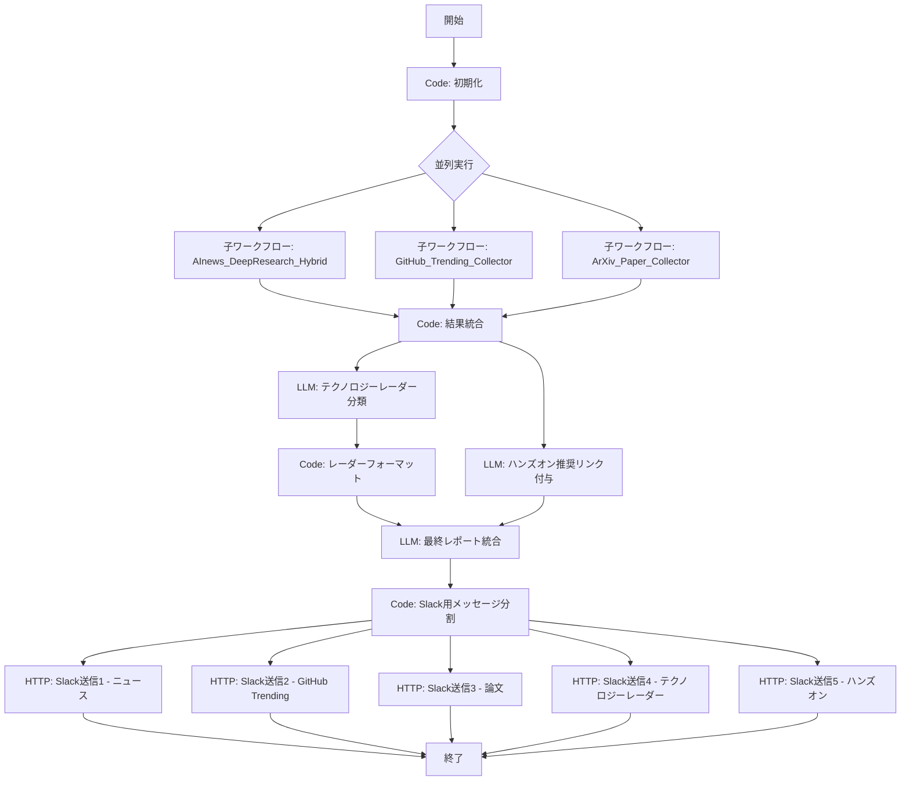

# テックインテリジェンスシステム 拡張設計書

## 既存システムとの関係

現行の `AInews_DeepResearch_Hybrid` ワークフローは、Tavily検索ベースのDeepResearchループで8カテゴリのAIニュースを収集しLINE配信する構成である。本設計書では、このワークフローを拡張し、以下の4つの新機能を「親子アプリ構成」で追加する。

### 拡張アーキテクチャ概要

```
[親ワークフロー: TechIntelligence_Master]
  |
  +-- [子1: 既存AInews_DeepResearch_Hybrid] ... ニュース収集
  +-- [子2: GitHub_Trending_Collector]       ... トレンドリポジトリ収集
  +-- [子3: ArXiv_Paper_Collector]           ... 論文収集
  +-- [統合LLM] テクノロジーレーダー分類 + ハンズオン推奨リンク付与
  +-- [Slack配信]
```

Difyでは「親子アプリ」構成をHTTP Requestノードで子ワークフローのAPIを呼び出す形で実現する。各子ワークフローは独立して動作可能であり、単体テストが容易である。

---

## 1. GitHub Trending連携

### 1-1. データソースと取得方法

GitHub Trendingには公式APIが存在しない。以下の3つの方法で代替する。

#### 方法A: 非公式GitHub Trending API（推奨）

```
エンドポイント: https://api.gitterapp.com/repositories
パラメータ:
  - language: python (または任意)
  - since: daily / weekly / monthly
  - spoken_language_code: (省略可)

レスポンス例:
[
  {
    "author": "openai",
    "name": "openai-agents-python",
    "description": "A lightweight, powerful framework for multi-agent workflows",
    "language": "Python",
    "stars": 15200,
    "forks": 1800,
    "currentPeriodStars": 3200,
    "url": "https://github.com/openai/openai-agents-python"
  }
]
```

**注意**: 非公式APIは安定性が保証されないため、方法Bと併用を推奨する。

#### 方法B: GitHub Search API（公式・安定）

```
エンドポイント: https://api.github.com/search/repositories
パラメータ例:
  ?q=topic:machine-learning+topic:ai+created:>2026-03-13&sort=stars&order=desc&per_page=10

レートリミット: 認証あり30回/分、認証なし10回/分
認証ヘッダー: Authorization: Bearer {GITHUB_TOKEN}
```

フィルタリングクエリの例:

| カテゴリ | クエリ |
|---------|--------|
| AI/ML全般 | `topic:machine-learning+topic:artificial-intelligence+created:>YYYY-MM-DD` |
| LLM | `topic:llm+topic:large-language-model+created:>YYYY-MM-DD` |
| Agent | `topic:ai-agent+topic:agent-framework+created:>YYYY-MM-DD` |
| MLOps | `topic:mlops+topic:model-serving+created:>YYYY-MM-DD` |

#### 方法C: GitHub Trending RSS（シンプル）

```
URL: https://mshibanami.github.io/GitHubTrendingRSS/daily/python.xml
     https://mshibanami.github.io/GitHubTrendingRSS/weekly/python.xml
```

### 1-2. Difyノード構成

```yaml
# ワークフロー: GitHub_Trending_Collector
# ノード構成:

# ノード1: 開始ノード
start_node:
  variables:
    - label: time_range
      type: text-input
      variable: time_range
      default: "weekly"
    - label: target_languages
      type: text-input
      variable: target_languages
      default: "python,typescript,rust"

# ノード2: Code - 検索クエリ生成
github_query_builder:
  type: code
  code: |
    def main(time_range: str, target_languages: str) -> dict:
        from datetime import datetime, timedelta

        days_map = {"daily": 1, "weekly": 7, "monthly": 30}
        days = days_map.get(time_range, 7)
        since_date = (datetime.now() - timedelta(days=days)).strftime('%Y-%m-%d')

        languages = [lang.strip() for lang in target_languages.split(',')]

        queries = []
        topics = [
            "machine-learning artificial-intelligence",
            "llm large-language-model",
            "ai-agent agent-framework",
            "deep-learning neural-network",
            "generative-ai diffusion-model"
        ]
        for topic_pair in topics:
            topics_query = "+".join([f"topic:{t}" for t in topic_pair.split()])
            for lang in languages:
                queries.append({
                    "url": f"https://api.github.com/search/repositories?q={topics_query}+language:{lang}+created:>{since_date}&sort=stars&order=desc&per_page=5",
                    "category": topic_pair,
                    "language": lang
                })

        return {
            "queries": queries,
            "since_date": since_date,
            "query_count": len(queries)
        }

# ノード3: Iteration - GitHub API呼び出しループ
github_api_loop:
  type: iteration
  iterator_selector: [github_query_builder, queries]
  parallel_nums: 1  # レートリミット対策

  # 内部ノード3-1: HTTP Request - GitHub API
  github_api_request:
    type: http-request
    method: GET
    url: "{{#item.url#}}"
    headers:
      Accept: application/vnd.github.v3+json
      Authorization: "Bearer {{#env.GITHUB_TOKEN#}}"
      User-Agent: DifyTechIntelligence
    timeout:
      max_connect_timeout: 10
      max_read_timeout: 30

  # 内部ノード3-2: Code - レスポンスパース
  github_response_parser:
    type: code
    code: |
      def main(response_body: str, category: str, language: str) -> dict:
          import json
          try:
              data = json.loads(response_body)
              items = data.get("items", [])
              repos = []
              for item in items[:5]:
                  repos.append({
                      "name": item.get("full_name", ""),
                      "description": item.get("description", ""),
                      "stars": item.get("stargazers_count", 0),
                      "url": item.get("html_url", ""),
                      "language": item.get("language", ""),
                      "topics": item.get("topics", []),
                      "created_at": item.get("created_at", ""),
                      "category": category
                  })
              return {"repos": repos, "count": len(repos)}
          except Exception as e:
              return {"repos": [], "count": 0, "error": str(e)}

# ノード4: Code - 重複排除・ランキング
github_dedup_ranker:
  type: code
  code: |
    def main(all_repos: list) -> dict:
        seen = set()
        unique_repos = []
        for batch in all_repos:
            if not batch or not isinstance(batch, list):
                continue
            for repo in batch:
                if not isinstance(repo, dict):
                    continue
                name = repo.get("name", "")
                if name and name not in seen:
                    seen.add(name)
                    unique_repos.append(repo)

        # スター数でソート
        unique_repos.sort(key=lambda x: x.get("stars", 0), reverse=True)

        # 上位20件に絞る
        top_repos = unique_repos[:20]

        # テキスト形式で出力
        text_output = ""
        for i, repo in enumerate(top_repos, 1):
            text_output += f"{i}. **{repo['name']}** ({repo.get('stars', 0)} stars)\n"
            text_output += f"   {repo.get('description', 'No description')}\n"
            text_output += f"   URL: {repo.get('url', '')}\n"
            text_output += f"   Topics: {', '.join(repo.get('topics', []))}\n\n"

        return {
            "top_repos": top_repos,
            "text_output": text_output,
            "total_unique": len(unique_repos)
        }

# ノード5: LLM - GitHub Trendingサマリー生成
github_summary_llm:
  type: llm
  model:
    provider: anthropic
    name: claude-sonnet-4-20250514
    mode: chat
    temperature: 0.5
  prompt: |
    ## (後述のプロンプト例を参照)
```

### 1-3. GitHub Trending分析プロンプト

```
あなたはAI/ML分野のOSSエキスパートです。
以下のGitHub Trendingリポジトリ一覧を分析し、開発者にとって有用なサマリーを作成してください。

## 入力データ
{{#github_dedup_ranker.text_output#}}

## 分析の観点
1. **注目度**: スター数の急上昇率、フォーク数から判断
2. **実用性**: すぐに業務やプロジェクトで使えるか
3. **新規性**: 既存ツールと比較した差別化ポイント
4. **カテゴリ**: 以下に分類
   - フレームワーク/ライブラリ
   - ツール/ユーティリティ
   - モデル/データセット
   - チュートリアル/学習教材

## 出力フォーマット
### 今週のGitHub AI/MLトレンド TOP10

#### [カテゴリ名]
1. **リポジトリ名** (stars数)
   - 概要: 1行で何ができるか
   - 注目ポイント: なぜ今注目されているか
   - 対象者: 初心者/中級者/上級者
   - 試し方: `pip install xxx` や `docker run xxx` など最短の試し方
```

---

## 2. arxiv/Papers with Code連携

### 2-1. データソースと取得方法

#### arxiv API（公式・無料・制限なし）

```
エンドポイント: http://export.arxiv.org/api/query
パラメータ:
  search_query: cat:cs.AI+OR+cat:cs.LG+OR+cat:cs.CL+OR+cat:cs.CV
  sortBy: submittedDate
  sortOrder: descending
  start: 0
  max_results: 20

完全なURL例:
http://export.arxiv.org/api/query?search_query=cat:cs.AI+OR+cat:cs.LG+OR+cat:cs.CL&sortBy=submittedDate&sortOrder=descending&max_results=20

レスポンス形式: Atom XML
レートリミット: 3秒に1回推奨
```

主要カテゴリコード:

| コード | 分野 |
|--------|------|
| cs.AI | Artificial Intelligence |
| cs.LG | Machine Learning |
| cs.CL | Computation and Language (NLP) |
| cs.CV | Computer Vision |
| cs.NE | Neural and Evolutionary Computing |
| cs.RO | Robotics |
| stat.ML | Machine Learning (Statistics) |

#### Papers with Code API（公式・無料）

```
エンドポイント: https://paperswithcode.com/api/v1/papers/
パラメータ:
  ordering: -proceeding  (最新順)
  page: 1
  items_per_page: 20

特定論文のコード取得:
GET https://paperswithcode.com/api/v1/papers/{paper_id}/repositories/

トレンド論文の取得:
GET https://paperswithcode.com/api/v1/papers/?ordering=-github_stars
```

#### Semantic Scholar API（公式・無料）

```
エンドポイント: https://api.semanticscholar.org/graph/v1/paper/search
パラメータ:
  query: large language model
  year: 2026
  fieldsOfStudy: Computer Science
  fields: title,abstract,year,citationCount,url,openAccessPdf
  limit: 20

レートリミット: APIキーなし100回/5分、APIキーあり1回/秒
APIキー取得: https://www.semanticscholar.org/product/api#api-key
```

### 2-2. Difyノード構成

```yaml
# ワークフロー: ArXiv_Paper_Collector
# ノード構成:

# ノード1: 開始ノード
start_node:
  variables:
    - label: categories
      type: text-input
      variable: categories
      default: "cs.AI,cs.LG,cs.CL,cs.CV"
    - label: max_papers
      type: number
      variable: max_papers
      default: 20

# ノード2: Code - arxivクエリ構築
arxiv_query_builder:
  type: code
  code: |
    def main(categories: str, max_papers: int) -> dict:
        cats = [cat.strip() for cat in categories.split(',')]
        search_query = "+OR+".join([f"cat:{cat}" for cat in cats])

        arxiv_url = (
            f"http://export.arxiv.org/api/query"
            f"?search_query={search_query}"
            f"&sortBy=submittedDate"
            f"&sortOrder=descending"
            f"&start=0"
            f"&max_results={max_papers}"
        )

        semantic_url = (
            f"https://api.semanticscholar.org/graph/v1/paper/search"
            f"?query=large+language+model+agent+2026"
            f"&fieldsOfStudy=Computer+Science"
            f"&fields=title,abstract,year,citationCount,url,openAccessPdf"
            f"&limit=10"
        )

        return {
            "arxiv_url": arxiv_url,
            "semantic_url": semantic_url
        }

# ノード3: HTTP Request - arxiv API呼び出し
arxiv_api_request:
  type: http-request
  method: GET
  url: "{{#arxiv_query_builder.arxiv_url#}}"
  headers:
    User-Agent: DifyTechIntelligence/1.0
  timeout:
    max_connect_timeout: 10
    max_read_timeout: 60

# ノード4: Code - arxiv XMLパース
arxiv_xml_parser:
  type: code
  code: |
    def main(response_body: str) -> dict:
        """arxiv Atom XMLをパースして論文リストを抽出する"""
        import re

        papers = []
        # XMLパース（Dify sandboxではxml.etree非対応の場合の正規表現フォールバック）
        entries = re.findall(r'<entry>(.*?)</entry>', response_body, re.DOTALL)

        for entry in entries:
            title_match = re.search(r'<title>(.*?)</title>', entry, re.DOTALL)
            summary_match = re.search(r'<summary>(.*?)</summary>', entry, re.DOTALL)
            id_match = re.search(r'<id>(.*?)</id>', entry)
            published_match = re.search(r'<published>(.*?)</published>', entry)
            categories = re.findall(r'<category.*?term="(.*?)"', entry)

            # 著者抽出
            authors = re.findall(r'<name>(.*?)</name>', entry)

            if title_match:
                title = title_match.group(1).strip().replace('\n', ' ')
                summary = summary_match.group(1).strip().replace('\n', ' ') if summary_match else ""
                arxiv_id = id_match.group(1).strip() if id_match else ""
                published = published_match.group(1).strip() if published_match else ""

                # arxiv IDからPDFリンクとabs URLを生成
                abs_url = arxiv_id
                pdf_url = arxiv_id.replace('/abs/', '/pdf/') if '/abs/' in arxiv_id else arxiv_id.replace('http://arxiv.org/abs/', 'http://arxiv.org/pdf/')

                papers.append({
                    "title": title,
                    "summary": summary[:500],  # 長すぎるabstractは切り詰め
                    "authors": authors[:5],  # 最初の5人
                    "arxiv_url": abs_url,
                    "pdf_url": pdf_url,
                    "published": published[:10],  # YYYY-MM-DD
                    "categories": categories[:5]
                })

        # テキスト形式の出力
        text_output = ""
        for i, paper in enumerate(papers, 1):
            author_str = ", ".join(paper["authors"][:3])
            if len(paper["authors"]) > 3:
                author_str += " et al."
            text_output += f"{i}. {paper['title']}\n"
            text_output += f"   著者: {author_str}\n"
            text_output += f"   日付: {paper['published']}\n"
            text_output += f"   分野: {', '.join(paper['categories'])}\n"
            text_output += f"   概要: {paper['summary'][:200]}...\n"
            text_output += f"   URL: {paper['arxiv_url']}\n\n"

        return {
            "papers": papers,
            "text_output": text_output,
            "count": len(papers)
        }

# ノード5: HTTP Request - Semantic Scholar API（並列実行）
semantic_api_request:
  type: http-request
  method: GET
  url: "{{#arxiv_query_builder.semantic_url#}}"
  headers:
    User-Agent: DifyTechIntelligence/1.0

# ノード6: Code - Semantic Scholarレスポンスパース
semantic_parser:
  type: code
  code: |
    def main(response_body: str) -> dict:
        import json
        try:
            data = json.loads(response_body)
            papers = data.get("data", [])
            high_impact = []
            for paper in papers:
                citation_count = paper.get("citationCount", 0)
                if citation_count >= 5:  # 被引用5件以上 = 注目度高
                    high_impact.append({
                        "title": paper.get("title", ""),
                        "citation_count": citation_count,
                        "url": paper.get("url", ""),
                        "abstract": (paper.get("abstract") or "")[:300]
                    })
            high_impact.sort(key=lambda x: x["citation_count"], reverse=True)
            return {"high_impact_papers": high_impact[:10], "count": len(high_impact)}
        except Exception as e:
            return {"high_impact_papers": [], "count": 0, "error": str(e)}

# ノード7: LLM - 論文わかりやすく解説
paper_explainer_llm:
  type: llm
  model:
    provider: anthropic
    name: claude-sonnet-4-20250514
    mode: chat
    temperature: 0.3
  prompt: |
    ## (後述のプロンプト例を参照)
```

### 2-3. 論文「わかりやすく」解説プロンプト

```
あなたはAI研究の「翻訳者」です。学術論文を、実務エンジニアが5分で理解できるように解説してください。

## 入力データ
### arxiv最新論文
{{#arxiv_xml_parser.text_output#}}

### 高被引用論文（Semantic Scholar）
{{#semantic_parser.high_impact_papers#}}

## 解説のルール
1. **専門用語は必ず補足**: 「Attention機構（入力のどの部分に注目するかを学習する仕組み）」のように
2. **「何が嬉しいのか」を最初に書く**: 従来手法と比較して、何がどのくらい改善されたか
3. **コード例があれば紹介**: Papers with Code上のリポジトリがあれば `pip install` 等で試せる情報を付与
4. **影響度を5段階で評価**:
   - 5: 業界を変える可能性あり（即座にチェック推奨）
   - 4: 重要な進歩（週末に読む価値あり）
   - 3: 興味深い研究（知っておくと良い）
   - 2: ニッチだが面白い
   - 1: 基礎研究段階

## 出力フォーマット

### 今週の注目AI論文 TOP5

#### 1. [論文タイトル（日本語訳）]
- 影響度: [5段階の星]
- 一言で: [1文で「何を・どうやって・どのくらい」改善したか]
- 従来手法との違い: [2-3行]
- 実務への影響: [エンジニアが気にすべきポイント]
- 試してみる: [GitHub URL / pip install / Hugging Face URL]
- 論文リンク: [arxiv URL]

---

### 論文キーワードトレンド
今週の論文で頻出したキーワード:
1. [キーワード] - [出現回数]件の論文で言及
2. ...
```

---

## 3. テクノロジーレーダー機能

### 3-1. 設計思想

ThoughtWorksのTechnology Radarに倣い、収集した全データ（ニュース、GitHub Trending、論文）を統合し、各技術を4象限に自動分類する。

```
    Adopt (採用)         Trial (試行)
  ┌──────────────────┬──────────────────┐
  │ 本番環境で使える   │ PoC・検証段階で   │
  │ 成熟した技術       │ 試す価値あり      │
  ├──────────────────┼──────────────────┤
  │ Assess (評価)      │ Hold (様子見)     │
  │ 調査・学習段階で   │ 現時点では採用    │
  │ 注視すべき技術     │ を見送るべき      │
  └──────────────────┴──────────────────┘
```

### 3-2. 分類基準（LLMへの指示に使用）

| 分類 | 基準 |
|------|------|
| **Adopt** | 公式GA済み、大手企業が本番導入、ドキュメント/コミュニティ成熟、セキュリティリスク低 |
| **Trial** | ベータ版だが安定、先進企業が検証中、GitHubスター急上昇、明確なユースケースあり |
| **Assess** | 論文発表/OSS公開から日が浅い、まだ本番実績少、ただし技術的に有望 |
| **Hold** | 重大なセキュリティ問題、ライセンスリスク、非推奨化の兆候、より良い代替技術が存在 |

### 3-3. Difyノード構成

```yaml
# 親ワークフロー内のノードとして統合

# ノード: LLM - テクノロジーレーダー分類
tech_radar_llm:
  type: llm
  model:
    provider: anthropic
    name: claude-sonnet-4-20250514
    mode: chat
    temperature: 0.3
  prompt: |
    ## (後述のプロンプト例を参照)

# ノード: Code - レーダー出力フォーマット
tech_radar_formatter:
  type: code
  code: |
    def main(radar_json: str) -> dict:
        import json
        try:
            radar = json.loads(radar_json)
        except:
            return {"formatted": "テクノロジーレーダーのパースに失敗しました", "error": True}

        quadrants = {
            "adopt": {"icon": "✅", "label": "Adopt（採用推奨）"},
            "trial": {"icon": "🧪", "label": "Trial（試行推奨）"},
            "assess": {"icon": "🔍", "label": "Assess（評価・注視）"},
            "hold": {"icon": "⏸️", "label": "Hold（様子見）"}
        }

        output = "━━━━━━━━━━━━━━━\n"
        output += "🎯 テクノロジーレーダー\n"
        output += "━━━━━━━━━━━━━━━\n\n"

        for quadrant_key, meta in quadrants.items():
            items = radar.get(quadrant_key, [])
            if items:
                output += f"{meta['icon']} {meta['label']}\n"
                for item in items:
                    name = item.get("name", "不明")
                    reason = item.get("reason", "")
                    movement = item.get("movement", "unchanged")
                    movement_icon = {"up": "↑", "down": "↓", "new": "🆕", "unchanged": "→"}.get(movement, "→")
                    output += f"  {movement_icon} {name}: {reason}\n"
                output += "\n"

        return {"formatted": output, "error": False}
```

### 3-4. テクノロジーレーダー分類プロンプト

```
あなたは「テクノロジーレーダーアナリスト」です。
収集した情報を総合的に分析し、AI/IT技術を4象限に分類してください。

## 入力データ

### 今週のAI/ITニュース
{{#news_findings#}}

### GitHub Trendingリポジトリ
{{#github_trending_summary#}}

### 最新研究論文
{{#arxiv_paper_summary#}}

## 分類基準

### Adopt（採用推奨）
以下のすべてを満たす技術:
- 公式にGA（General Availability）リリース済み
- 複数の大手企業が本番環境で導入実績あり
- 公式ドキュメント・コミュニティが成熟
- セキュリティ監査済みまたはリスクが低い
例: LangChain (安定版), OpenAI GPT-4o API, HuggingFace Transformers

### Trial（試行推奨）
以下のいずれかを満たす技術:
- ベータ版だが機能的に安定している
- 先進的な企業がPoC/検証段階で利用
- GitHub上でスター数が急上昇中（週+500以上）
- 明確な業務ユースケースが存在する
例: Claude MCP, Dify 1.x, CrewAI

### Assess（評価・注視）
以下のいずれかを満たす技術:
- 論文発表やOSS公開から3ヶ月以内
- まだ本番導入実績が少ないが、技術的ポテンシャルが高い
- 新しいパラダイムやアプローチを提案している
例: 新しいアーキテクチャ論文, 新興OSSフレームワーク

### Hold（様子見）
以下のいずれかを満たす技術:
- 重大なセキュリティ脆弱性が報告された
- ライセンス変更でリスクが増大した
- 非推奨化やメンテナンス停止の兆候がある
- より優れた代替技術が確立された

## 出力形式（厳密にこのJSONフォーマットで出力）

```json
{
  "adopt": [
    {
      "name": "技術名",
      "reason": "分類理由（1行）",
      "movement": "new|up|down|unchanged",
      "evidence": "根拠となるニュース/リポジトリ/論文"
    }
  ],
  "trial": [...],
  "assess": [...],
  "hold": [...]
}
```

## 注意事項
- 各象限に最低2つ、最大5つの技術を配置してください
- movementフィールド:
  - "new": 今週初めてレーダーに登場
  - "up": 前回より上位の象限に移動（例: Assess → Trial）
  - "down": 前回より下位の象限に移動（例: Trial → Hold）
  - "unchanged": 前回と同じ象限
- 技術名は具体的に（「AIフレームワーク」ではなく「LangGraph v0.3」のように）
- 必ずJSON形式のみで出力してください。説明文は不要です。
```

---

## 4. ハンズオン推奨機能

### 4-1. 設計思想

ニュースを「読んで終わり」にしないために、各ニュースや技術に対して「試してみよう」リンクを自動付与する。リンクの種類は以下の5カテゴリとする。

| カテゴリ | 説明 | 例 |
|----------|------|-----|
| **Repository** | GitHubリポジトリ | `github.com/xxx/yyy` |
| **Documentation** | 公式ドキュメント | `docs.xxx.com` |
| **Playground** | ブラウザで試せる環境 | `xxx.playground.com`, Google Colab |
| **Tutorial** | ステップバイステップガイド | 公式チュートリアル, Zenn記事 |
| **Course** | 体系的な学習コース | Coursera, DeepLearning.AI |

### 4-2. リンク収集戦略

#### 自動収集フロー

```
ニュース/技術名
  ↓
[Tavily Search] "技術名 tutorial getting started"
  ↓
[GitHub Search API] "技術名" → リポジトリURL取得
  ↓
[LLM] 収集したURL群を精査・分類
  ↓
ハンズオン推奨リンク付きニュース
```

### 4-3. Difyノード構成

```yaml
# 既存のマスターレポート作成LLMの後に追加するノード群

# ノード1: Code - ハンズオン検索クエリ生成
handson_query_builder:
  type: code
  code: |
    def main(master_report: str) -> dict:
        """
        マスターレポートから技術キーワードを抽出し、
        ハンズオン用検索クエリを生成する
        """
        import re

        # レポートから技術固有名詞を抽出（簡易的なアプローチ）
        # 英単語の連続（2語以上、先頭大文字を含む）をキーワード候補とする
        tech_patterns = [
            r'(?:OpenAI|Anthropic|Google|Meta|Microsoft)\s+\w+',
            r'(?:GPT|Claude|Gemini|Llama|Mistral)[\s-][\w.]+',
            r'(?:LangChain|LangGraph|CrewAI|AutoGen|Dify)',
            r'(?:PyTorch|TensorFlow|JAX|HuggingFace)',
            r'(?:RAG|MCP|A2A|RLHF|DPO|PEFT|LoRA|QLoRA)',
        ]

        keywords = set()
        for pattern in tech_patterns:
            matches = re.findall(pattern, master_report)
            keywords.update(matches)

        # 検索クエリを生成
        queries = []
        for keyword in list(keywords)[:10]:  # 最大10キーワード
            queries.append({
                "keyword": keyword,
                "search_query": f"{keyword} getting started tutorial github playground 2026"
            })

        return {
            "queries": queries,
            "keyword_count": len(queries)
        }

# ノード2: Iteration - ハンズオンリンク検索ループ
handson_search_loop:
  type: iteration
  iterator_selector: [handson_query_builder, queries]
  parallel_nums: 1

  # 内部: Tavily Search
  handson_tavily_search:
    type: tool
    provider_id: tavily
    tool_name: tavily_search
    tool_configurations:
      max_results: 3
      search_depth: basic
      topic: general
    tool_parameters:
      query:
        type: mixed
        value: "{{#item.search_query#}}"

# ノード3: LLM - ハンズオンリンク整理・付与
handson_enricher_llm:
  type: llm
  model:
    provider: anthropic
    name: claude-sonnet-4-20250514
    mode: chat
    temperature: 0.3
  prompt: |
    ## (後述のプロンプト例を参照)
```

### 4-4. ハンズオン推奨プロンプト

```
あなたは「開発者のメンター」です。
AIニュースレポートの各トピックに対して、実際に手を動かして試せるリソースを付与してください。

## 入力データ

### マスターレポート
{{#master_report_llm.text#}}

### ハンズオン検索結果
{{#handson_search_results#}}

### GitHub Trendingデータ
{{#github_trending_summary#}}

## 付与するリンクの種類

各ニュースに対して、以下の5種類のリンクを可能な限り付与してください:

1. **📦 リポジトリ**: GitHubリポジトリへの直接リンク
   - 優先順位: 公式リポ > 人気フォーク > 関連ツール
2. **📖 ドキュメント**: 公式ドキュメントへのリンク
   - 優先順位: Getting Started > API Reference > FAQ
3. **🎮 プレイグラウンド**: ブラウザで即座に試せる環境
   - Google Colab, Hugging Face Spaces, Replit, 公式Playground
4. **📝 チュートリアル**: ステップバイステップの解説
   - 公式チュートリアル > Zenn/Qiita記事 > YouTube動画
5. **🎓 学習コース**: 体系的に学べるコース
   - DeepLearning.AI, Coursera, 公式ハンズオン

## ハンズオンの難易度表記

各リンクに難易度を付与してください:
- 🟢 初級 (15分): インストール不要、ブラウザで試せる
- 🟡 中級 (1時間): ローカル環境構築が必要
- 🔴 上級 (半日): 複数コンポーネントのセットアップが必要

## 出力フォーマット

### 🛠️ 今週の「試してみよう」

#### [ニューストピック1の名前]
関連ニュース: [ニュースの1行要約]

| 種類 | リンク | 難易度 | 備考 |
|------|--------|--------|------|
| 📦 リポジトリ | [URL] | - | Stars: xxx |
| 📖 ドキュメント | [URL] | - | Getting Started |
| 🎮 プレイグラウンド | [URL] | 🟢 | Colab対応 |
| 📝 チュートリアル | [URL] | 🟡 | 日本語あり |

**最短で試す方法**:
```bash
pip install xxx
python -c "from xxx import yyy; yyy.demo()"
```

---

## 注意事項
- URLは検索結果に含まれている実在のURLのみを使用してください
- 検索結果にないURLを推測や捏造しないでください
- 各ニュースに対して最低2つのリンクを付与してください
- 日本語のリソースがある場合は優先的に紹介してください
- リンクが見つからない場合は「公式サイトで検索: [検索キーワード]」と記載してください
```

---

## 5. 統合ワークフロー: TechIntelligence_Master

### 5-1. 全体アーキテクチャ



### 5-2. 統合初期化ノード

```python
def main(date_range: str = None, depth: int = 3) -> dict:
    from datetime import datetime, timedelta

    today = datetime.now()
    week_ago = today - timedelta(days=7)

    if not date_range:
        date_range = f"{week_ago.strftime('%Y年%m月%d日')}〜{today.strftime('%Y年%m月%d日')}"

    since_date = week_ago.strftime('%Y-%m-%d')

    return {
        "date_range": date_range,
        "since_date": since_date,
        "depth": depth,
        "query_suffix": today.strftime('%Y年%m月'),
        "weekday": today.strftime('%A'),
        "execution_timestamp": today.isoformat()
    }
```

### 5-3. 結果統合ノード

```python
def main(
    news_report: str,
    github_trending: str,
    arxiv_papers: str
) -> dict:
    """3つのデータソースの結果を統合する"""

    combined = f"""
## ソース1: AI/ITニュース
{news_report or '(取得失敗)'}

---

## ソース2: GitHub Trending (AI/ML)
{github_trending or '(取得失敗)'}

---

## ソース3: 最新研究論文 (arxiv)
{arxiv_papers or '(取得失敗)'}
"""

    # 各ソースの状態チェック
    source_status = {
        "news": bool(news_report and len(news_report) > 100),
        "github": bool(github_trending and len(github_trending) > 100),
        "arxiv": bool(arxiv_papers and len(arxiv_papers) > 100)
    }
    active_sources = sum(1 for v in source_status.values() if v)

    return {
        "combined_data": combined,
        "source_status": source_status,
        "active_sources": active_sources,
        "has_enough_data": active_sources >= 2  # 2ソース以上でレポート生成
    }
```

### 5-4. Slack配信ノード

```yaml
# Slack Incoming Webhook を使用
slack_news_post:
  type: http-request
  method: POST
  url: "{{#env.SLACK_WEBHOOK_URL#}}"
  headers:
    Content-Type: application/json
  body:
    type: json
    data: |
      {
        "blocks": [
          {
            "type": "header",
            "text": {
              "type": "plain_text",
              "text": "📰 AI/IT テックインテリジェンス {{#init_code.date_range#}}"
            }
          },
          {
            "type": "divider"
          },
          {
            "type": "section",
            "text": {
              "type": "mrkdwn",
              "text": "{{#formatted_section_text#}}"
            }
          }
        ]
      }
```

---

## 6. 実装ロードマップ

### Phase 1: 基盤整備（1週間）
- [ ] GitHub Personal Access Token取得・Dify環境変数に設定
- [ ] Semantic Scholar APIキー取得（任意）
- [ ] Slack Incoming Webhook URL設定
- [ ] 既存ワークフローのSlack配信対応（LINE → Slack変更 or 併用）

### Phase 2: GitHub Trending連携（1週間）
- [ ] `GitHub_Trending_Collector` ワークフロー新規作成
- [ ] GitHub Search APIの動作確認
- [ ] レスポンスパース・重複排除ロジック実装
- [ ] サマリー生成LLMプロンプトの調整

### Phase 3: arxiv/論文連携（1週間）
- [ ] `ArXiv_Paper_Collector` ワークフロー新規作成
- [ ] arxiv API XMLパースの動作確認
- [ ] Semantic Scholar API連携
- [ ] 論文わかりやすく解説プロンプトの調整

### Phase 4: テクノロジーレーダー＋ハンズオン（1週間）
- [ ] テクノロジーレーダー分類LLMノード追加
- [ ] レーダー出力フォーマッターの実装
- [ ] ハンズオン検索・リンク付与の実装
- [ ] プロンプト調整

### Phase 5: 統合・テスト（1週間）
- [ ] `TechIntelligence_Master` 親ワークフロー作成
- [ ] 子ワークフローの呼び出し・統合テスト
- [ ] Slack Block Kit形式での配信テスト
- [ ] 月水金スケジュール設定
- [ ] エラーハンドリング・リトライの確認

---

## 7. API制限・コスト見積もり

| API | 制限 | 想定使用量/回 | コスト |
|-----|------|--------------|--------|
| GitHub Search API | 30回/分（認証あり） | 15回 | 無料 |
| arxiv API | 3秒/リクエスト推奨 | 1回 | 無料 |
| Semantic Scholar | 100回/5分（キーなし） | 1回 | 無料 |
| Papers with Code | 制限なし | 1-2回 | 無料 |
| Tavily Search | プランによる | 3-5回（既存）+ 10回（ハンズオン） | 既存プラン内 |
| Claude Sonnet 4 | トークンベース | 約5回のLLM呼び出し | 約$0.30-0.50/実行 |

### 月額コスト概算（月水金 = 月12-13回実行）
- Tavily: 既存プラン内
- Claude API: 約$4-7/月
- GitHub/arxiv/Semantic Scholar: 無料
- **合計: 約$4-7/月（既存費用に追加）**

---

## 8. 配信スケジュールとコンテンツ構成

### 月水金の配信内容

| 曜日 | メイン配信内容 | 補助配信 |
|------|---------------|---------|
| **月曜** | 週次AI/ITニュースまとめ + テクノロジーレーダー | ハンズオン推奨 |
| **水曜** | GitHub Trending Weekly + 注目リポジトリ解説 | 新着論文ダイジェスト |
| **金曜** | arxiv論文ハイライト + 週間まとめ | 来週の注目イベント予告 |

### Slackチャンネル構成（推奨）

```
#tech-intelligence        ... メインの配信チャンネル
#tech-intelligence-papers ... 論文専用（興味ある人向け）
#tech-intelligence-github ... GitHub Trending専用
#tech-intelligence-radar  ... テクノロジーレーダー（月次サマリー）
```

---

**作成日**: 2026年3月20日
**バージョン**: 1.0
**対象ワークフロー**: AInews_DeepResearch_Hybrid (既存) を拡張
